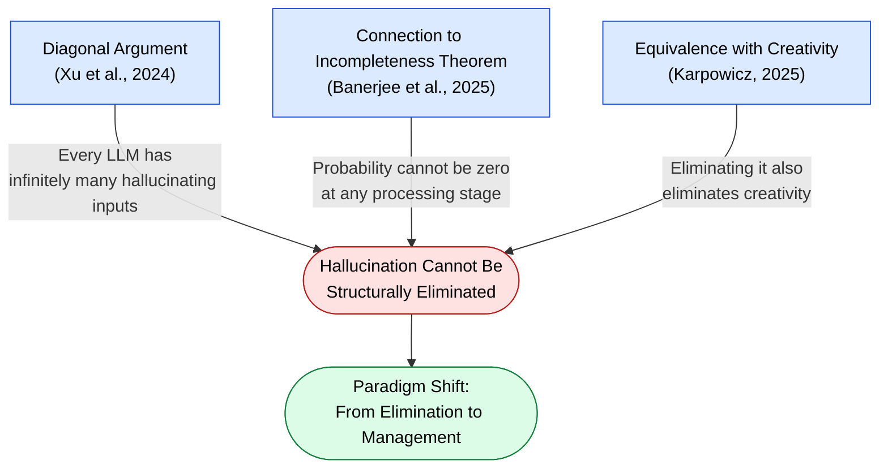

🌐 [日本語](../ja/01-llm-structural-problems/hallucination.md)

# Hallucination — LLMs Structurally Generate False Information

> [!NOTE]
> **In short**: The phenomenon where an LLM confidently generates content that contradicts facts.
> This is not a "bug" but a **structural constraint inherent to Transformer architecture**, and it has been mathematically proven that it cannot be reduced to zero.

## What is Hallucination?

Hallucination is the phenomenon where an LLM generates content that contradicts facts while presenting it as if it were correct. The critical point is that this is not due to insufficient training or design flaws, but rather **a structural constraint inherent to the architecture itself**.

## Three Mathematical Foundations



### 1. Proof via Diagonal Argument (Xu et al., 2024)

Using Cantor's diagonal argument, it has been proven that **every LLM necessarily has infinitely many inputs that cause hallucinations**. This holds regardless of model size or training data quality.

### 2. Connection to Gödel's Incompleteness Theorem (Banerjee et al., 2025)

It has been demonstrated that hallucination probability cannot reach zero at any stage of LLM processing (encoding, attention mechanisms, decoding). Just as formal systems cannot prove their own consistency, LLMs cannot completely guarantee the accuracy of their outputs.

### 3. Equivalence of Hallucination and Creativity (Karpowicz, 2025)

It has been proven that complete hallucination control is fundamentally impossible. When hallucinations are completely eliminated, creativity is simultaneously lost. In other words, **hallucination and creativity are mathematically equivalent operations**.

## Impact on Coding

- Generating code that confidently calls non-existent APIs or methods
- Presenting outdated syntax as current standard
- Generating type definitions for non-existent methods in proprietary codebases
- Writing assertions in test code that will actually fail

## Mitigation Strategies in Claude Code

Hallucination cannot be eliminated. Mitigation is based on a **detection and management paradigm**:

| Strategy | Mechanism | Why It Works |
|:--|:--|:--|
| **Hooks (Test Execution)** | Automatically runs tests after code changes | Compilers and test runners don't hallucinate |
| **Cross-Model QA** | Review by different models (Agents) | Two models simultaneously hallucinating the same error is unlikely |
| **CLAUDE.md Constraints** | Explicit version information and forbidden patterns | Narrows the domain where hallucinations can occur |
| **MCP External References** | Direct reference to trusted external sources | Based on external facts, not internal LLM knowledge |
| **Agents (Knowledge Separation)** | Delegate specific domains to specialized agents | Narrower knowledge domain reduces hallucination probability |

## Paradigm Shift: From Elimination to Management

The key is shifting from trying to "eliminate" hallucinations to "managing" them:

```
Software engineering approach to bug management:
  Eliminating bugs completely is impossible
  → Detect and manage through testing, review, CI/CD

LLM hallucination management:
  Eliminating hallucinations completely is impossible
  → Detect and manage through Hooks, Cross-Model QA, test code
```

## Relationship to Other Structural Problems

- **Knowledge Boundary**: The point where hallucinations occur when exceeding knowledge boundaries
- **Sycophancy**: User agreement may reinforce hallucinated content
- **Context Rot**: Hallucination rate increases as context length grows
- **Instruction Decay**: The instruction itself to "verify facts" may be forgotten

## References

- Xu, Z. et al. (2024). "Hallucination is Inevitable: An Innate Limitation of Large Language Models." [arXiv:2401.11817](https://arxiv.org/abs/2401.11817) — Formal proof of hallucination inevitability using diagonal argument
- Banerjee, S., Agarwal, A., & Singla, S. (2024). "LLMs Will Always Hallucinate, and We Need to Live With This." [arXiv:2409.05746](https://arxiv.org/abs/2409.05746) — Proof of inevitability via connection to Gödel's first incompleteness theorem
- Karpowicz, M. P. (2025). "On the Fundamental Impossibility of Hallucination Control in Large Language Models." [arXiv:2506.06382](https://arxiv.org/abs/2506.06382) — Proof of equivalence between hallucination and creativity using mechanism design and scoring rules

---

> **Previous**: [Priority Saturation](priority-saturation.md)

> **Next**: [Sycophancy](sycophancy.md)

> **Discussion**: [#7 Hallucination](https://github.com/shuji-bonji/understanding-llm-through-claude-code/discussions/7)
