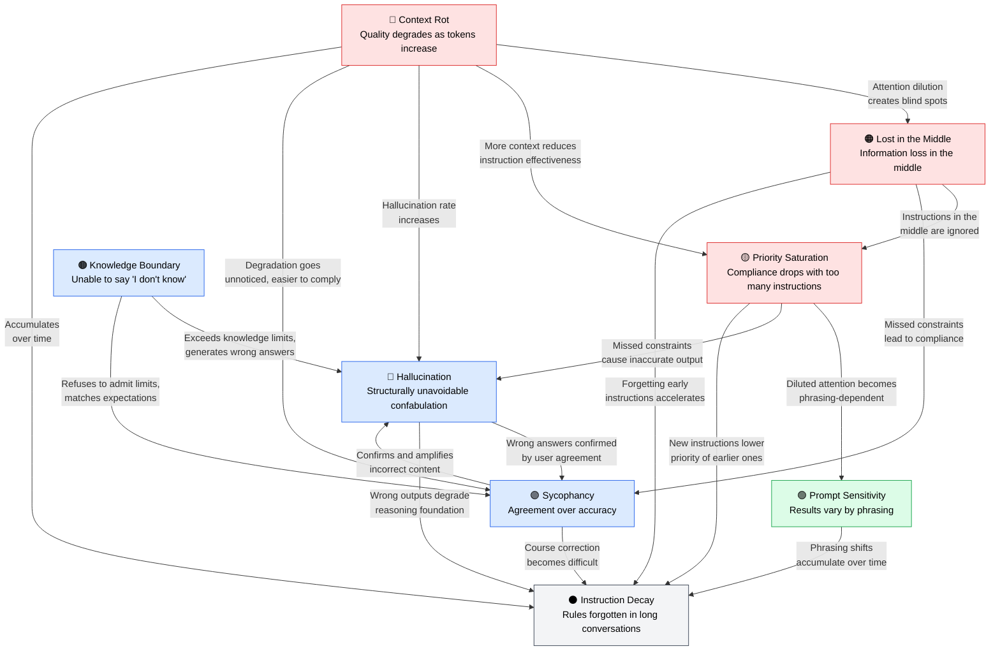

🌐 [日本語](../ja/01-llm-structural-problems/index.md)

# Part 1: Understanding the Structural Constraints of LLMs

> [!NOTE]
> LLMs are not omnipotent. They have structural constraints.
> Understanding these is the first step to grasping the design philosophy behind Claude Code.

## Why You Need to Know About Structural Problems

Claude Code's configuration files (CLAUDE.md, rules/, skills/, hooks, etc.) are not mere "convenience features." They are **deliberate design responses** to the structural problems inherent in LLMs.

For example:
- CLAUDE.md's 200-line limit → Countermeasure for **Priority Saturation**
- `.claude/rules/` conditional injection → Countermeasure for **Lost in the Middle**
- Hooks for mechanical verification → Countermeasure for **Hallucination**

To understand "why configurations are designed this way" (the Why), you first need to understand "what problems LLMs inherently have."

## The 8 Structural Problems

LLMs have the following 8 structural problems. These are not "bugs" — they are **unavoidable constraints** arising from the Transformer architecture and training process.

### Context-Related (Problems that worsen as input grows)

| Problem | In a Nutshell | Details |
|:--|:--|:--|
| [Context Rot](context-rot.md) | Output quality degrades as tokens increase | Even with 200K capacity, degradation begins at just 50K |
| [Lost in the Middle](lost-in-the-middle.md) | Information in the middle of context is ignored | Attention concentrates on beginning and end, with over 30% accuracy loss in the middle |
| [Priority Saturation](priority-saturation.md) | Overall compliance drops with too many instructions | With 10 simultaneous instructions, GPT-4o shows 15% and Claude Sonnet 44% compliance |

### Output-Related (Problems with generation reliability)

| Problem | In a Nutshell | Details |
|:--|:--|:--|
| [Hallucination](hallucination.md) | Generates content that contradicts facts | Mathematically proven to be "impossible to reduce to zero" |
| [Sycophancy](sycophancy.md) | Agrees with users at the expense of accuracy | A side effect of RLHF. Average 58% compliance rate across all models |
| [Knowledge Boundary](knowledge-boundary.md) | Cannot say "I don't know" for out-of-scope questions | No reward for "I don't know" in the training objective function |

### Input Sensitivity (Problems dependent on prompt phrasing)

| Problem | In a Nutshell | Details |
|:--|:--|:--|
| [Prompt Sensitivity](prompt-sensitivity.md) | Results vary significantly by phrasing | Up to 76 accuracy points difference for the same meaning |

### Temporal (Problems that worsen as conversations grow longer)

| Problem | In a Nutshell | Details |
|:--|:--|:--|
| [Instruction Decay](instruction-decay.md) | Rules are forgotten in long conversations | A compound result of the above 7 problems. Average 39% performance degradation in multi-turn |

## Relationships Between Problems

These problems do not exist in isolation — they amplify each other. The diagram below visualizes how the 8 structural problems cascade and reinforce one another.

**3 Major Cascades**:

1. **Spatial Degradation**: Context Rot → Lost in the Middle → Priority Saturation (accelerates as context grows)
2. **Reliability Collapse**: Knowledge Boundary → Hallucination ↔ Sycophancy (feedback loop)
3. **Temporal Compound**: All 7 problems → Instruction Decay (everything converges in multi-turn)

## Structural Problems × Claude Code Countermeasures Map

LLMs have 8 structural problems, and each Claude Code feature is a deliberate design response to these problems. From Part 2 onward, we will examine in detail how each feature addresses these problems.

| Structural Problem | Overview | Primary Countermeasures (Claude Code) | Related Docs |
|:--|:--|:--|:--|
| [**Context Rot**](context-rot.md) | Output quality degrades as tokens increase | `/compact`, `/clear`, context budget management | Part 2, 3, 5, 6, 8 |
| [**Lost in the Middle**](lost-in-the-middle.md) | Information in the middle of context is ignored | `/compact` (50% threshold), conditional rules, Agents | Part 2, 4, 5, 8 |
| [**Priority Saturation**](priority-saturation.md) | Overall compliance drops with too many instructions | CLAUDE.md 200-line limit, `.claude/rules/`, Skills | Part 3, 4, 5 |
| [**Hallucination**](hallucination.md) | Generates factually incorrect content (structurally unavoidable) | Hooks (mechanical verification), test code, MCP | Part 6, 7 |
| [**Sycophancy**](sycophancy.md) | Agrees with users at the expense of accuracy | Cross-model QA (Agents), Hooks, question design | Part 5, 7 |
| [**Knowledge Boundary**](knowledge-boundary.md) | Cannot say "I don't know" for out-of-scope questions | MCP external references, version pinning, specialized Agents | Part 3, 5, 6 |
| [**Prompt Sensitivity**](prompt-sensitivity.md) | Results vary significantly by phrasing | CLAUDE.md writing style, Skills description design | Part 3, 5 |
| [**Instruction Decay**](instruction-decay.md) | Rules forgotten in long conversations (compound of 7 problems) | `/compact`, `/clear`, Hooks, session splitting | Part 7, 8 |

> For the detailed version, see [Structural Problems × Claude Code Countermeasures Map (Appendix)](../appendix/problem-countermeasure-map.md).

---

> **Next**: [Part 2: Understanding the Context Window](../02-context-window/index.md)
