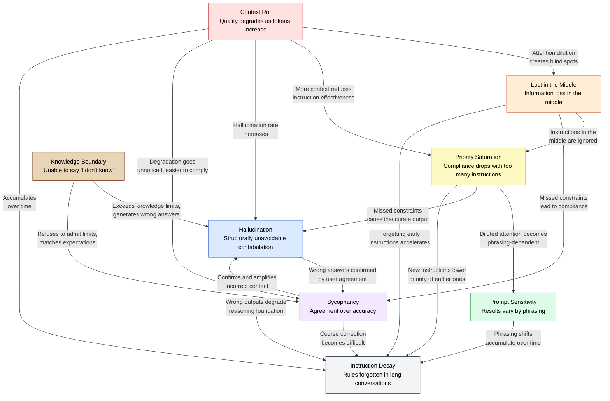

🌐 [日本語](../ja/01-llm-structural-problems/index.md)

# Part 1: Understanding the Structural Constraints of LLMs

> [!NOTE]
> LLMs are not omnipotent. Transformer-based models have structural constraints that come from input length and how attention is allocated.
> This Part defines those constraints. The subject is the constraints themselves, not a product setup guide.

## Why You Need to Know About Structural Problems

The intended reader is a developer who uses cloud LLMs. The goal is to understand the mechanisms and apply them in one's own environment.

Claude Code's configuration (CLAUDE.md, rules/, skills/, hooks, and so on) is a **design response** to structural problems in LLMs. Claude Code is the subject because it is a representative example that can be described in detail and accurately today.

The principles here apply directly to Cursor, Cline, or plain prompt design. The same constraints appear. The same way of thinking applies.

The destination is [Part 11: Cross-LLM Principles](../11-cross-llm-principles/index.md). This Part defines the constraints. Parts 2 onward show countermeasures in the representative example. Part 11 extracts what does not depend on the product.

Concrete examples in Claude Code:

- CLAUDE.md's 200-line limit → countermeasure for **Priority Saturation**
- `.claude/rules/` conditional injection → countermeasure for **Lost in the Middle**
- Hooks for mechanical verification → countermeasure for **Hallucination**

To understand why configurations are designed this way (the Why), you first need to understand what problems LLMs have.

## The 8 Structural Problems

LLMs have the following 8 structural problems. These are not "bugs" — they are **unavoidable constraints** arising from the Transformer architecture and training process.

### Context-Related (Problems that worsen as input grows)

| Problem | In a Nutshell | Details |
|:--|:--|:--|
| [Context Rot](context-rot.md) | Output quality degrades as tokens increase | Even with 200K capacity, degradation begins at just 50K |
| [Lost in the Middle](lost-in-the-middle.md) | Information in the middle of context is ignored | Attention concentrates on beginning and end, with over 30% accuracy loss in the middle |
| [Priority Saturation](priority-saturation.md) | Overall compliance drops with too many instructions | With 10 simultaneous instructions, GPT-4o shows 15% and Claude Sonnet 44% compliance |

### Output-Related (Problems with generation reliability)

| Problem | In a Nutshell | Details |
|:--|:--|:--|
| [Hallucination](hallucination.md) | Generates content that contradicts facts | Mathematically proven to be "impossible to reduce to zero" |
| [Sycophancy](sycophancy.md) | Agrees with users at the expense of accuracy | A side effect of RLHF. Average 58% compliance rate across all models |
| [Knowledge Boundary](knowledge-boundary.md) | Cannot say "I don't know" for out-of-scope questions | No reward for "I don't know" in the training objective function |

### Input Sensitivity (Problems dependent on prompt phrasing)

| Problem | In a Nutshell | Details |
|:--|:--|:--|
| [Prompt Sensitivity](prompt-sensitivity.md) | Results vary significantly by phrasing | Up to 76 accuracy points difference for the same meaning |

### Temporal (Problems that worsen as conversations grow longer)

| Problem | In a Nutshell | Details |
|:--|:--|:--|
| [Instruction Decay](instruction-decay.md) | Rules are forgotten in long conversations | A compound result of the above 7 problems. Average 39% performance degradation in multi-turn |

## Relationships Between Problems

These problems do not exist in isolation — they amplify each other. The diagram below visualizes how the 8 structural problems cascade and reinforce one another.

```mermaid
graph TD
    %% ── Node definitions ──
    CR["Context Rot<br/>Quality degrades as tokens increase"]
    LM["Lost in the Middle<br/>Information loss in the middle"]
    PS["Priority Saturation<br/>Compliance drops with too many instructions"]
    HL["Hallucination<br/>Structurally unavoidable confabulation"]
    SY["Sycophancy<br/>Agreement over accuracy"]
    KB["Knowledge Boundary<br/>Unable to say 'I don't know'"]
    PM["Prompt Sensitivity<br/>Results vary by phrasing"]
    ID["Instruction Decay<br/>Rules forgotten in long conversations"]

    %% ── Cascade from Context Rot ──
    CR -->|"Attention dilution<br/>creates blind spots"| LM
    CR -->|"More context reduces<br/>instruction effectiveness"| PS
    CR -->|"Hallucination rate<br/>increases"| HL
    CR -->|"Degradation goes<br/>unnoticed, easier to comply"| SY

    %% ── Propagation from Lost in the Middle ──
    LM -->|"Instructions in the<br/>middle are ignored"| PS
    LM -->|"Missed constraints<br/>lead to compliance"| SY
    LM -->|"Forgetting early<br/>instructions accelerates"| ID

    %% ── Propagation from Priority Saturation ──
    PS -->|"Diluted attention becomes<br/>phrasing-dependent"| PM
    PS -->|"Missed constraints<br/>cause inaccurate output"| HL

    %% ── Knowledge Boundary → Hallucination chain ──
    KB -->|"Exceeds knowledge limits,<br/>generates wrong answers"| HL
    KB -->|"Refuses to admit limits,<br/>matches expectations"| SY

    %% ── Sycophancy ↔ Hallucination feedback ──
    SY -->|"Confirms and amplifies<br/>incorrect content"| HL
    HL -->|"Wrong answers confirmed<br/>by user agreement"| SY

    %% ── All problems → Instruction Decay (temporal compound) ──
    CR -->|"Accumulates<br/>over time"| ID
    PS -->|"New instructions lower<br/>priority of earlier ones"| ID
    HL -->|"Wrong outputs degrade<br/>reasoning foundation"| ID
    SY -->|"Course correction<br/>becomes difficult"| ID
    PM -->|"Phrasing shifts<br/>accumulate over time"| ID

    %% ── Styles ──
    classDef cr fill:#fee2e2,stroke:#b91c1c,color:#000
    classDef lm fill:#ffedd5,stroke:#c2410c,color:#000
    classDef ps fill:#fef9c3,stroke:#a16207,color:#000
    classDef hl fill:#dbeafe,stroke:#1d4ed8,color:#000
    classDef sy fill:#f3e8ff,stroke:#7c3aed,color:#000
    classDef kb fill:#e8d5b7,stroke:#78350f,color:#000
    classDef pm fill:#dcfce7,stroke:#15803d,color:#000
    classDef id fill:#f3f4f6,stroke:#374151,color:#000

    class CR cr
    class LM lm
    class PS ps
    class HL hl
    class SY sy
    class KB kb
    class PM pm
    class ID id
```

**3 Major Cascades**:

1. **Spatial Degradation**: Context Rot → Lost in the Middle → Priority Saturation (accelerates as context grows)
2. **Reliability Collapse**: Knowledge Boundary → Hallucination ↔ Sycophancy (feedback loop)
3. **Temporal Compound**: All 7 problems → Instruction Decay (everything converges in multi-turn)

## Structural Problems × Claude Code Countermeasures Map

LLMs have 8 structural problems. The countermeasures in the table below are representative examples in Claude Code. From Part 2 onward, we examine how each feature addresses these problems. Product-independent principles are extracted in [Part 11](../11-cross-llm-principles/index.md).

| Structural Problem | Overview | Primary Countermeasures (Claude Code) | Related Docs |
|:--|:--|:--|:--|
| [**Context Rot**](context-rot.md) | Output quality degrades as tokens increase | `/compact`, `/clear`, context budget management | Part 2, 3, 5, 6, 8 |
| [**Lost in the Middle**](lost-in-the-middle.md) | Information in the middle of context is ignored | `/compact` (50% threshold), conditional rules, Agents | Part 2, 4, 5, 8 |
| [**Priority Saturation**](priority-saturation.md) | Overall compliance drops with too many instructions | CLAUDE.md 200-line limit, `.claude/rules/`, Skills | Part 3, 4, 5 |
| [**Hallucination**](hallucination.md) | Generates factually incorrect content (structurally unavoidable) | Hooks (mechanical verification), test code, MCP | Part 6, 7 |
| [**Sycophancy**](sycophancy.md) | Agrees with users at the expense of accuracy | Cross-model QA (Agents), Hooks, question design | Part 5, 7 |
| [**Knowledge Boundary**](knowledge-boundary.md) | Cannot say "I don't know" for out-of-scope questions | MCP external references, version pinning, specialized Agents | Part 3, 5, 6 |
| [**Prompt Sensitivity**](prompt-sensitivity.md) | Results vary significantly by phrasing | CLAUDE.md writing style, Skills description design | Part 3, 5 |
| [**Instruction Decay**](instruction-decay.md) | Rules forgotten in long conversations (compound of 7 problems) | `/compact`, `/clear`, Hooks, session splitting | Part 7, 8 |

> For the detailed version, see [Structural Problems × Claude Code Countermeasures Map (Appendix)](../appendix/problem-countermeasure-map.md).

## This constraint is not unique to Claude

The eight problems are not defects of a specific product. They arise from Transformer-based models and their training. In any environment that uses cloud LLMs, the same constraints appear, to varying degrees.

How they show up elsewhere:

- As chat history grows, agreements made in the middle stop showing up in later replies
- When a long spec is pasted in one shot, requirements in the middle drop out
- When too many rules are listed at once, none of them is followed well

The Claude Code countermeasure table is a representative set of concrete responses. Other tools do not necessarily ship features at the same granularity. What transfers is the way of thinking: keep input short, do not bury important instructions, put verification outside the model. The details are collected in [Part 11: Cross-LLM Principles](../11-cross-llm-principles/index.md).

---

> **Next**: [Part 2: Understanding the Context Window](../02-context-window/index.md)
