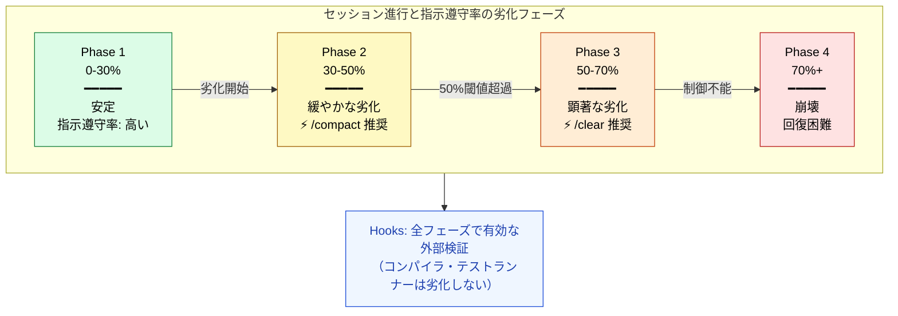
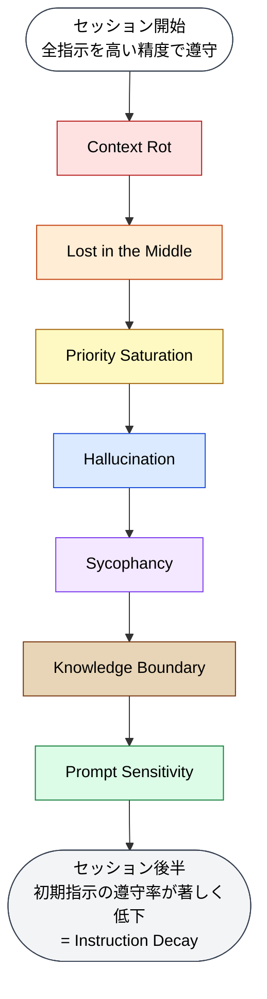

# Instruction Decay（指示遵守の減衰）— 長い会話でルールを忘れる

> [!NOTE]
> **一言で言うと**: LLM は長い会話の中で初期指示への遵守率が低下する。
> マルチターン会話での性能は平均 39% 低下する。
> これは前の 7 つの構造的問題が時間軸に沿って複合的に発生した結果である。

## Instruction Decay とは何か

Instruction Decay とは、LLM が長い会話の中で**初期に与えられた指示への遵守率が徐々に低下する**現象である。Microsoft / Salesforce の 2025 年研究によると、マルチターン会話での LLM の性能は**平均 39% 低下する**。

## 劣化の性質

重要なのは、これが**能力低下ではなく信頼性の崩壊**として現れること。モデルが「できなくなる」のではなく、「できる時とできない時の振れ幅が大きくなる」状態。

### 回復の困難性

LLM が会話途中で誤った方向に進むと、そこから**回復できない**という重要な発見がある。誤った前提に基づいた推論が蓄積され、後の応答の品質を継続的に低下させる。

## 複合的な原因

Instruction Decay は単独の現象ではなく、**前の 7 つの構造的問題が時間軸に沿って複合的に発生した結果**である:

| 問題                    | 時間経過での影響                                       |
| :---------------------- | :----------------------------------------------------- |
| **Context Rot**         | 会話が長くなるほどコンテキストが増加し、品質劣化       |
| **Lost in the Middle**  | 初期指示がコンテキスト中間部に押しやられ、無視される   |
| **Priority Saturation** | 会話の中で新しい指示が追加され、初期指示の優先度が低下 |
| **Hallucination**       | 誤った出力が蓄積され、以降の推論の基盤が劣化           |
| **Sycophancy**          | ユーザーの方向性を追認し続け、軌道修正が困難に         |
| **Knowledge Boundary**  | 知識の限界を超えた回答が蓄積                           |
| **Prompt Sensitivity**  | 会話の流れでプロンプトの文脈が変化し、初期意図からズレ |

## コーディングにおける影響

- 序盤に決めたアーキテクチャ方針が、長いセッション後に無視される
- テスト方針（TDD、カバレッジ目標）が徐々に省略される
- コーディング規約（命名規則、エラーハンドリング方針）の遵守率が低下
- Git コミット粒度が、セッション後半で大きくなる

## Claude Code での対策



| 対策                             | 仕組み                       | なぜ効くのか                                  |
| :------------------------------- | :--------------------------- | :-------------------------------------------- |
| **`/compact`（予防的圧縮）**     | 50%使用率前に会話履歴を圧縮  | Context Rot / Lost in the Middle の蓄積を防ぐ |
| **`/clear`（セッション分割）**   | セッションをリセット         | 全ての蓄積された劣化をリセット                |
| **Hooks**                        | コンテキスト外で機械的に検証 | LLM の指示遵守に依存しない                    |
| **Agents**                       | 独立したコンテキストで実行   | 新鮮なコンテキストでタスクを実行              |
| **小単位の Git コミット**        | 変更を頻繁にコミット         | 劣化した出力のロールバックを容易にする        |
| **Stop Hook でのセッションログ** | セッション終了時にログを記録 | 次のセッションへの引継ぎを確保                |

## セッション設計の原則

```
原則1: セッションは短く保つ
  → 1セッション = 1タスク（または関連する小タスクの集合）

原則2: 検証機構はコンテキスト外に配置する
  → Hooks, テスト, CI/CD は LLM の指示遵守に依存しない

原則3: 状態は外部に永続化する
  → Git コミット, CLAUDE.md, メモリツールで次セッションに引き継ぐ
```

## 他の構造的問題との関係

Instruction Decay は他の 7 つの問題の**時間軸での集大成**:



## 参考文献

- Laban, P., Hayashi, H., Zhou, Y., & Neville, J. (2025). "LLMs Get Lost In Multi-Turn Conversation." Microsoft Research & Salesforce Research. [arXiv:2505.06120](https://arxiv.org/abs/2505.06120) — 200,000+ シミュレーション会話での検証。平均39%の性能低下と112%の不安定性増加を測定

---

> **前へ**: [Prompt Sensitivity](prompt-sensitivity.md)

> **Part 1 完了**: [Part 2: コンテキストウィンドウを理解する](../02-context-window/index.md) へ

> **Discussion**: [#13 Instruction Decay](https://github.com/shuji-bonji/understanding-llm-through-claude-code/discussions/13)
