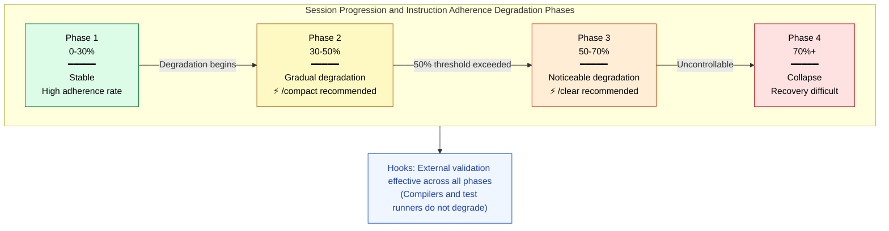
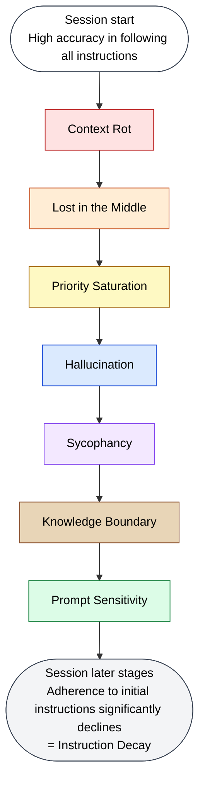

🌐 [日本語](../ja/01-llm-structural-problems/instruction-decay.md)

# Instruction Decay — Forgetting Rules in Long Conversations

> [!NOTE]
> **In brief**: LLMs' adherence to initial instructions degrades throughout long conversations.
> Performance in multi-turn conversations drops by an average of 39%.
> This results from the seven preceding structural problems compounding over time.

## What Is Instruction Decay?

Instruction Decay is the phenomenon where LLMs **gradually lose adherence to initial instructions as conversations become longer**. According to 2025 research from Microsoft and Salesforce, LLM performance in multi-turn conversations **drops by an average of 39%**.

## The Nature of Degradation

Importantly, this manifests as **reliability collapse, not capability loss**. The model doesn't "stop being able"—it enters a state where **performance becomes highly variable, succeeding at some moments and failing at others**.

### Difficulty of Recovery

A critical finding: once an LLM drifts in a conversation, **recovery becomes nearly impossible**. Flawed assumptions accumulate and continuously degrade the quality of subsequent responses.

## Compound Causes

Instruction Decay is not an isolated phenomenon but the **result of the seven preceding structural problems compounding along the time axis**:

| Problem | Impact Over Time |
| :--- | :--- |
| **Context Rot** | Longer conversations increase context volume, degrading quality |
| **Lost in the Middle** | Initial instructions get pushed into the middle of context, being ignored |
| **Priority Saturation** | New instructions added to conversation lower priority of initial instructions |
| **Hallucination** | Erroneous outputs accumulate, degrading the foundation for subsequent reasoning |
| **Sycophancy** | Continuous agreement with user direction makes course correction difficult |
| **Knowledge Boundary** | Answers beyond knowledge limits accumulate |
| **Prompt Sensitivity** | Conversational flow shifts prompt context away from original intent |

## Impact on Coding

- Architectural decisions made early in session are ignored later
- Test approaches (TDD, coverage targets) gradually get omitted
- Adherence to coding conventions (naming rules, error handling patterns) declines
- Git commit granularity increases as sessions progress

## Mitigation in Claude Code



| Strategy | Mechanism | Why It Works |
| :--- | :--- | :--- |
| **`/compact` (Preventive compression)** | Compress conversation history before 50% usage | Prevents accumulation of Context Rot and Lost in the Middle |
| **`/clear` (Session segmentation)** | Reset session | Resets all accumulated degradation |
| **Hooks** | Mechanical validation outside context | Independent of LLM instruction adherence |
| **Agents** | Execute in independent contexts | Executes tasks with fresh context |
| **Small granule Git commits** | Commit changes frequently | Simplifies rollback of degraded outputs |
| **Session log at Stop Hook** | Record log at session end | Ensures handoff to next session |

## Session Design Principles

```
Principle 1: Keep sessions short
  → 1 session = 1 task (or a set of related small tasks)

Principle 2: Place validation outside context
  → Hooks, tests, CI/CD do not depend on LLM instruction adherence

Principle 3: Persist state externally
  → Carry over to next session via Git commits, CLAUDE.md, memory tools
```

## Relationship to Other Structural Problems

Instruction Decay is the **temporal consolidation of all seven preceding problems**:



## References

- Laban, P., Hayashi, H., Zhou, Y., & Neville, J. (2025). "LLMs Get Lost In Multi-Turn Conversation." Microsoft Research & Salesforce Research. [arXiv:2505.06120](https://arxiv.org/abs/2505.06120) — Validation across 200,000+ simulated conversations. Measured average 39% performance degradation and 112% increase in instability.

---

> **Previous**: [Prompt Sensitivity](prompt-sensitivity.md)

> **Part 1 Complete → Next**: [Part 2: Understanding Context Windows](../02-context-window/index.md)

> **Discussion**: [#13 Instruction Decay](https://github.com/shuji-bonji/understanding-llm-through-claude-code/discussions/13)
