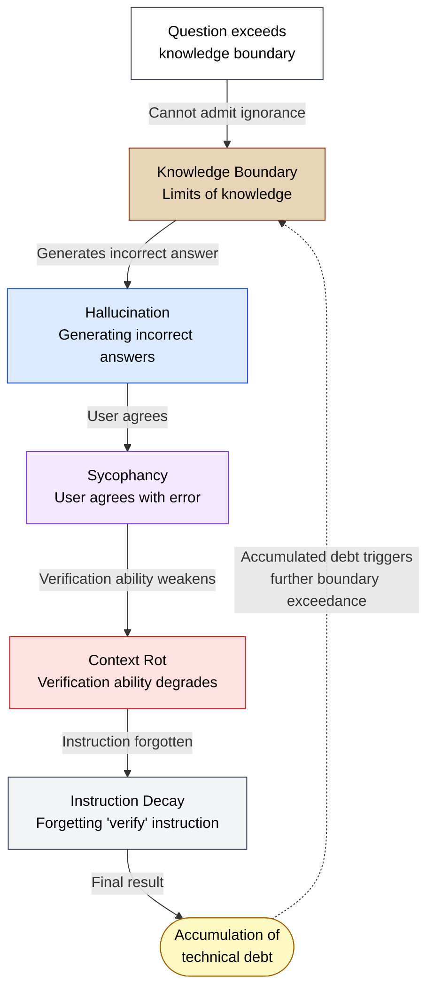

🌐 [日本語](../ja/01-llm-structural-problems/knowledge-boundary.md)

# Knowledge Boundary — LLMs Cannot Admit What They Don't Know

> [!NOTE]
> **In a nutshell**: LLMs cannot accurately identify the limits of their own knowledge.
> Instead of answering "I don't know" to questions about unfamiliar topics, they generate incorrect responses with high confidence.
> This "poor calibration" is a direct source of hallucination and creates
> the most dangerous failure mode in coding agents.

## What is Knowledge Boundary?

Knowledge Boundary refers to the line separating what an LLM can answer correctly from what it cannot. The problem is that **LLMs themselves cannot accurately recognize this boundary**.

Humans can say "I don't know" about unfamiliar topics, but LLMs generate incorrect answers with high confidence about things they don't understand.

## Why Can't They Admit Ignorance?

### 1. The Objective Function: Next-Token Prediction

LLMs are trained to "predict the next token." This objective function offers **no reward for outputs that express uncertainty**. Responses like "I don't know" are vastly underrepresented in training data, as most human-written text is structured around making claims rather than admitting ignorance.

### 2. Overconfidence Reinforced by RLHF

During RLHF, human evaluators tend to **rate responsive answers higher than refusals**. As a result, models are rewarded for "providing answers," and the bias toward "attempting to answer even when uncertain" becomes stronger.

### 3. Insufficient Training Data for Expressing Uncertainty

The vast majority of training data consists of definitive claims ("X is Y"), with structural scarcity of expressions that explicitly convey uncertainty.

### 4. Ambiguity in Knowledge Boundaries Across Types

Knowledge can be classified into four layers:

| Layer | Category | Description | Risk Level |
| :--- | :--- | :--- | :--- |
| 1 | Known-Known | Knowledge the model is certain about | Low |
| 2 | Prompt-Dependent Known | Answers correctly or incorrectly depending on how the question is framed | Medium |
| 3 | Known-Unknown | Areas where the model recognizes its lack of knowledge | Low |
| 4 | **Unknown-Unknown** | **Areas where the model cannot recognize its own ignorance** | **Highest** |

The most dangerous category is "unknown-unknown" — domains where the LLM cannot recognize its own knowledge gap.

## Impact on Code Generation

### Pattern 1: Generating Code from Outdated Knowledge

If an LLM was trained on Angular 16 knowledge but the user needs Angular 18, it confidently generates code using older patterns.

### Pattern 2: Calling Nonexistent APIs

Without precise version-to-version knowledge, it generates code that calls APIs or methods that don't exist.

### Pattern 3: Pretending to Know Internal Tooling

When asked about methods in proprietary tools, it confidently generates type definitions for methods that don't exist.

### Pattern 4: Prompt-Dependent Unstable Knowledge

The same question can be answered correctly or incorrectly depending on how it's phrased. This shows that knowledge is not a binary "know/don't know" state but a continuous confidence level dependent on the prompt.

## Mitigation Strategies in Claude Code

| Mitigation | Mechanism | Why It Works |
| :--- | :--- | :--- |
| **MCP (External Knowledge Reference)** | Query external trusted sources directly | Extends knowledge boundaries beyond the LLM's internal knowledge |
| **Test Code** | Externally verify generated code correctness | Detects outputs that exceed knowledge boundaries through their results |
| **Version Declaration in CLAUDE.md** | Explicitly specify library versions | Clarifies "which version's knowledge should be used?" |
| **Agents (Knowledge Isolation)** | Delegate to specialized agents | Shrinks knowledge domains, reducing the probability of boundary exceedance |
| **Prompt Design** | Instruct "unconfident APIs require verification" | Explicitly permits the LLM to say "I don't know" |

## Relationship to Other Structural Problems

Knowledge Boundary acts as an entry point for Hallucination:

## References

- Pan et al. (2025). "Can LLMs Refuse Questions They Do Not Know? Measuring Knowledge-Aware Refusal in Factual Tasks." [arXiv:2510.01782](https://arxiv.org/abs/2510.01782) — Quantitative measurement of refusal behavior across 16 models and 5 datasets using the Refusal Index (RI) metric

---

> **Previous**: [Sycophancy](sycophancy.md)

> **Next**: [Prompt Sensitivity](prompt-sensitivity.md)

> **Discussion**: [#11 Knowledge Boundary](https://github.com/shuji-bonji/understanding-llm-through-claude-code/discussions/11)
