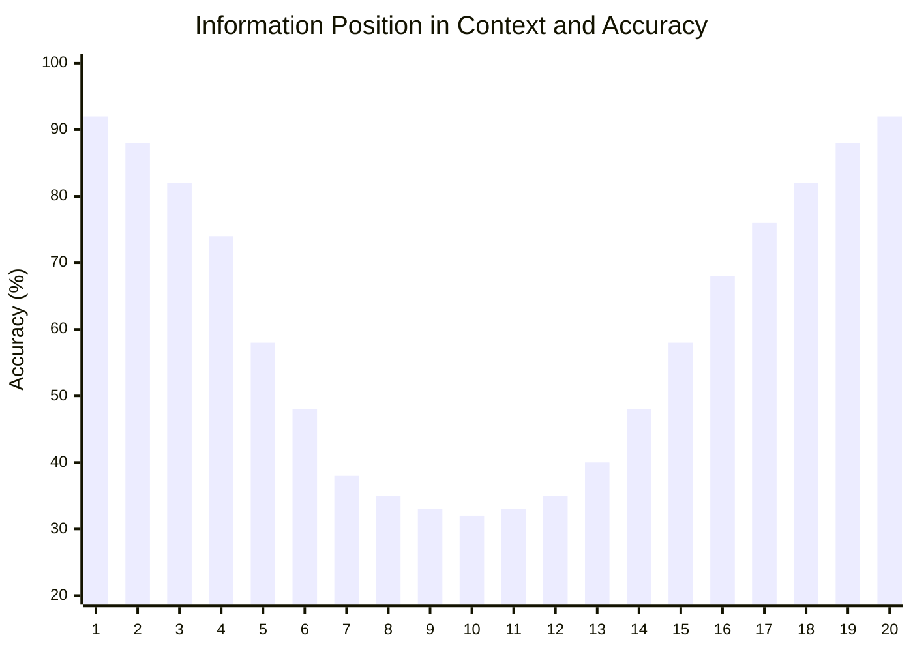
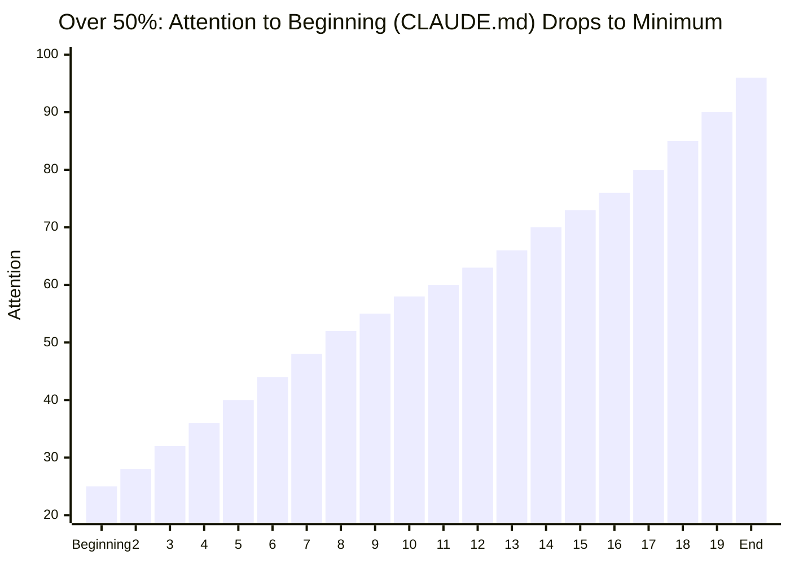

🌐 [日本語](../ja/01-llm-structural-problems/lost-in-the-middle.md)

# Lost in the Middle — Ignoring Information in the Middle of Context

> [!NOTE]
> **In short**: LLMs excel at remembering information at the beginning and end, but significantly ignore middle content.
> When searching across 20 documents, the accuracy of information positioned 5th through 15th drops by over 30%.

## What is Lost in the Middle?

Lost in the Middle is the phenomenon where LLMs **concentrate attention on the beginning (Primacy Bias) and end (Recency Bias) of context, while ignoring the middle section**. This is the most concrete manifestation of Context Rot and a structural constraint stemming from Transformer position encodings.

## The U-Shaped Curve Revealed

LLM attention patterns form a "U-shaped curve." Attention concentrates at the beginning and end, leaving the middle as a blind spot.

**Context Usage Below 50%: U-Shaped Curve**

> [!NOTE]
> Accuracy is high at the beginning (Primacy bias) and end (Recency bias), but drops by over 30% in the middle section (Blind spot).
> When given 20 documents, retrieval accuracy for information positioned 5th through 15th drops significantly.

### The Role of RoPE (Rotary Position Embedding)

RoPE, widely used in modern LLMs, has the characteristic that attention weights decay as positions become farther apart. This structurally triggers the decreased attention to the middle section.

### Critical Point: 50% Context Usage Threshold

When context usage exceeds 50%, the U-shaped curve pattern breaks down.

**Context Usage Over 50%: Pattern Collapse**

> [!TIP]
> Once usage exceeds 50%, Recency (recent content) becomes dominant, and **attention to information at the beginning (including CLAUDE.md) drops to its lowest point**.
>
> **Practical implications**:
>
> - Below 50%: CLAUDE.md benefits from Primacy bias and functions relatively well
> - **Over 50%: CLAUDE.md falls to the least-attended position → `/compact` becomes necessary**
> - Skills are injected at the end when called (the most-attended position) → highly effective
> - Hooks operate outside context → unaffected by position bias

This is the scientific basis for why `/compact` should be run before 50% usage is reached.

## Impact on Coding

- In long conversations, design decisions made early are forgotten
- Rules written in CLAUDE.md become less adhered to as conversation progresses
- Important discussions in the middle (such as bug root cause analysis) are not reflected in later implementations

## Countermeasures in Claude Code

| Countermeasure           | Mechanism                           | Why It Works                                                                |
| :----------------------- | :---------------------------------- | :-------------------------------------------------------------------------- |
| **`/compact`**           | Summarize and compress chat history | Keeps context usage below 50%, preventing U-curve collapse                  |
| **`.claude/rules/`**     | Conditional rule injection          | Avoids loading all rules constantly; injects only necessary rules at end    |
| **Agents**               | Independent context windows         | Execute tasks with fresh context, fundamentally avoiding middle problems    |
| **Skills**               | On-demand loading                   | Inject near end when needed, placing in high-attention positions            |
| **Hooks**                | Forced execution outside context    | Mechanical verification independent of LLM attention patterns               |
| **Strategic information placement** | Place critical info at beginning/end | Position important information at high-attention positions in U-curve       |

## Relationship to Other Structural Problems

Lost in the Middle is part of Context Rot while simultaneously amplifying other problems:

- **Priority Saturation**: Instructions in the middle being ignored reduces the effective number of instructions
- **Instruction Decay**: As conversations lengthen, the middle grows, accelerating forgotten initial instructions
- **Sycophancy**: Overlooking important constraints makes it easier to comply directly with user requests

## References

- Liu, N. F., Lin, K., Hewitt, J., Paranjape, A., Bevilacqua, M., Petroni, F., & Liang, P. (2024). "Lost in the Middle: How Language Models Use Long Contexts." *Transactions of the Association for Computational Linguistics*, 12, 157–173. [arXiv:2307.03172](https://arxiv.org/abs/2307.03172) / [DOI:10.1162/tacl_a_00638](https://doi.org/10.1162/tacl_a_00638) — Discovery of U-shaped attention patterns in long-context processing

- Su, J. et al. (2021). "RoFormer: Enhanced Transformer with Rotary Position Embedding." [arXiv:2104.09864](https://arxiv.org/abs/2104.09864) — Original RoPE paper. Foundation for the mechanism where attention scores decay as positions become farther apart

---

> **Next**: [Priority Saturation](priority-saturation.md)

> **Discussion**: [#9 Lost in the Middle](https://github.com/shuji-bonji/understanding-llm-through-claude-code/discussions/9)
