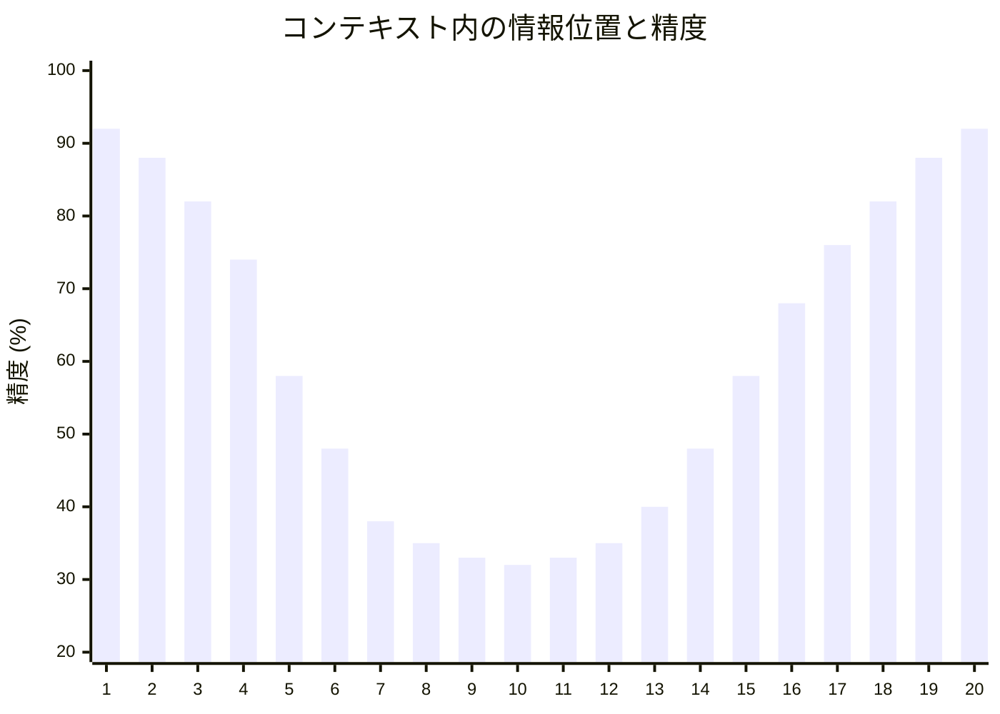
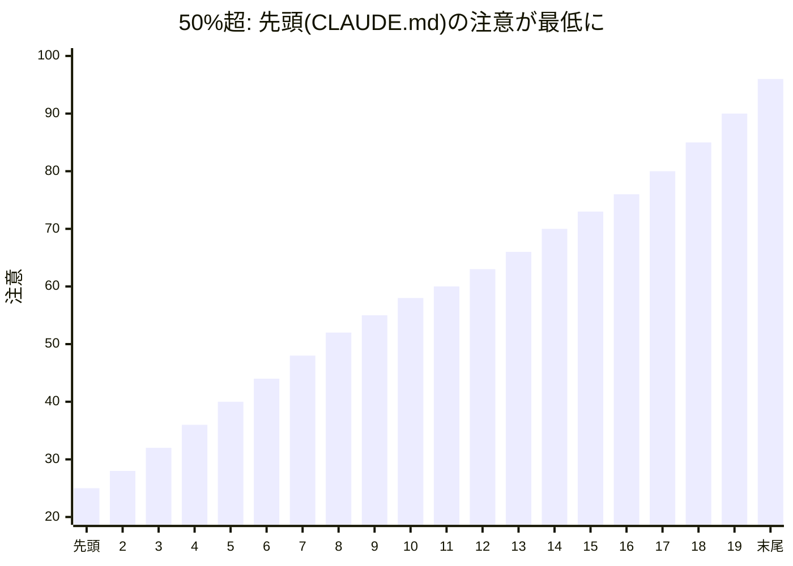

# Lost in the Middle — コンテキスト中間部の情報を無視する

> [!NOTE]
> **一言で言うと**: LLM は先頭と末尾の情報をよく覚えているが、中間部の情報を著しく無視する。
> 20個の文書から検索する場合、5番目〜15番目に配置された情報の精度は 30% 以上低下する。

## Lost in the Middle とは何か

Lost in the Middle とは、LLM がコンテキストの**先頭（Primacy Bias）と末尾（Recency Bias）に注意を集中させ、中間部を無視する**現象である。これは Context Rot の最も具体的な発現形態であり、Transformer の位置エンコーディングに起因する構造的な制約である。

## U字カーブの正体

LLM の注意パターンは「U字カーブ」を描く。先頭と末尾に注意が集中し、中間部が死角になる。

**コンテキスト使用率50%未満: U字カーブ**

> [!NOTE]
> 先頭（Primacy bias）と末尾（Recency bias）の精度が高く、中間部（Blind spot）で 30% 以上低下する。
> 20個の文書を与えた場合、5番目〜15番目に配置された情報の検索精度が著しく低下する。

### RoPE（Rotary Position Embedding）の役割

現代の LLM で広く使われる RoPE は、位置が離れるほど注意重みが減衰する特性を持つ。これが中間部への注意低下を構造的に引き起こしている。

### 臨界点: コンテキスト使用率50%

コンテキスト使用率が50%を超えると、U字カーブのパターンが崩壊する。

**コンテキスト使用率50%超: パターン崩壊**

> [!TIP]
> 50%を超えると Recency（直近）が支配的になり、**先頭の情報（CLAUDE.md 含む）への注意が最も低下する**。
>
> **実践的な含意**:
>
> - 50%未満: CLAUDE.md は Primacy bias の恩恵で比較的機能する
> - **50%超: CLAUDE.md が最も軽視される位置に落ちる → `/compact` が必要**
> - Skills は呼出し時に末尾（最も注目される位置）に注入される → 効果的
> - Hooks はコンテキスト外で動作 → 位置バイアスの影響を受けない

これが `/compact` を50%使用率前に実行すべき理由の科学的根拠である。

## コーディングへの影響

- 長い会話の中で、序盤に決めた設計方針が忘れられる
- CLAUDE.md に書いたルールが、会話が進むにつれて遵守されなくなる
- 中間で行った重要な議論（バグの原因分析など）が後の実装に反映されない

## Claude Code での対策

| 対策                 | 仕組み                         | なぜ効くのか                                                     |
| :------------------- | :----------------------------- | :--------------------------------------------------------------- |
| **`/compact`**       | 会話履歴を要約・圧縮           | コンテキスト使用率を50%未満に保ち、U字カーブの崩壊を防ぐ         |
| **`.claude/rules/`** | 条件付きルール注入             | 全ルールを常時載せず、必要なルールだけを末尾（高注意位置）に注入 |
| **Agents**           | 独立したコンテキストウィンドウ | 新鮮なコンテキストでタスクを実行、中間部の問題を根本回避         |
| **Skills**           | オンデマンド読み込み           | 必要な時に末尾近くに注入し、高注意位置に配置                     |
| **Hooks**            | コンテキスト外で強制実行       | LLM の注意パターンに依存しない機械的な検証                       |
| **情報の戦略的配置** | 重要情報を先頭/末尾に          | U字カーブの高注意位置に重要情報を配置                            |

## 他の構造的問題との関係

Lost in the Middle は Context Rot の一部であると同時に、他の問題を増幅する:

- **Priority Saturation**: 中間部の指示が無視されることで、実質的な有効指示数が減少
- **Instruction Decay**: 会話が長くなるほど中間部が増え、初期指示の忘却が加速
- **Sycophancy**: 重要な制約を見落とすことで、ユーザーの要求にそのまま従いやすくなる

## 参考文献

- Liu, N. F., Lin, K., Hewitt, J., Paranjape, A., Bevilacqua, M., Petroni, F., & Liang, P. (2024). "Lost in the Middle: How Language Models Use Long Contexts." *Transactions of the Association for Computational Linguistics*, 12, 157–173. [arXiv:2307.03172](https://arxiv.org/abs/2307.03172) / [DOI:10.1162/tacl_a_00638](https://doi.org/10.1162/tacl_a_00638) — 長文コンテキストにおける U 字型注意パターンの発見
- Su, J. et al. (2021). "RoFormer: Enhanced Transformer with Rotary Position Embedding." [arXiv:2104.09864](https://arxiv.org/abs/2104.09864) — RoPE の原論文。位置が離れるほど注意スコアが減衰するメカニズムの基盤

---

> **次へ**: [Priority Saturation](priority-saturation.md)

> **Discussion**: [#9 Lost in the Middle](https://github.com/shuji-bonji/understanding-llm-through-claude-code/discussions/9)
