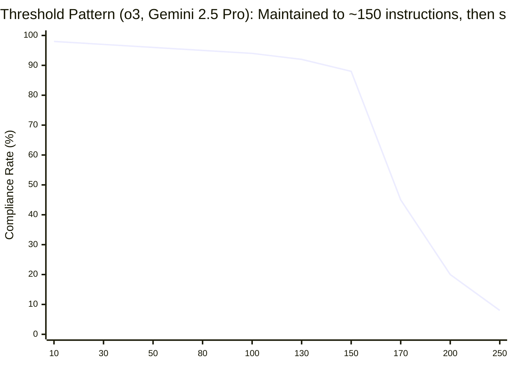
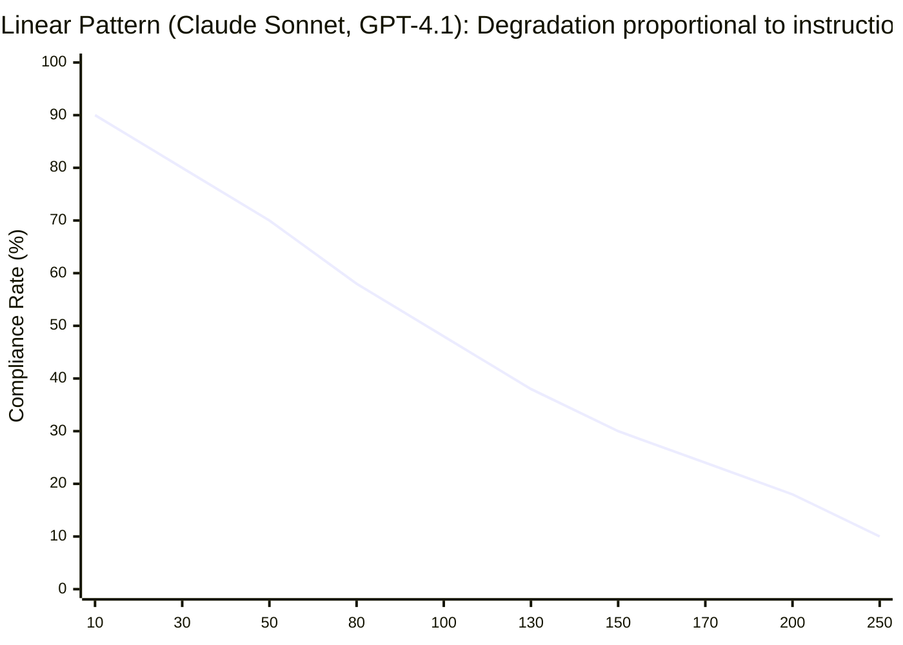
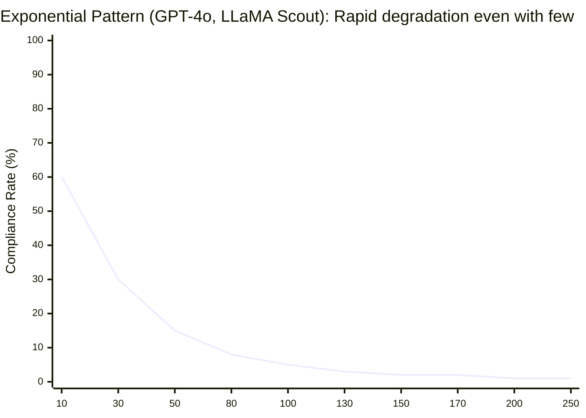

🌐 [日本語](../ja/01-llm-structural-problems/priority-saturation.md)

# Priority Saturation — Compliance Rates Degrade When Instructions Accumulate

> [!NOTE]
> **In short**: The more instructions you give an LLM simultaneously, the lower the compliance rate for each individual instruction.
> "Everything is important" is equivalent to "nothing is important."
> This is the scientific foundation behind CLAUDE.md's 200-line limit.

## What Is Priority Saturation?

Priority Saturation is the phenomenon where **the probability of complying with each individual instruction decreases as the number of simultaneous instructions given to an LLM increases**.

## Quantitative Evidence

### IFScale / ManyIFEval Benchmarks

IFScale measures compliance rates when the number of simultaneous instructions increases incrementally, while ManyIFEval measures compliance rates relative to instruction token volume.

| Model             | Full Compliance at 10 Instructions | Degradation Pattern                      | Source           |
| :---------------- | :--------------------------------- | :--------------------------------------- | :--------------- |
| GPT-4o            | **15%**                            | Exponential (rapid degradation)          | IFScale / ManyIFEval |
| Claude 3.5 Sonnet | **44%**                            | Linear (gradual degradation)             | IFScale / ManyIFEval |
| o3, Gemini 2.5 Pro | High                               | Threshold (maintained ~150 instructions, then sharp drop) | IFScale |

### Three Degradation Patterns

1. **Threshold Pattern** (o3, Gemini 2.5 Pro): Nearly perfect up to ~150 instructions, then sharp decline

2. **Linear Pattern** (GPT-4.1, Claude Sonnet 4): Gradual degradation proportional to instruction count

3. **Exponential Pattern** (GPT-4o, LLaMA Scout): Rapid degradation even with small instruction counts

### Critical Degradation Point: ~3,000 Tokens

ManyIFEval confirmed that inference performance begins to degrade at **approximately 3,000 tokens** of instruction volume. This is a fundamental constraint that cannot be improved by prompt engineering techniques (such as Chain-of-Thought).

## Why 200 Lines?

The 200-line limit in CLAUDE.md is a design decision grounded in this research:

- 200 lines ≈ approximately 2,000–3,000 tokens
- This aligns with the degradation threshold identified by ManyIFEval
- Staying within 200 lines maintains approximately 30–40 active instructions
- This preserves individual instruction compliance rates at practical levels

## Impact on Coding

- Cramming all rules into CLAUDE.md means critical rules (type safety, testing strategy) are ignored with the same probability as trivial ones (indentation width)
- Giving 10 review criteria simultaneously in code review results in more than half being overlooked
- Test coverage verification becomes less rigorous the more check items you add

## Mitigation Strategies in Claude Code

| Strategy                | Mechanism              | Why It Works                                     |
| :---------------------- | :--------------------- | :----------------------------------------------- |
| **CLAUDE.md 200-line limit** | Limit resident instructions | Keeps simultaneously active instructions below degradation threshold |
| **`.claude/rules/`**    | Conditional injection  | Distributes instructions, reducing simultaneous count |
| **Skills**              | On-demand loading      | Load task-specific instructions only when needed |
| **Hooks**               | Out-of-context enforcement | Exclude mechanically verifiable rules from context budget |
| **Start Small principle** | Add after observing failures | Prevent accumulation of unnecessary rules |

## Relationship to Other Structural Problems

Priority Saturation compounds with the following issues:

- **Context Rot**: As context length increases, instruction effectiveness further degrades
- **Lost in the Middle**: Instructions placed in the middle are ignored both due to saturation and positional effects
- **Prompt Sensitivity**: With more instructions, attention spreads thinner, making outputs more susceptible to phrasing variations
- **Hallucination**: Missing compliance constraints leads to increased output inaccuracy

## References

- Jaroslawicz, D., Whiting, B., Shah, P., & Maamari, K. (2025). "How Many Instructions Can LLMs Follow at Once?" Distyl AI. [arXiv:2507.11538](https://arxiv.org/abs/2507.11538) — IFScale benchmark measuring compliance degradation across 10–500 instruction densities
- ManyIFEval (2025) — Compliance evaluation under high instruction counts, showing marked degradation around 3,000 tokens

---

> **Next**: [Hallucination](hallucination.md)

> **Discussion**: [#10 Priority Saturation](https://github.com/shuji-bonji/understanding-llm-through-claude-code/discussions/10)
