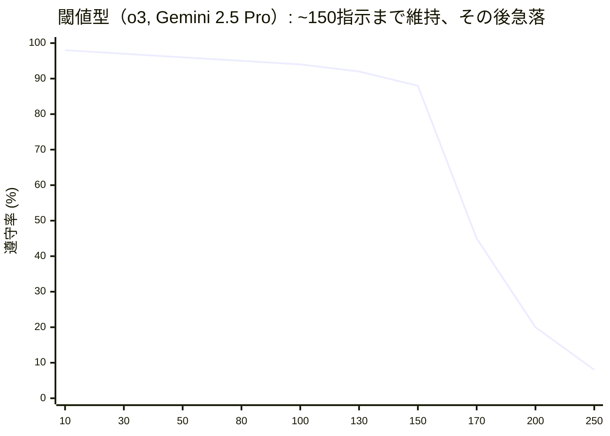
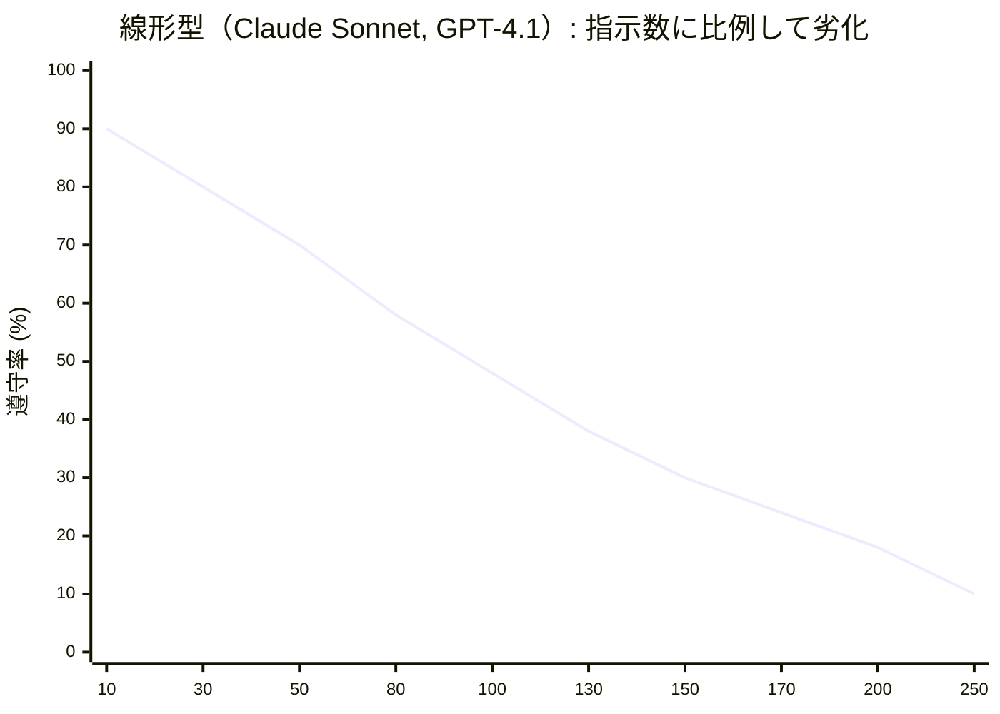
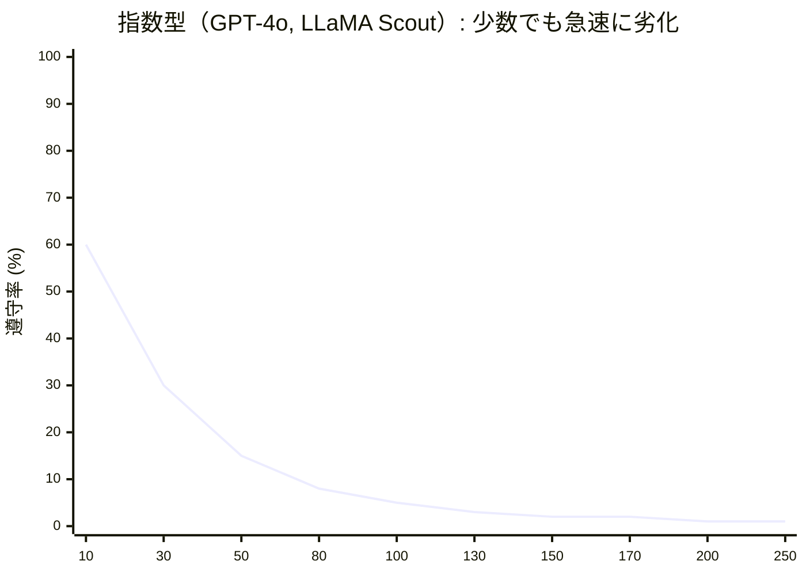

# Priority Saturation（優先度飽和）— 指示が多いと全体の遵守率が低下する

> [!NOTE]
> **一言で言うと**: LLM に同時に与える指示が増えるほど、個々の指示への遵守率が低下する。
> 「全てが重要」は「何も重要でない」と同義。
> これが CLAUDE.md の 200 行制限の科学的根拠である。

## Priority Saturation とは何か

Priority Saturation（優先度飽和）とは、LLM に同時に与える指示の数が増えるほど、**個々の指示を遵守する確率が低下する**現象である。

## 定量的な根拠

### IFScale / ManyIFEval ベンチマーク

IFScale は同時指示数を段階的に増やした時の遵守率を、ManyIFEval は指示のトークン量に対する遵守率を測定するベンチマークである。

| モデル             | 10指示での全遵守率 | 劣化パターン                           | 出典                 |
| :----------------- | :----------------- | :------------------------------------- | :------------------- |
| GPT-4o             | **15%**            | 指数型（急速に劣化）                   | IFScale / ManyIFEval |
| Claude 3.5 Sonnet  | **44%**            | 線形型（徐々に劣化）                   | IFScale / ManyIFEval |
| o3, Gemini 2.5 Pro | 高                 | 閾値型（~150指示まで維持、その後急落） | IFScale              |

### 3つの劣化パターン

1. **閾値型**（o3, Gemini 2.5 Pro）: ~150 指示までほぼ完璧、その後急落

2. **線形型**（GPT-4.1, Claude Sonnet 4）: 指示数に比例して徐々に劣化

3. **指数型**（GPT-4o, LLaMA Scout）: 少数の指示でも急速に劣化

### 劣化の臨界点: 約3,000トークン

ManyIFEval は、推論性能が**約 3,000 トークン**の指示量で劣化し始めることを確認した。プロンプトエンジニアリングの技法（Chain-of-Thought 等）でも改善できない根本的な制約である。

## なぜ 200 行なのか

CLAUDE.md の 200 行制限は、この研究知見に基づく設計判断である:

- 200 行 ≈ 約 2,000〜3,000 トークン
- これは ManyIFEval が示した劣化閾値とほぼ一致
- 200 行内に収めることで、約 30〜40 個のアクティブな指示を維持
- 個々の指示の遵守率を実用的なレベルに保つ

## コーディングへの影響

- CLAUDE.md にあらゆるルールを詰め込むと、重要なルール（型安全性、テスト方針）も些細なルール（インデント幅）も同じ確率で無視される
- コードレビューで10個の観点を同時に指示すると、半分以上が見落とされる
- テストの網羅性チェックも、チェック項目が多いほど個々の項目の検証が甘くなる

## Claude Code での対策

| 対策                    | 仕組み               | なぜ効くのか                                       |
| :---------------------- | :------------------- | :------------------------------------------------- |
| **CLAUDE.md 200行制限** | 常駐指示数を制限     | 同時有効指示数を劣化閾値以下に保つ                 |
| **`.claude/rules/`**    | 条件付き注入         | 指示を分散し、同時有効数を削減                     |
| **Skills**              | オンデマンド展開     | タスク固有の指示を必要時のみロード                 |
| **Hooks**               | コンテキスト外の強制 | 機械的に検証可能なルールをコンテキスト予算から除外 |
| **Start Small 原則**    | 失敗観察後に追加     | 不要なルールの蓄積を防ぐ                           |

## 他の構造的問題との関係

Priority Saturation は以下の問題と複合する:

- **Context Rot**: コンテキストが長くなるほど、指示の有効性がさらに低下
- **Lost in the Middle**: 中間に配置された指示は、飽和に加えて位置による無視も受ける
- **Prompt Sensitivity**: 指示数が増えると、個々の指示への注意が薄まり、表現の影響を受けやすくなる
- **Hallucination**: 遵守すべき制約を見落とすことで、不正確な出力が増加

## 参考文献

- Jaroslawicz, D., Whiting, B., Shah, P., & Maamari, K. (2025). "How Many Instructions Can LLMs Follow at Once?" Distyl AI. [arXiv:2507.11538](https://arxiv.org/abs/2507.11538) — IFScale ベンチマーク。10〜500 指示密度での遵守率劣化を測定
- ManyIFEval (2025) — 多数同時指示での遵守率評価。3,000 トークン付近で劣化が顕著になることを示す

---

> **次へ**: [Hallucination](hallucination.md)

> **Discussion**: [#10 Priority Saturation](https://github.com/shuji-bonji/understanding-llm-through-claude-code/discussions/10)
