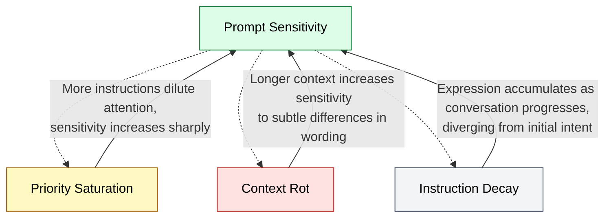

🌐 [日本語](../ja/01-llm-structural-problems/prompt-sensitivity.md)

# Prompt Sensitivity — Same Meaning, Different Results

> [!NOTE]
> **In short**: LLMs generate significantly different outputs for semantically equivalent prompts. Asking the same question with different wording can result in differences of up to 76 percentage points in accuracy. This is not merely instability, but a structural constraint that reveals shallow model understanding.

## What is Prompt Sensitivity?

Prompt Sensitivity is the phenomenon where **LLMs produce substantially different outputs even when given semantically identical prompts, if the wording differs**.

For example:

- "Please refactor this function"
- "Please improve this function"
- "Please clean up this function"

Although these are semantically nearly equivalent, an LLM may generate different outputs for each.

## Why Does It Occur?

### Mathematical Explanation

Analysis using Taylor expansion shows that output differences are determined by:

```
Output Difference ≈ Gradient Norm × Embedding Difference Norm
```

The crucial point: **LLMs do not internally cluster semantically similar inputs**. Even with the same meaning, different token sequences generate different embedding vectors, leading to different outputs.

### Impact of Surface Form

LLMs respond largely to **statistical patterns in tokens** rather than meaning. As a result:

- Imperative vs. interrogative sentences produce different results
- Bullet points vs. free text produce different results
- Technical terminology vs. plain language produce different results

## Quantitative Evidence

- **Up to 76 percentage points difference** between different phrasings of the same question
- This reflects not "instability" but "training on specific expression patterns"

## Impact on Coding

- Rules written ambiguously in CLAUDE.md are less likely to be followed
- Vague Skills descriptions lead to failed automatic invocations
- The quality of generated code varies depending on how users phrase their natural language requests

## Mitigation in Claude Code

| Mitigation Strategy | Mechanism | Why It Works |
| :--- | :--- | :--- |
| **CLAUDE.md writing style** | Concrete, imperative language with code examples | Eliminates ambiguous expressions, improves compliance rate |
| **Skills description design** | Include diverse user natural language expressions | Similar to SEO principles, improves matching accuracy across varied phrasings |
| **Conditional injection via `.claude/rules/`** | Reduces number of simultaneously active instructions | Prevents sensitivity degradation (effect increases with more instructions) |
| **Hooks and tests** | External validation independent of prompt wording | Verifies results regardless of how the prompt is written |

### Writing Effective CLAUDE.md

```markdown
# ❌ Ambiguous (high sensitivity)

- Please write good tests
- I want clean code

# ✅ Concrete (low sensitivity)

- Create Jasmine tests for all public methods
- Place test files in *.spec.ts
- Use describe/it structure in test writing
```

### Writing Effective Skills Descriptions

```yaml
# ❌ Ambiguous (auto-invocation often fails)
description: Component-related tasks

# ✅ Concrete (covers diverse expressions)
description: >
  Create new Angular components. Generate scaffolding with OnPush
  change detection, NgRx Store integration, and Jasmine tests.
  Use for requests like "create a component", "add a new screen", etc.
```

## Relationship to Other Structural Problems

Prompt Sensitivity **bidirectionally amplifies** with other problems.



> [!TIP]
> **Solid arrows (→)**: Direction in which each problem amplifies Prompt Sensitivity / **Dashed arrows (⇢)**: Feedback loops where Prompt Sensitivity worsens each problem

## References

- Zhuo, J., Zhang, S., Fang, X., Duan, H., Lin, D., & Chen, K. (2024). "Assessing and Understanding the Prompt Sensitivity of LLMs." _EMNLP 2024 Findings_. [ACL Anthology](https://aclanthology.org/2024.findings-emnlp.108/) — Mathematical formulation of Prompt Sensitivity using first-order Taylor expansion and Cauchy-Schwarz inequality
- Lu, S., Schuff, H., & Gurevych, I. (2024). "How are Prompts Different in Terms of Sensitivity?" _NAACL 2024_. [ACL Anthology](https://aclanthology.org/2024.naacl-long.325/) — Analysis of the mechanism by which minor prompt changes produce large output differences

---

> **Previous**: [Knowledge Boundary](knowledge-boundary.md)

> **Next**: [Instruction Decay](instruction-decay.md)

> **Discussion**: [#12 Prompt Sensitivity](https://github.com/shuji-bonji/understanding-llm-through-claude-code/discussions/12)
