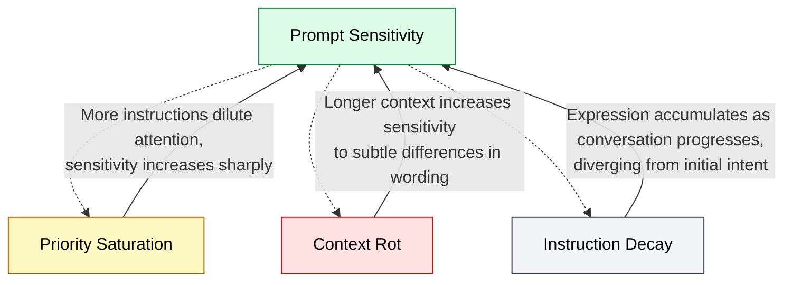

🌐 [日本語](../ja/01-llm-structural-problems/prompt-sensitivity.md)

# Prompt Sensitivity — Same Meaning, Different Results

> [!NOTE]
> **In short**: LLMs generate significantly different outputs for semantically equivalent prompts. Merely changing the few-shot *formatting* has been reported to cause differences of up to 76 percentage points in accuracy (Sclar et al. 2023). This is not merely instability, but a reflection of the model's reliance on statistical token patterns — though the magnitude of the observed difference also depends on the evaluation method (see below).

## What is Prompt Sensitivity?

Prompt Sensitivity is the phenomenon where **LLMs produce substantially different outputs even when given semantically identical prompts, if the wording differs**.

For example:

- "Please refactor this function"
- "Please improve this function"
- "Please clean up this function"

Although these are semantically nearly equivalent, an LLM may generate different outputs for each.

## Why Does It Occur?

### Mathematical Explanation (a conceptual first-order approximation)

The output's sensitivity to a small change in the input can, **conceptually**, be estimated by a first-order approximation (a Taylor expansion with a Cauchy-Schwarz upper bound):

```
Output Difference ≲ Gradient Norm × Embedding Difference Norm
```

> [!NOTE]
> This is not a theorem from any specific paper, but a conceptual heuristic grounded in gradient-based saliency (`saliency = ‖∇(output logit)‖`, Lu et al. 2024). Because Transformers are strongly nonlinear (Attention, FFN), a first-order approximation is only a local indicator of sensitivity, with limited global explanatory power.

The point to note: in embedding space, semantically similar inputs *are* clustered. Sensitivity still arises because **small embedding differences are amplified by downstream nonlinear transformations**. The accurate framing is "the meaning is close, yet the effect on the output distribution can be large."

### Impact of Surface Form

LLMs respond largely to **statistical patterns in tokens** rather than meaning. As a result:

- Imperative vs. interrogative sentences produce different results
- Bullet points vs. free text produce different results
- Technical terminology vs. plain language produce different results

## Quantitative Evidence

- Merely changing the few-shot **formatting** (surface-level, spurious features such as separators, symbols, and casing) produces a difference of **up to 76 accuracy points** on LLaMA-2-13B (Sclar et al. 2023)
- Note that this "76 points" is a difference due to **formatting changes**, not semantically equivalent paraphrases. Treat it as distinct from sensitivity to meaning-preserving rephrasing
- The magnitude of sensitivity **varies greatly by task, model, and evaluation method**

> [!NOTE]
> A substantial part of the observed sensitivity is an artifact of brittle evaluation metrics (log-likelihood scoring and rigid answer matching overlooking semantically correct answers expressed through alternative phrasings); under appropriate evaluation design, modern LLMs are more robust than previously reported (Hua et al. 2025). So do not over-generalize "prompt sensitivity is an inevitable structural constraint of the Transformer." The effect is real, but **the observed magnitude depends on the evaluation method**. The practical implication (ambiguous instructions are unstable) is unchanged, but the numbers must be read together with the benchmark setup.

## Underspecification — When an Axis Is Left Unstated, the Prior Takes Over {#underspecification}

A twin problem of Prompt Sensitivity is **Underspecification**. If Prompt Sensitivity is "changing the **wording** of an already-specified prompt changes the output," Underspecification is "leaving an axis **unstated entirely** lets the model fill it from its prior distribution." Underspecification is the limiting case of sensitivity — for an axis with zero specification, the output is decided not by reasoning but by the most frequent pattern in the training data.

> [!NOTE]
> Framing Underspecification as a twin / limiting case of Prompt Sensitivity, and the connection to the sister site below, is this site's own framing (none of the individual cited papers claim this correspondence).

### Why the Model Cannot Decide on Its Own

An LLM's output is a sample from the conditional probability distribution `P(output | token sequence)`. The prompt is merely the token sequence that **conditions** that distribution.

- If the prompt specifies an axis (role, output format, success criteria, etc.), the distribution is sharply narrowed along that axis.
- If it does not, the conditioning on that axis stays weak, and the model **fills it by sampling from its prior — the pattern most frequent in the training data**.

So the model does not "fail to decide." It **mechanically fills the unspecified axis from a statistical prior rather than by reasoning**. Because that prior shifts with context and token sequence, the same request gets filled differently across sessions — and that is exactly the source of nondeterminism (the parts that drift each time).

> [!IMPORTANT]
> When we say "without a stated role, the model cannot decide which perspective to answer from," strictly speaking it **is not deciding**. It is merely filling a weakly-specified axis with the mode of its prior. So the remedy is not "get the model to decide well" but **to explicitly specify the axes you do not want to vary, sharpening the conditioning**.

| Request | Unspecified axis | What the model fills from its prior |
| :--- | :--- | :--- |
| "Write tests" | Test framework | Whatever is most frequent in training data (Jest, etc., depending on the project) |
| "Document this function" | Output format (JSDoc / Markdown / comments) | The most frequent style per language |
| "Review this" | Lens (bugs / design / style) and strictness | A generic, "safe" lens |

### Connection to the Sister Site

The sister site ai-agent-architecture organizes the **seven conditions** of a well-formed prompt (Role, Premise, Objective, Input, Process/Constraints, Output Format, Examples) as "independent axes along which output can vary." This section carries the **why** behind it — the principle by which weakly-specified axes get filled from the prior. For the design decision to externalize each axis into a layer instead of re-filling it in every prompt, see there.

- [ai-agent-architecture / Prompt Decomposition](https://shuji-bonji.github.io/ai-agent-architecture/concepts/09-prompt-decomposition) — externalizing the seven conditions into five layers (What / How)

## Impact on Coding

- Rules written ambiguously in CLAUDE.md are less likely to be followed
- Vague Skills descriptions lead to failed automatic invocations
- The quality of generated code varies depending on how users phrase their natural language requests

## Mitigation in Claude Code

The following are representative examples in Claude Code.

| Mitigation Strategy | Mechanism | Why It Works |
| :--- | :--- | :--- |
| **CLAUDE.md writing style** | Concrete, imperative language with code examples | Eliminates ambiguous expressions, improves compliance rate |
| **Skills description design** | Include diverse user natural language expressions | Similar to SEO principles, improves matching accuracy across varied phrasings |
| **Conditional injection via `.claude/rules/`** | Reduces number of simultaneously active instructions | Prevents sensitivity degradation (effect increases with more instructions) |
| **Hooks and tests** | External validation independent of prompt wording | Verifies results regardless of how the prompt is written |
| **Plugins / Marketplaces** | Distribute verified prompts as installable packages | See [Appendix: Plugins & Marketplaces](../appendix/plugins-and-marketplaces.md) — team-wide calibration instead of per-engineer trial and error |

### Writing Effective CLAUDE.md

```markdown
# Bad example — Ambiguous (high sensitivity)

- Please write good tests
- I want clean code

# Good example — Concrete (low sensitivity)

- Create Jasmine tests for all public methods
- Place test files in *.spec.ts
- Use describe/it structure in test writing
```

### Writing Effective Skills Descriptions

```yaml
# Bad example — Ambiguous (auto-invocation often fails)
description: Component-related tasks

# Good example — Concrete (covers diverse expressions)
description: >
  Create new Angular components. Generate scaffolding with OnPush
  change detection, NgRx Store integration, and Jasmine tests.
  Use for requests like "create a component", "add a new screen", etc.
```

## Relationship to Other Structural Problems

Prompt Sensitivity **bidirectionally amplifies** with other problems.


```mermaid
flowchart TD
    PS["Prompt Sensitivity"]
    PSat["Priority Saturation"]
    CR["Context Rot"]
    ID["Instruction Decay"]

    PSat -->|"More instructions dilute attention,<br>sensitivity increases sharply"| PS
    CR -->|"Longer context increases sensitivity<br>to subtle differences in wording"| PS
    ID -->|"Expression accumulates as conversation progresses,<br>diverging from initial intent"| PS

    %% Feedback loops (downward spiral)
    PS -.-> PSat
    PS -.-> CR
    PS -.-> ID

    style PS fill:#dcfce7,stroke:#15803d,color:#000
    style PSat fill:#fef9c3,stroke:#a16207,color:#000
    style CR fill:#fee2e2,stroke:#b91c1c,color:#000
    style ID fill:#f3f4f6,stroke:#374151,color:#000
```

> [!TIP]
> **Solid arrows (→)**: Direction in which each problem amplifies Prompt Sensitivity / **Dashed arrows (⇢)**: Feedback loops where Prompt Sensitivity worsens each problem

## This constraint is not unique to Claude

Even when the meaning is the same, wording and format change the output. Models depend on statistical patterns in tokens, so this occurs regardless of product.

How it shows up elsewhere:

- "Refactor this" and "improve this" change the scope of the edit
- If the output format is unspecified, it differs from session to session
- Make axes you do not want to vary (role, success criteria, output format) explicit
- Put verification outside the prompt

Other tools do not necessarily ship features at the same granularity. Product-independent principles are extracted in [Part 11: Cross-LLM Principles](../11-cross-llm-principles/index.md).

## References

- Sclar, M., Choi, Y., Tsvetkov, Y., & Suhr, A. (2023). "Quantifying Language Models' Sensitivity to Spurious Features in Prompt Design." _arXiv:2310.11324_. [arXiv](https://arxiv.org/abs/2310.11324) — Up to 76 accuracy points on LLaMA-2-13B from few-shot formatting (spurious feature) changes. The source of this page's "76 points"
- Zhuo, J., Zhang, S., Fang, X., Duan, H., Lin, D., & Chen, K. (2024). "ProSA: Assessing and Understanding the Prompt Sensitivity of LLMs." _EMNLP 2024 Findings_. [ACL Anthology](https://aclanthology.org/2024.findings-emnlp.108/) — Empirical sensitivity assessment via PromptSensiScore (PSS) and decoding confidence (no Taylor-expansion formulation appears in this paper)
- Lu, S., Schuff, H., & Gurevych, I. (2024). "How are Prompts Different in Terms of Sensitivity?" _NAACL 2024_. [ACL Anthology](https://aclanthology.org/2024.naacl-long.325/) — Analyzes prompt sensitivity via gradient-based saliency (`‖∇output‖`). The grounding for this page's first-order approximation
- Hua, A., Tang, K., Gu, C., Gu, J., Wong, E., & Qin, Y. (2025). "Flaw or Artifact? Rethinking Prompt Sensitivity in Evaluating LLMs." _EMNLP 2025_. [arXiv](https://arxiv.org/abs/2509.01790) — A substantial part of observed sensitivity is an artifact of brittle evaluation metrics; under proper evaluation design, LLMs are more robust than reported

---

> **Previous**: [Knowledge Boundary](knowledge-boundary.md)

> **Next**: [Instruction Decay](instruction-decay.md)

> **Discussion**: [#12 Prompt Sensitivity](https://github.com/shuji-bonji/understanding-llm-through-claude-code/discussions/12)
