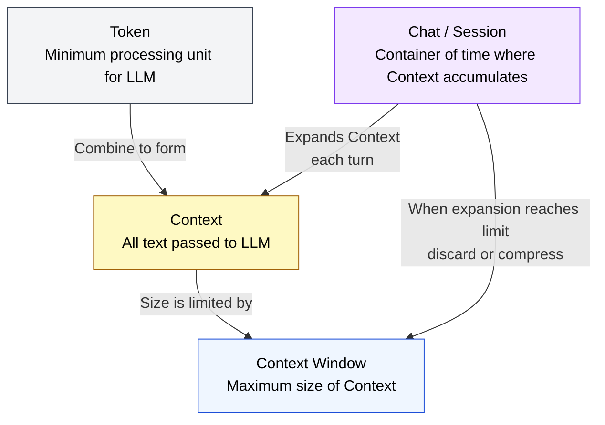
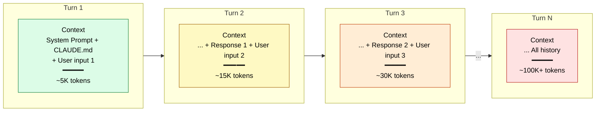
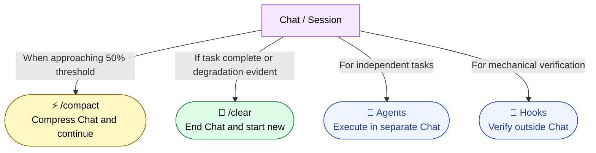

🌐 [日本語](../ja/02-context-window/chat-session.md)

# Chat / Session — The "Container of Time" Where Context Accumulates

> [!NOTE]
> **In a nutshell**: Chat (conversation / session) is a "container" in which Context accumulates and expands over time.
> If Token, Context, and Context Window represent "space," then Chat represents "time."
> By understanding this container, we can physically explain "why Context expands" and "why Instruction Decay occurs."

## What is Chat?

Chat (chat / session / conversation) is **a collection of a series of exchanges (turns) between a user and an LLM**.

ChatGPT's "chat," Claude.ai's "conversation," Claude Code's "session" — the names differ, but the essence is the same. **Context accumulates within a single Chat.**

```
Chat (Session)
├── Turn 1: User input + LLM response
├── Turn 2: User input + LLM response
├── Turn 3: User input + LLM response
│     ↑ All history up to this point is passed as Context each time
└── ...
```

## Relationship Between Four Core Concepts

Token, Context, and Context Window are static concepts at a given moment. By adding Chat, we can explain **changes over time**.



| Concept            | Nature                      | Developer Analogy      |
| :----------------- | :-------------------------- | :---------------------- |
| **Token**          | Minimum unit of space       | Memory byte             |
| **Context**        | Complete input at a moment  | HTTP request body       |
| **Context Window** | Space limit                 | Process memory space    |
| **Chat / Session** | Container of time           | TCP connection          |

> [!TIP]
> **Developer analogy**: Chat is similar to a TCP connection. Multiple requests (turns) are exchanged within the connection, and state (Context) accumulates. When you close the connection (`/clear`), the state resets.

## What Happens Within a Chat?

### Context Expansion per Turn

The LLM is stateless. It doesn't "remember" — instead, **each turn it reads the entire history from the beginning as Context**.



### Context Expansion Triggers Structural Problems

As Chat grows longer (more turns), the structural problems learned in Part 1 emerge in sequence.

| Chat Stage       | Context State          | Emerging Problems                         |
| :--------------- | :--------------------- | :---------------------------------------- |
| Early (~30%)     | Small and stable       | Almost no issues                          |
| Middle (30-50%)  | Expansion underway     | Context Rot begins                        |
| Late (50-70%)    | Middle section fades   | Lost in the Middle, Priority Saturation   |
| Final (70%+)     | Approaching limit      | Increased Hallucination, worse Sycophancy |
| Throughout       | Complex over time axis | **Instruction Decay** (culmination)       |

> [!IMPORTANT]
> **Chat is the physical cause of Instruction Decay.** In Part 1, we learned "39% average performance degradation in multi-turn," but that "multi-turn" is precisely the accumulation of turns within a single Chat.

## The Idea of "Managing" Chat

Once you understand Chat, Claude Code's countermeasures become visible as "Chat management strategies."

| Countermeasure | Operation on Chat                              |
| :------------- | :--------------------------------------------- |
| **`/compact`** | Compress the content within Chat (replace history with summary) |
| **`/clear`**   | End Chat and start a new one                   |
| **Agents**     | Execute in a separate Chat from the main one   |
| **Hooks**      | Execute outside Chat (without going through LLM) |
| **CLAUDE.md**  | "Initial Context" automatically injected at the beginning of each Chat |



## Design Principle for Chat

```
Principle: 1 Chat = 1 Task

The basic strategy is to keep Chat "as short as possible."
A long Chat means Context expansion,
and Context expansion means emergence of structural problems.
```

This principle is covered in detail in Part 8 (session management).

---

> **Previous**: [Token, Context, Context Window](token-context-basics.md)

> **Next**: [What is the Context Window — What the LLM "Sees"](what-llm-sees.md)
