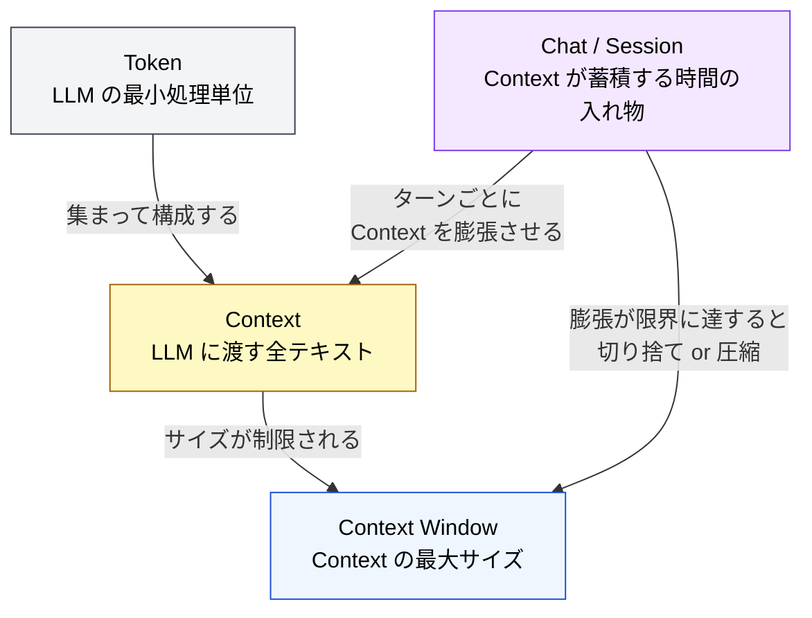
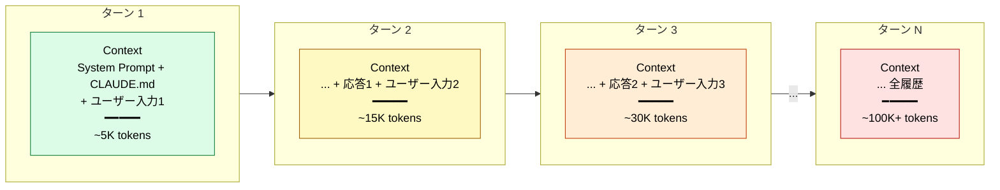
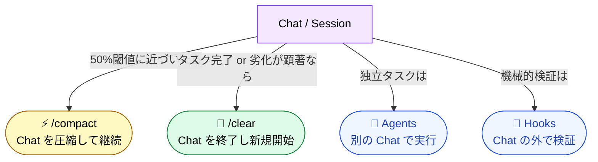

# Chat / Session — Context が蓄積する「時間の入れ物」

> [!NOTE]
> **一言で言うと**: Chat（会話 / セッション）は、Context が時間とともに蓄積・膨張する「入れ物」である。
> Token・Context・Context Window が「空間」の概念なら、Chat は「時間」の概念。
> この入れ物を理解することで、「なぜ Context が膨らむのか」「なぜ Instruction Decay が起きるのか」が物理的に説明できる。

## Chat とは何か

Chat（チャット / セッション / 会話）とは、**ユーザーと LLM の間で行われる一連のやり取り（ターン）の集合**のこと。

ChatGPT の「チャット」、Claude.ai の「会話」、Claude Code の「セッション」—— 呼び方は違うが、本質は同じである。**1つの Chat の中で Context が蓄積していく**。

```
Chat（セッション）
├── ターン 1: ユーザー入力 + LLM 応答
├── ターン 2: ユーザー入力 + LLM 応答
├── ターン 3: ユーザー入力 + LLM 応答
│     ↑ ここまでの全履歴が Context として毎回渡される
└── ...
```

## 4つの基礎概念の関係

Token・Context・Context Window は「ある瞬間」の静的な概念である。Chat を加えることで、**時間軸での変化**が説明できるようになる。



| 概念               | 性質               | 開発者向けの比喩      |
| :----------------- | :----------------- | :-------------------- |
| **Token**          | 空間の最小単位     | メモリのバイト        |
| **Context**        | ある瞬間の入力全体 | HTTP リクエストボディ |
| **Context Window** | 空間の上限         | プロセスのメモリ空間  |
| **Chat / Session** | 時間の入れ物       | TCP コネクション      |

> [!TIP]
> **開発者向けの比喩**: Chat は TCP コネクションに近い。コネクションの中で複数のリクエスト（ターン）がやり取りされ、状態（Context）が蓄積していく。コネクションを閉じる（`/clear`）と状態はリセットされる。

## Chat の中で何が起きているか

### ターンごとの Context 膨張

LLM はステートレスである。「覚えている」のではなく、**毎ターン、全履歴を含む Context を最初から読み直す**。



### Context 膨張が構造的問題を引き起こす

Chat が長くなる（＝ターンが増える）ほど、Part 1 で学んだ構造的問題が順に発現する。

| Chat の段階    | Context の状態 | 発現する問題                            |
| :------------- | :------------- | :-------------------------------------- |
| 序盤（~30%）   | 小さく安定     | ほぼ問題なし                            |
| 中盤（30-50%） | 膨張が進行     | Context Rot が始まる                    |
| 後半（50-70%） | 中間部が死角に | Lost in the Middle、Priority Saturation |
| 終盤（70%+）   | 限界に接近     | Hallucination 増加、Sycophancy 悪化     |
| 全体を通して   | 時間軸で複合   | **Instruction Decay**（全問題の集大成） |

> [!IMPORTANT]
> **Chat こそが Instruction Decay の物理的原因である。** Part 1 で「マルチターンで平均 39% 性能低下」と学んだが、その「マルチターン」とは「1つの Chat の中でターンが蓄積すること」に他ならない。

## Chat を「管理する」という発想

Chat を理解すると、Claude Code の対策が「Chat の管理戦略」であることが見える。

| 対策           | Chat に対する操作                              |
| :------------- | :--------------------------------------------- |
| **`/compact`** | Chat の中身を圧縮する（履歴を要約に置換）      |
| **`/clear`**   | Chat を終了し、新しい Chat を開始する          |
| **Agents**     | メインの Chat とは別の Chat で実行する         |
| **Hooks**      | Chat の外で実行する（LLM を経由しない）        |
| **CLAUDE.md**  | 毎 Chat の冒頭に自動注入される「初期 Context」 |



## Chat の設計原則

```
原則: 1 Chat = 1 タスク

Chat は「できるだけ短く」が基本戦略。
長い Chat は Context の膨張を意味し、
Context の膨張は構造的問題の発現を意味する。
```

この原則は Part 8（セッション管理）で詳しく扱う。

---

> **前へ**: [Token・Context・Context Window](token-context-basics.md)

> **次へ**: [コンテキストウィンドウとは何か — LLM が「見る」もの](what-llm-sees.md)
