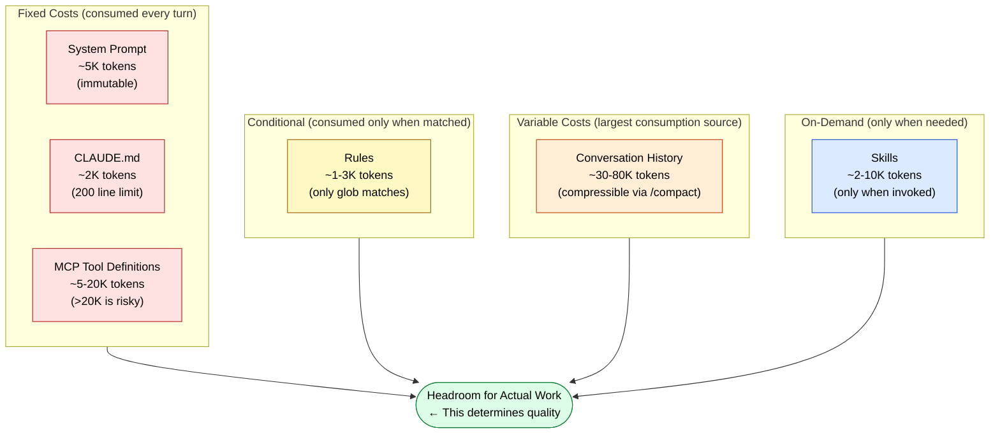

🌐 [日本語](../ja/02-context-window/context-budget.md)

# Context Budget: Thinking in Terms of Token Allocation

> [!NOTE]
> How to allocate tokens in the context window and what to spend them on.
> This "budget" concept becomes the quantitative basis for all design decisions in Parts 3–7.
>
> ※ This page explains using the typical 200K token context window for Claude Code as a reference. While Claude 4.6 has been extended to 1M tokens, the principles of budget management remain the same.

## Why Think in Terms of "Budget"?

The context window is a finite resource. While 200K tokens might seem large, as we learned in Part 1:

- **Context Rot**: Degradation already begins around 50K tokens
- **Lost in the Middle**: The U-shaped curve breaks down when usage exceeds 50%
- **Priority Saturation**: Compliance rates decline at ~3,000 tokens of instructions

In other words, using all 200K tokens is not the intended design. **The effective context budget is 100K or less**, and how to allocate within that becomes the key to good system design.

## Typical Context Budget Allocation



## Budget Allocation Principles

### Minimize Fixed Costs

Resident context (System Prompt + CLAUDE.md + MCP definitions) is "fixed cost"—consumed every turn.

| Item | Estimate | Management |
| :--- | :--- | :--- |
| System Prompt | ~5K | Immutable |
| CLAUDE.md | ~2K (200 lines) | Strictly enforce 200-line limit |
| MCP Tool Definitions | ~5-20K | Remove unused MCPs. Tool Search auto-enables above 20K |

### Control Variable Costs

Conversation history is the largest "variable cost." Left unchecked, it consumes most of the context.

- Preventively compress with `/compact` (run before hitting 50% usage)
- Split sessions with `/clear` (reset per task)

### Context Increase Triggers

In budget management, it's crucial to understand **what causes context to grow**. Below is a list of context increase triggers:

| Type | Trigger | Injection Timing | Consumption Pattern |
|:--|:--|:--|:--|
| System Prompt | Session start | Automatic | Fixed per turn |
| CLAUDE.md | Session start | Automatic | Fixed per turn |
| MCP Tool Definitions | MCP server connection | Automatic | Fixed per turn |
| Rules | Workspace file matches glob pattern | Automatic (conditional) | Consumed only when matched |
| Skills | User invokes with `/` | Manual | Temporary, consumed on invocation |
| Skills (auto) | LLM judges semantic similarity to description | LLM decision | Temporary, consumed on judgment |
| Conversation History | User input + LLM response accumulation | Automatic (cumulative) | Increases per turn |
| Tool Execution Results | MCP tool responses | Automatic | Added with each execution |
| File Reads | LLM references files via Read/Grep etc. | LLM decision | Added with each reference |

> [!TIP]
> "Automatic" triggers become fixed costs in your budget, while "manual," "LLM decision," and "conditional" triggers are variable costs. The core strategy of budget management is to minimize fixed costs and control variable costs.

## Budget Impact of MCP Tool Definitions

When you connect an MCP server, tool definitions (names, parameter schemas, descriptions) are consumed **every turn**.

```
If MCP is 25K tokens:
  200K - 5K(System) - 2K(CLAUDE.md) - 25K(MCP) = 168K
  → Apply 50% rule: effective 84K
  → Subtract conversation history 50K: remaining 34K (for actual work)

If MCP is 50K tokens:
  200K - 5K - 2K - 50K = 143K
  → Apply 50% rule: effective 71.5K
  → Subtract conversation history 50K: remaining 21.5K (quite tight)
```

## Connection to Parts 3–7

This budget concept provides the quantitative basis for design decisions in the following parts.

| Part | Budget Impact | Design Decision |
| :--- | :--- | :--- |
| Part 3 (CLAUDE.md) | Fixed cost ~2K | Minimize fixed costs with 200-line limit |
| Part 4 (Rules) | Conditional ~1-3K | Add only when needed via glob matching |
| Part 5 (Skills/Agents) | On-demand / separate budget | Skills are temporary; Agents use separate context |
| Part 6 (MCP) | Fixed cost ~5-20K | Limit tool count; lazy-load via Tool Search |
| Part 7 (Hooks) | **Zero budget** | Execute outside context. Most budget-efficient |

---

> **Previous**: [Injection Timing Overview](injection-timing.md)

> **Next**: [Part 3: Resident Context](../03-always-loaded-context/index.md)
