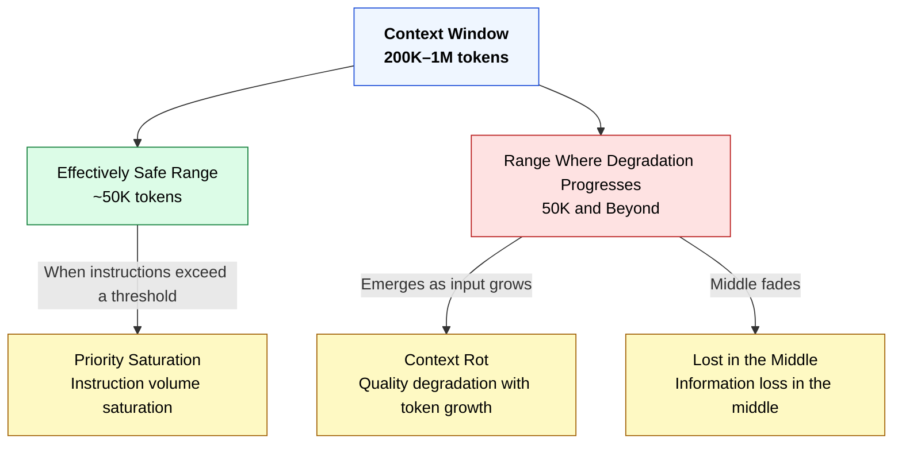

🌐 [日本語](../ja/02-context-window/context-window.md)

# Context Window — Capacity and the Safe Range

> [!NOTE]
> **In a nutshell**: A context window is the maximum Context an LLM can process at once. The unit is tokens.
> You should not use the full capacity. Quality still falls as input grows, even when room remains.

## What Is a Context Window?

A **Context Window** is the maximum size of Context an LLM can process in one pass.

| Model | Context Window Size |
| :-- | :-- |
| Claude Sonnet 4.6 / Opus 4.6 | 1M tokens (200K+ may be at standard rate) |
| Claude Sonnet 4 / Opus 4 | 200K tokens |
| GPT-4o | 128K tokens |
| Gemini 2.5 Pro | 1M tokens |

Numbers change by model and time. What matters for design is less the exact figure than the fact that the bound is finite—and finite across products.

> [!TIP]
> **Developer analogy**: A context window is like memory allocated to a process. Exceeding it is like OOM: tokens are truncated.

## Why It Matters

Limits differ by model. Using the full limit is still a mistake.

Even with spare capacity, longer input lowers output quality. A context window is not "how much you may use," but "of that capacity, only a smaller range keeps quality."

Keeping resident instructions short, loading rules only when needed, and splitting work across sessions are all responses to this constraint.

## Bigger Is Not Safer

This is the critical point and the bridge to Part 1.

Do not treat the window as usable to the brim. Only part of the capacity sustains quality. Expanding to 1M does not change that principle. Quantitative allocation is covered in [Context Budget](context-budget.md).

## Connection to Part 1

- **Context Rot**: Quality falls as tokens grow. A large window does not prevent degradation from long input.
- **Lost in the Middle**: Middle content is less likely to be used. Longer Context widens the blind spot.
- **Priority Saturation**: More simultaneous instructions lower compliance. A thick always-on block invites this.

## Representative Example: Claude Code and the Context Window

The table below is a **representative example** in Claude Code. Other tools may not have the same files or commands. What transfers is the *role*, not the name.

| Claude Code Feature | Strategy Toward the Context Window |
| :-- | :-- |
| CLAUDE.md size limit | Keep resident Context minimal |
| `.claude/rules/` | Inject only when a condition matches |
| Skills | Consume Context only when needed |
| Agents | Run in a separate Context Window |
| `/compact` | Compress Context to reclaim space |
| `/clear` | Reset Context |
| Hooks | Consume zero Context |

Product-independent principles are extracted in [Part 11](../11-cross-llm-principles/index.md).

## How the Three Concepts Relate

| Concept | In One Word | Developer Analogy |
| :-- | :-- | :-- |
| **Token** | Processing unit | Memory byte |
| **Context** | Full input to the model | HTTP request body |
| **Context Window** | Input size limit | Process memory space |

Token is the unit, Context is the content, Context Window is the ceiling. Design mainly controls what goes into Context and how long it is.

## Before Moving On

With the ceiling and the safe range in place, the next topic is how Context grows over time. [Chat / Session](chat-session.md) is that container of time.

---

> **Previous**: [Context — Everything Passed in One Inference](context.md)

> **Next**: [Chat / Session — The Container of Time Where Context Accumulates](chat-session.md)
