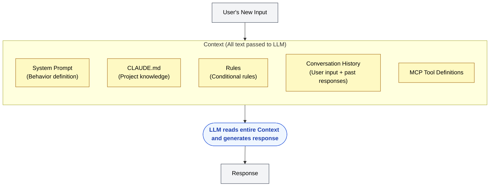
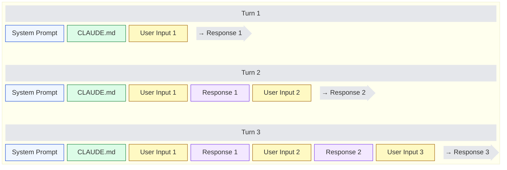

🌐 [日本語](../ja/02-context-window/context.md)

# Context — Everything Passed in One Inference

> [!NOTE]
> **In a nutshell**: Context is all information passed to an LLM for a single inference.
> The model does not keep prior turns internally. It reads only the Context it is given.

## What Is Context?

Context is **all the text an LLM uses to generate one response**. It includes system instructions, project rules, conversation history, tool definitions, and tool results.

As a developer, you might map it as follows.

| Analogy | What Corresponds to Context |
| :-- | :-- |
| Function call | All data passed as arguments |
| HTTP request | The entire request body |
| Compilation | All source files passed to the compiler |

## Why It Matters

LLMs are **stateless**. They do not "remember" past conversations. The application repacks the full history into Context on every turn, and the model reads that pack to respond.

What you put in and what you leave out is a design choice. As history grows, Context expands. That is the physical cause of [Context Rot](../01-llm-structural-problems/context-rot.md) and [Instruction Decay](../01-llm-structural-problems/instruction-decay.md) from Part 1.

## What Can Enter Context

Using Claude Code as a representative example, one inference's Context may include the following.

Other tools may not use the same file names. What is shared is the distinction among always-loaded information, conditionally loaded information, and history that accumulates over turns.

## What "Stateless" Means

If you know REST APIs, this is intuitive. Generating a response is like an HTTP request: **each call is independent**.

The model does not remember past turns; it rereads the full history each time. As turns accumulate, Context grows.

Memory that must survive across sessions belongs outside Context—in files, for example. If it is not passed in, it does not exist for the next inference.

## Connection to Part 1

- **Context Rot**: Quality degrades as input tokens grow. Longer Context makes this more likely.
- **Instruction Decay**: Compliance with early instructions falls in long conversations. History growth acts over time.

The response pattern is shared: select what to load, cut or compress when it grows long, and persist important decisions in files.

## Before Moving On

Context is the *content*. Next, the Context Window is the *upper bound* on that content. Using the full bound is not safe.

---

> **Previous**: [Token — The LLM's Processing Unit](token.md)

> **Next**: [Context Window — Capacity and the Safe Range](context-window.md)
