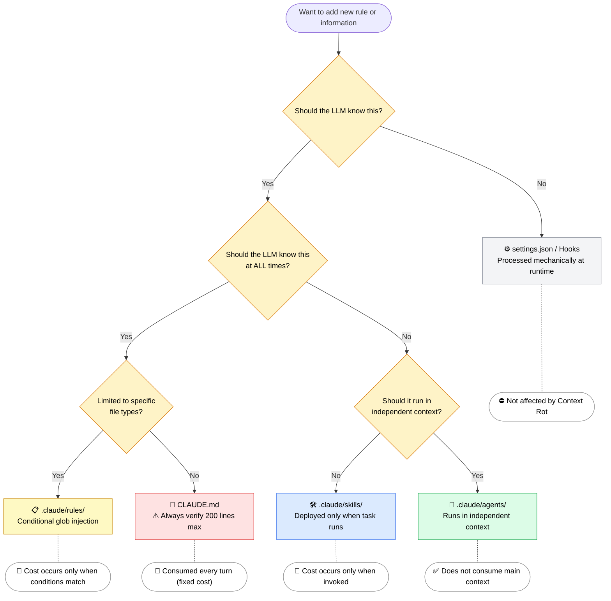

🌐 [日本語](../ja/02-context-window/injection-timing.md)

# Injection Timing Overview

> [!NOTE]
> Each configuration file has a defined "when" and "how" it gets injected into the LLM's context window.
> Understanding this mechanism reveals principles that apply to other LLM tools (Cursor, Cline, Copilot, etc.).

## Injection Timing Inventory

| Layer              | Target           | Injection Timing           | Context Consumption                  |
| :----------------- | :--------------- | :------------------------- | :----------------------------------- |
| **Resident**       | System Prompt    | Session start              | Always (every turn)                  |
| **Resident**       | CLAUDE.md        | Session start              | Always (every turn)                  |
| **Conditional**    | `.claude/rules/` | Glob pattern match         | Only when conditions match           |
| **On-Demand**      | Skills           | User call or LLM decision  | Only when invoked                    |
| **On-Demand**      | Agents           | Agent() tool invocation    | **Separate context** (no main consumption) |
| **Tool Definition**| MCP Tools        | Session start              | Always (as tool definitions)         |
| **Accumulated**    | Conversation history | Added each turn          | Cumulative (compressible via /compact) |
| **Outside Context**| settings.json    | -                          | None                                 |
| **Outside Context**| Hooks            | -                          | None (except Prompt Hook)            |

## Four Injection Patterns

### 1. Resident Injection (Always Loaded)

Loaded at session start and **consumed every turn**.

```
Session start → Inject System Prompt + CLAUDE.md
Turn 1: [System Prompt][CLAUDE.md][User Input 1]
Turn 2: [System Prompt][CLAUDE.md][User Input 1][Response 1][User Input 2]
...
```

Because it's always resident, the impact on context budget is largest. → This is the basis for the 200-line limit in CLAUDE.md

### 2. Conditional Injection

Injected only when specific conditions (glob pattern match) are met.

```
Edit *.component.ts → component-rules are injected
Edit *.spec.ts → testing-rules are injected
Edit *.cs → the above rules are not injected
```

→ Countermeasure for Priority Saturation. Inject needed rules only when needed.

### 3. On-Demand Injection

Injected via user invocation or LLM's automatic decision.

Skills are **deployed within the main context** (equivalent to import).
Agents **execute in independent context** (equivalent to separate process).

### 4. Outside Context (Runtime Layer)

Never enters the LLM's context window. Claude Code's runtime handles it.

settings.json → Permission control, environment variables
Hooks → Execute shell commands on lifecycle events

## Design Decision Flowchart

When adding new rules or information, decide in the following order.



---

> **Previous**: [What the LLM Sees in the Context Window](what-llm-sees.md)

> **Next**: [Context Budget as a Concept](context-budget.md)
