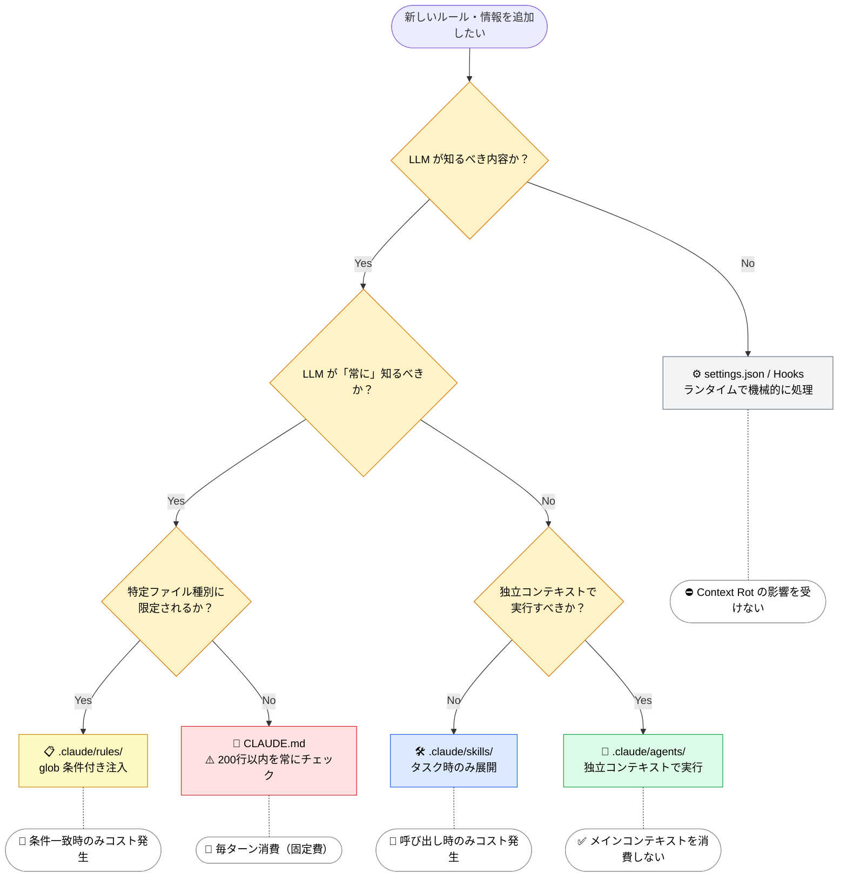

# 注入タイミングの全体像

> [!NOTE]
> 各設定ファイルは「いつ」「どのように」LLM のコンテキストウィンドウに注入されるかが決まっている。
> この仕組みを理解することで、他の LLM ツール（Cursor、Cline、Copilot 等）にも応用できる原理が見えてくる。

## 注入タイミング一覧

| レイヤー           | 対象             | 注入タイミング             | コンテキスト消費                         |
| :----------------- | :--------------- | :------------------------- | :--------------------------------------- |
| **常駐**           | System Prompt    | セッション開始時           | 常時（毎ターン）                         |
| **常駐**           | CLAUDE.md        | セッション開始時           | 常時（毎ターン）                         |
| **条件付き**       | `.claude/rules/` | glob パターン一致時        | 条件一致時のみ                           |
| **オンデマンド**   | Skills           | ユーザー呼出 or LLM 判断時 | 呼び出し時のみ                           |
| **オンデマンド**   | Agents           | Agent() ツール呼び出し時   | **別コンテキスト**（メインを消費しない） |
| **ツール定義**     | MCP Tools        | セッション開始時           | 常時（ツール定義として）                 |
| **蓄積**           | 会話履歴         | 毎ターン追加               | 累積（/compact で圧縮可能）              |
| **コンテキスト外** | settings.json    | -                          | なし                                     |
| **コンテキスト外** | Hooks            | -                          | なし（Prompt Hook を除く）               |

## 注入の4つのパターン

### 1. 常駐注入（Always Loaded）

セッション開始時に読み込まれ、**毎ターン消費し続ける**。

```
セッション開始 → System Prompt + CLAUDE.md を注入
ターン1: [System Prompt][CLAUDE.md][ユーザー入力1]
ターン2: [System Prompt][CLAUDE.md][ユーザー入力1][応答1][ユーザー入力2]
...
```

常駐するため、コンテキスト予算への影響が最も大きい。→ CLAUDE.md の 200 行制限の根拠

### 2. 条件付き注入（Conditional）

特定の条件（glob パターン一致）を満たした時だけ注入される。

```
*.component.ts を編集 → component-rules が注入される
*.spec.ts を編集 → testing-rules が注入される
*.cs を編集 → 上記のルールは注入されない
```

→ Priority Saturation 対策。必要な時だけ必要なルールを注入。

### 3. オンデマンド注入（On-Demand）

ユーザーの呼び出し、または LLM の自動判断で注入される。

Skills は**メインコンテキスト内**に展開される（import に相当）。
Agents は**独立したコンテキスト**で実行される（別プロセスに相当）。

### 4. コンテキスト外（Runtime Layer）

LLM のコンテキストウィンドウに一切入らない。Claude Code のランタイムが処理する。

settings.json → 権限制御、環境変数
Hooks → ライフサイクルイベントでシェルコマンド実行

## 設計判断のフローチャート

新しいルールや情報を追加する時、以下の順で判断する。



---

> **前へ**: [コンテキストウィンドウとは何か](what-llm-sees.md)

> **次へ**: [コンテキスト予算という考え方](context-budget.md)
