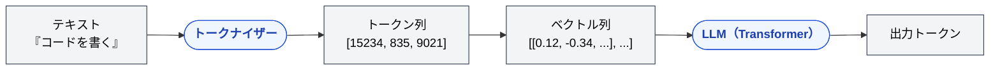
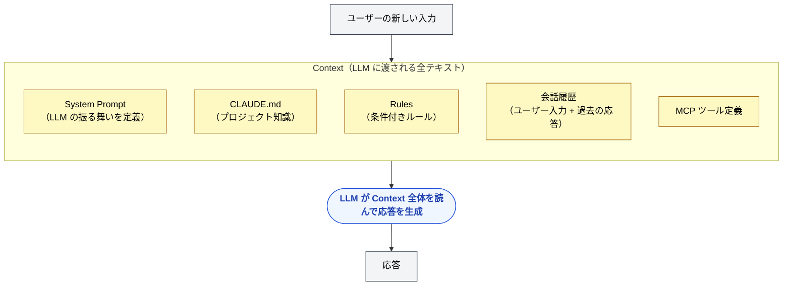
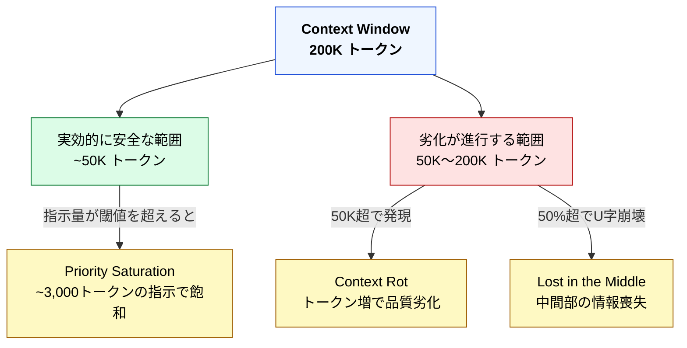
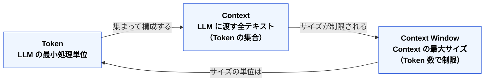

# Token・Context・Context Window — 3つの基礎概念

> [!NOTE]
> このページは Part 2 の出発点であり、本リポジトリ全体の前提知識となる。
> Part 1 の構造的問題も、Part 3 以降の設計判断も、この3概念の理解なしには「なぜ」が見えない。

## Token — LLM の「文字」

### Token とは何か

LLM はテキストを「文字」単位でも「単語」単位でもなく、**Token**（トークン）という独自の単位で処理する。

```
入力テキスト:  "Claude Code でコードを書く"
                ↓ トークナイザーが分割
トークン列:    ["Claude", " Code", " で", "コード", "を", "書", "く"]
```

英語は概ね「1単語 ≈ 1〜1.3 トークン」、日本語は「1文字 ≈ 1〜3 トークン」になる。同じ内容でも日本語の方がトークン消費が多い。

### なぜ Token 単位なのか

LLM の内部は**数値ベクトルの演算**で動いている。テキストを直接は処理できないため、テキスト → トークン（整数 ID） → ベクトルに変換する必要がある。



このパイプライン全体を「トークン」という単位が貫いている。だから LLM の能力も制約も、全てトークン単位で語られる。

### Token の実感を掴む

| 目安                            | トークン数                            |
| :------------------------------ | :------------------------------------ |
| 英語 1 単語                     | ~1 トークン                           |
| 日本語 1 文字                   | ~1〜3 トークン                        |
| この README.md（約 135 行）     | ~2,000 トークン                       |
| 一般的なソースファイル（200行） | ~1,000〜3,000 トークン                |
| Claude の 200K コンテキスト     | 英語の本 約2冊分 / 日本語の本 約1冊分 |

> [!TIP]
> **開発者向けの比喩**: Token はメモリのバイトに相当する。CPU（LLM）がデータを処理する最小単位であり、メモリ容量（コンテキストウィンドウ）もバイト（トークン）で測る。

## Context — LLM に渡す「全情報」

### Context とは何か

Context（コンテキスト）とは、**LLM が1回の応答を生成するために参照する全てのテキスト**のこと。

開発者の日常で例えると:

| 比喩            | Context に相当するもの               |
| :-------------- | :----------------------------------- |
| 関数呼び出し    | 引数として渡される全データ           |
| HTTP リクエスト | リクエストボディ全体                 |
| コンパイル      | コンパイラに渡されるソースファイル群 |

LLM はステートレスである。過去の会話を「覚えている」のではなく、**毎回、会話履歴を含む全てのテキストが Context として渡され、それを読んで応答を生成する**。



### 「ステートレス」の意味

REST API に馴染みのある開発者なら直感的に分かるはず。LLM の応答生成は HTTP リクエストと同じで、**リクエストごとに独立**している。

```
ターン1: Context = [System Prompt + CLAUDE.md + ユーザー入力1]
           → 応答1 を生成

ターン2: Context = [System Prompt + CLAUDE.md + ユーザー入力1 + 応答1 + ユーザー入力2]
           → 応答2 を生成（ユーザー入力1 と応答1 を「覚えている」のではなく「読んでいる」）

ターン3: Context = [System Prompt + CLAUDE.md + ... + ユーザー入力3]
           → Context は毎ターン膨らんでいく
```

ターンが進むほど Context が膨らむ。これが Part 1 で学んだ **Context Rot** と **Instruction Decay** の物理的な原因である。

## Context Window — 有限の「思考空間」

### Context Window とは何か

Context Window（コンテキストウィンドウ）とは、**LLM が一度に処理できる Context の最大サイズ**である。

| モデル                   | Context Window サイズ |
| :----------------------- | :-------------------- |
| Claude Sonnet 4 / Opus 4 | 200K トークン         |
| GPT-4o                   | 128K トークン         |
| Gemini 2.5 Pro           | 1M トークン           |

> [!TIP]
> **開発者向けの比喩**: Context Window はプロセスに割り当てられたメモリ空間。サイズを超えると OOM（Out of Memory）するのと同じように、Context Window を超えるとトークンが切り捨てられる。

### 「大きければ安全」ではない

ここが最も重要なポイントであり、Part 1 で学んだ構造的問題との接続点になる。



200K トークンの Context Window は「200K まで使える」のではなく、「200K のうち、品質を保てるのは一部」と理解すべきである。この定量的な話は [コンテキスト予算](context-budget.md) で詳しく扱う。

## 3概念の関係



| 概念               | 一言で           | 開発者向けの比喩      |
| :----------------- | :--------------- | :-------------------- |
| **Token**          | LLM の処理単位   | メモリのバイト        |
| **Context**        | LLM への入力全体 | HTTP リクエストボディ |
| **Context Window** | 入力の最大サイズ | プロセスのメモリ空間  |

## Claude Code の設計は全て Context Window の制約に基づく

Part 3 以降で学ぶ Claude Code の各機能は、この Context Window を**効率的に使う**ための仕組みである。

| Claude Code の機能  | Context Window に対する戦略       |
| :------------------ | :-------------------------------- |
| CLAUDE.md 200行制限 | 常駐する Context を最小限に抑える |
| `.claude/rules/`    | 必要な時だけ Context に注入する   |
| Skills              | 呼ばれた時だけ Context を消費する |
| Agents              | 別の Context Window で実行する    |
| `/compact`          | Context を圧縮して空間を回復する  |
| `/clear`            | Context をリセットする            |
| Hooks               | Context を一切消費しない          |

次のページでは、この Context Window の中に**何が・いつ・どう入るか**の全体像を見ていく。

---

> **次へ**: [コンテキストウィンドウとは何か — LLM が「見る」もの](what-llm-sees.md)

> **Discussion**: [GitHub Discussions](https://github.com/shuji-bonji/understanding-llm-through-claude-code/discussions)
