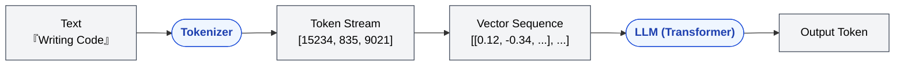
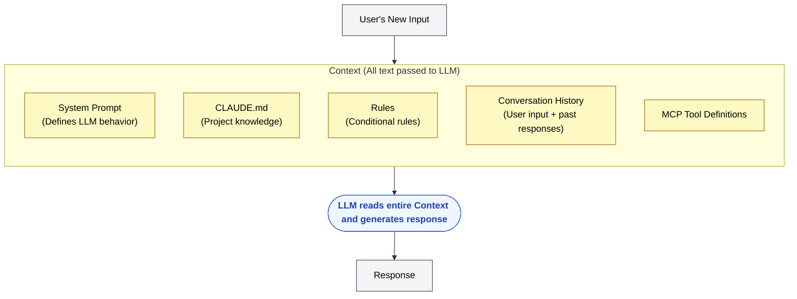
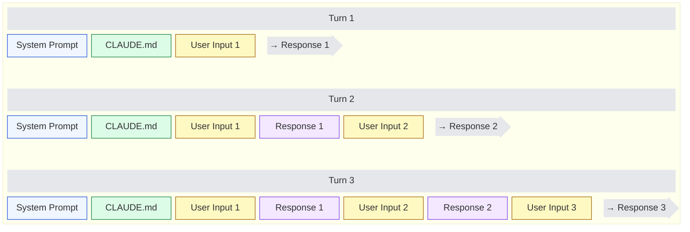
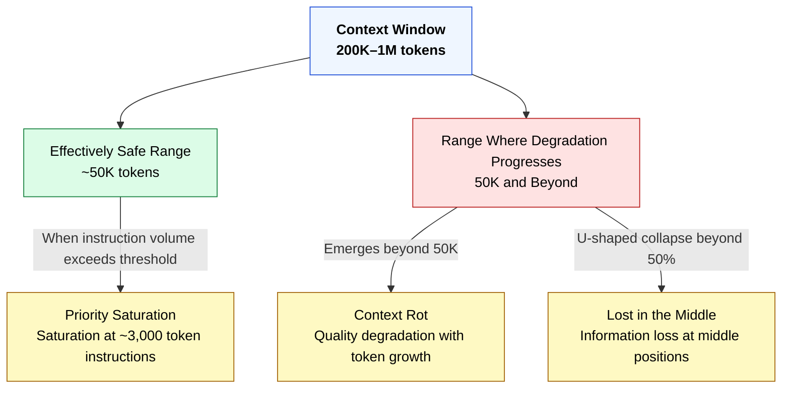
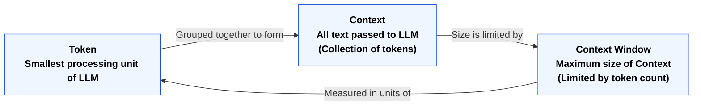

🌐 [日本語](../ja/02-context-window/token-context-basics.md)

# Token, Context, and Context Window — Three Foundational Concepts

> [!NOTE]
> This page is the starting point for Part 2 and serves as prerequisite knowledge for the entire repository.
> Neither the structural problems in Part 1 nor the design decisions from Part 3 onward will make sense without understanding these three concepts.

## Token — The "Character" Unit of LLMs

### What Is a Token?

LLMs don't process text by individual characters or even words. Instead, they use their own unit called a **Token**.

```
Input text:    "Claude Code でコードを書く"
               ↓ tokenizer splits it
Token stream:  ["Claude", " Code", " で", "コード", "を", "書", "く"]
```

In English, roughly "1 word ≈ 1–1.3 tokens," while in Japanese "1 character ≈ 1–3 tokens." The same content consumes more tokens in Japanese.

### Why Tokens?

The internal machinery of an LLM is built on **arithmetic with numerical vectors**. Since text cannot be processed directly, it must be converted: text → token (integer ID) → vector.



The token unit threads through this entire pipeline. That's why every capability and constraint of an LLM is discussed in token terms.

### Getting a Feel for Tokens

| Reference                        | Token Count                    |
| :------------------------------- | :------------------------------ |
| 1 English word                   | ~1 token                        |
| 1 Japanese character             | ~1–3 tokens                     |
| This README.md (~135 lines)       | ~2,000 tokens                   |
| A typical source file (200 lines) | ~1,000–3,000 tokens             |
| Claude's 200K context            | ~2 books in English / ~1 book in Japanese |

> [!TIP]
> **Developer analogy**: A token is like a byte in memory. It's the smallest unit that the CPU (LLM) processes, and the memory capacity (context window) is measured in bytes (tokens).

## Context — All "Information" Passed to an LLM

### What Is Context?

Context is **all the text that an LLM reads to generate a single response**.

As a developer, you might think of it this way:

| Analogy          | What Corresponds to Context     |
| :--------------- | :------------------------------ |
| Function call    | All data passed as arguments    |
| HTTP request     | The entire request body         |
| Compilation      | All source files passed to compiler |

LLMs are stateless. They don't "remember" past conversations; instead, **each time, the entire conversation history is passed as Context, and the LLM reads it to generate a response**.



### What "Stateless" Means

If you're familiar with REST APIs, this should be intuitive. LLM response generation works like an HTTP request: **each invocation is independent**.



The LLM doesn't "remember" past conversations; it "reads" the entire history on each turn. As turns progress, the Context grows. This is the physical cause of the **Context Rot** and **Instruction Decay** we learned in Part 1.

## Context Window — The Finite "Thinking Space"

### What Is a Context Window?

A Context Window is **the maximum size of Context that an LLM can process at one time**.

| Model                        | Context Window Size         |
| :--------------------------- | :--------------------------- |
| Claude Sonnet 4.6 / Opus 4.6 | 1M tokens (200K+ at standard rate) |
| Claude Sonnet 4 / Opus 4     | 200K tokens                 |
| GPT-4o                       | 128K tokens                 |
| Gemini 2.5 Pro               | 1M tokens                   |

> [!TIP]
> **Developer analogy**: A context window is like the memory space allocated to a process. Just as exceeding this space causes OOM (Out of Memory), exceeding the context window results in tokens being truncated.

### "Bigger Isn't Safer"

This is the most crucial point and where the structural problems from Part 1 connect.



A context window should not be thought of as "usable up to full capacity," but rather "of the available capacity, only a portion can maintain quality." This principle holds regardless of whether the window is expanded to 1M tokens. We'll cover the quantitative details in [Context Budget](context-budget.md).

## The Relationship Between the Three Concepts



| Concept            | In One Word      | Developer Analogy     |
| :----------------- | :--------------- | :-------------------- |
| **Token**          | LLM's processing unit | Memory bytes         |
| **Context**        | All input to LLM | HTTP request body     |
| **Context Window** | Input size limit | Process memory space  |

## All Claude Code Design Is Based on Context Window Constraints

Every Claude Code feature you'll learn in Part 3 and beyond is a mechanism to **use the context window efficiently**.

| Claude Code Feature | Context Window Strategy                 |
| :------------------ | :--------------------------------------- |
| CLAUDE.md 200-line limit | Keep resident Context to a minimum  |
| `.claude/rules/`    | Inject Context only on glob match        |
| Skills              | Consume Context only on user call or LLM decision |
| Agents              | Run in a separate context window         |
| `/compact`          | Compress Context to recover space        |
| `/clear`            | Reset Context                            |
| Hooks               | Consume zero Context                     |

The next page explores the full picture of **what, when, and how** enters the context window.

---

> **Next**: [Chat / Session — "Container of Time" Where Context Accumulates](chat-session.md)

> **Previous**: [Part 1: Structural Problems](../01-llm-structural-problems/index.md)

> **Discussion**: [GitHub Discussions](https://github.com/shuji-bonji/understanding-llm-through-claude-code/discussions)
