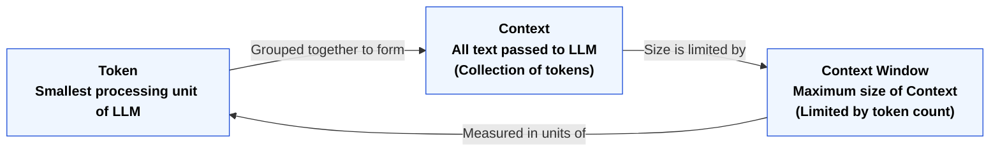

🌐 [日本語](../ja/02-context-window/token-context-basics.md)

# Token, Context, and Context Window — Relationships

> [!NOTE]
> Token, Context, and Context Window are each defined on their own page.
> This page only shows how the three relate. Read the dedicated pages for full definitions.

## Links to Each Page

| Concept | Page | In One Line |
| :-- | :-- | :-- |
| **Token** | [Token](token.md) | The LLM's processing unit |
| **Context** | [Context](context.md) | Everything passed in one inference |
| **Context Window** | [Context Window](context-window.md) | The ceiling—and the smaller safe range |

## How the Three Relate

```mermaid
graph LR
    TOKEN["Token<br/>Smallest processing unit of LLM"]
    CONTEXT["Context<br/>All text passed to LLM<br/>(Collection of tokens)"]
    CW["Context Window<br/>Maximum size of Context<br/>(Limited by token count)"]

    TOKEN -->|"Grouped together to form"| CONTEXT
    CONTEXT -->|"Size is limited by"| CW
    CW -->|"Measured in units of"| TOKEN

    classDef concept fill:#eff6ff,stroke:#1d4ed8,color:#000,font-weight:bold
    class TOKEN,CONTEXT,CW concept
```

| Concept | In One Word | Developer Analogy |
| :-- | :-- | :-- |
| **Token** | LLM processing unit | Memory byte |
| **Context** | Full input to the LLM | HTTP request body |
| **Context Window** | Input size limit | Process memory space |

Token is the unit. Context is the full input for one inference, measured in that unit. Context Window is the upper bound on that Context.

Design mainly controls the content and length of Context. Using the right unit and not trusting the full ceiling are prerequisites for everything that follows in later Parts.

---

> **Next**: [Token — The LLM's Processing Unit](token.md)
