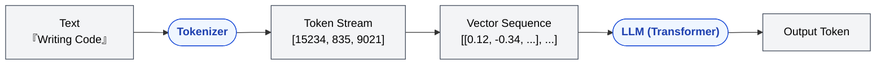

🌐 [日本語](../ja/02-context-window/token.md)

# Token — The LLM's Processing Unit

> [!NOTE]
> **In a nutshell**: A token is the smallest unit an LLM uses to process text. It is neither a character nor a word.
> Context limits, quality degradation, and billing are all measured in tokens.

## What Is a Token?

LLMs do not process text by characters or by words. They use their own unit called a **Token**.

```
Input text:    "Claude Code でコードを書く"
               ↓ tokenizer splits it
Token stream:  ["Claude", " Code", " で", "コード", "を", "書", "く"]
```

In English, roughly "1 word ≈ 1–1.3 tokens." In Japanese, "1 character ≈ 1–3 tokens." The same content consumes more tokens in Japanese.

## Why It Matters

Context limits, quality degradation, and billing are measured in tokens. Estimating by characters or lines, especially in Japanese, diverges from reality.

Design choices such as shorter instructions, shorter history, and injecting only what is needed all reduce to "how many tokens." If the unit is wrong, the later discussion of Context and Context Window cannot be measured.

## Why Tokens?

The internal machinery of an LLM is **arithmetic on numerical vectors**. Text cannot be processed directly, so it must be converted: text → token (integer ID) → vector.



The token unit runs through this entire pipeline. That is why every capability and constraint of an LLM is discussed in token terms.

## Getting a Feel for Tokens

| Reference | Token Count |
| :-- | :-- |
| 1 English word | ~1 token |
| 1 Japanese character | ~1–3 tokens |
| This README.md (~135 lines) | ~2,000 tokens |
| A typical source file (200 lines) | ~1,000–3,000 tokens |
| Claude's 200K context | ~2 books in English / ~1 book in Japanese |

> [!TIP]
> **Developer analogy**: A token is like a byte in memory. It is the smallest unit the CPU (LLM) processes, and memory capacity (the context window) is measured in bytes (tokens).

## Before Moving On

Token is the unit. Next, Context is the full input for one inference, measured in that unit.

---

> **Next**: [Context — Everything Passed in One Inference](context.md)
