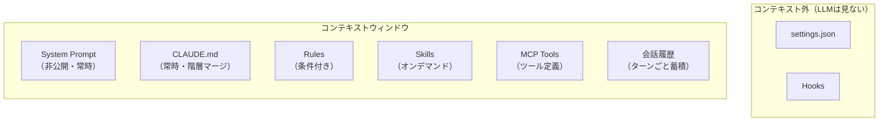

# コンテキストウィンドウとは何か — LLM が「見る」もの

> [!NOTE]
> [前のページ](chat-session.md) で Chat / Session の概念を学んだ。
> このページでは、Claude Code が Context Window の中に**具体的に何を配置するか**の全体像を見る。

## LLM の思考空間

LLM にとって、コンテキストウィンドウが「世界の全て」である。ウィンドウの外にある情報は存在しないのと同じ。

Claude Code では、この Context Window の中に以下が全て配置される。

## コンテキストウィンドウの構造

| 要素                           | 注入タイミング           | 説明                                                     |
| :----------------------------- | :----------------------- | :------------------------------------------------------- |
| **System Prompt**              | 常時（セッション開始時） | Claude Code 内部のシステムプロンプト。ユーザーは変更不可 |
| **CLAUDE.md**                  | 常時（セッション開始時） | プロジェクト知識・規約。階層マージされる。200行以内推奨  |
| **Rules** (`.claude/rules/`)   | 条件付き（glob 一致時）  | ファイルパターンに一致した場合のみ注入                   |
| **Skills** (`.claude/skills/`) | オンデマンド             | LLM が判断、またはユーザーが `/` で呼び出し              |
| **MCP Tools** (`.mcp.json`)    | 常時（ツール定義として） | 20K トークン超で性能劣化                                 |
| **会話履歴**                   | 常時（ターンごとに蓄積） | ユーザーとの対話ログ。`/compact` で圧縮可能              |

> [!WARNING]
> **コンテキスト外の要素**: `settings.json` と `Hooks` は LLM のコンテキストウィンドウに**入らない**。これらは Claude Code の「ランタイム」（Node.js に相当する部分）が処理するものであり、LLM の「思考」には直接影響しない。

## 「コンテキストに入る」と「コンテキスト外」の違い

| 区分               | 対象                                    | LLM への影響                           |
| :----------------- | :-------------------------------------- | :------------------------------------- |
| **コンテキスト内** | CLAUDE.md, Rules, Skills, MCP, 会話履歴 | LLM が直接「読んで」判断に使う         |
| **コンテキスト外** | settings.json, Hooks                    | LLM は存在を知らない。ランタイムが処理 |

この区分を理解することが、Part 3〜7 の設計判断を理解する鍵になる。

## 構造的問題との接続

Part 1 で学んだ構造的問題は、全てこのコンテキストウィンドウの制約に起因する:

- **Context Rot**: コンテキストが埋まるほど品質が低下
- **Lost in the Middle**: コンテキスト中間部への注意が低下
- **Priority Saturation**: コンテキスト内の指示が多いほど遵守率が低下

---

> **前へ**: [Chat / Session](chat-session.md)

> **次へ**: [注入タイミングの全体像](injection-timing.md)
