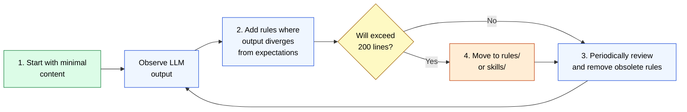

🌐 [日本語](../ja/03-always-loaded-context/claude-md.md)

# Design Principles of CLAUDE.md

> [!IMPORTANT]
> → Why: **Priority Saturation** mitigation (rationale for the 200-line limit)
> → Why: **Prompt Sensitivity** mitigation (concrete, directive language)

## What Is CLAUDE.md?

CLAUDE.md is automatically loaded when a session starts and continues consuming context window space **every turn**—it's "resident memory." The LLM sees it as a system reminder injected at the beginning.

| Attribute | Value |
| :--- | :--- |
| Injection Timing | Automatically loaded at session start |
| Context Consumption | Continuous (consumed every turn) |
| How LLM Sees It | Injected as a system reminder |
| Recommended Size | **200 lines or fewer** |

## Why 200 Lines Maximum?

→ Based on Priority Saturation research findings.

- 200 lines ≈ roughly 2,000–3,000 tokens
- Aligns closely with ManyIFEval's degradation threshold (~3,000 tokens)
- Staying within 200 lines maintains approximately 30–40 active instructions
- Preserves individual instruction adherence at a practical level

> [!IMPORTANT]
> Details: [Priority Saturation](../01-llm-structural-problems/priority-saturation.md)

## What Should You Write?

CLAUDE.md should contain "information that the LLM cannot infer just by reading code."

### What to Include

- Project tech stack (Angular 18 + NgRx + .NET 8)
- Framework-level design decisions
- Build and test commands (`npm run test:ci`)
- Commit conventions (Conventional Commits)
- Prohibitions (no `any` type, no `console.log`)

### What NOT to Include

- Code style rules (handled by .editorconfig / eslint)
- Patterns the LLM can infer from the codebase
- Rules that apply only to specific file types → move to `.claude/rules/`
- Workflow for specific tasks → move to `.claude/skills/`

## Example: Delegating Specifications via llms.txt (e-shiwake)

> [!TIP]
> Keeping CLAUDE.md lightweight doesn't rely solely on moving content to Rules/Skills. **Using specification documents that the app itself provides** is another approach.

[e-shiwake](https://github.com/shuji-bonji/e-shiwake) uses [llms.txt](https://llmstxt.org/), a proposed standard for applications to publish specifications for LLMs. Note that llms.txt is not a Claude Code feature; it's a standard format for websites to publish specifications for LLM consumption.

```
If everything went into CLAUDE.md:
  CLAUDE.md (development rules + chart of accounts + procedures + data models + ...)
  → Balloons to hundreds of lines, Priority Saturation reduces instruction adherence

With specifications delegated to llms.txt:
  CLAUDE.md          → Development rules and guidelines only (lightweight)
  llms.txt           → App specs, data models, tool inventory
  help/*/content.md  → Detailed docs for each feature (Single Source of Truth)
  .claude/skills/    → Domain knowledge injected by referencing llms.txt and content.md
```

<details>
<summary>e-shiwake's CLAUDE.md (excerpt) — focused on development rules, excludes specifications</summary>

```markdown
# e-shiwake

Personal accounting PWA ledger app. Local-first with IndexedDB.

## Tech Stack

SvelteKit + TypeScript + shadcn-svelte + Tailwind CSS v4 + Dexie.js

## Critical: IndexedDB Persistence

Svelte 5's $state generates Proxies. Before persisting to IndexedDB, always convert
to a plain object using JSON.parse(JSON.stringify(...)).

## Documentation Sync Rules

- Single Source of Truth: each help page's content.md
- content.md and +page.svelte must always be updated together
- When features change, also update llms.txt and +server.ts
```

</details>

<details>
<summary>e-shiwake's llms.txt (excerpt) — publishes app specs, data models, and tool inventory</summary>

```markdown
# e-shiwake (Electronic Ledger)

A PWA ledger application for sole proprietors and freelancers.

## Feature List
- Ledger (compound entries, household allocation, search, CSV export)
- General Ledger / Trial Balance / Income Statement / Balance Sheet
- Consumption Tax Summary / Fixed Asset Register / Invoice Management

## Data Model
JournalEntry { id, date, description, lines[], evidences[] }
JournalLine  { accountCode, accountName, debit, credit, taxCategory }

## WebMCP Tools (Chrome 146+)
search_journals / create_journal / list_accounts / generate_ledger
generate_trial_balance / generate_profit_loss / calculate_consumption_tax ...
```

</details>

Key aspects of this design:

- **CLAUDE.md's responsibilities become clear** — limited to "rules the LLM must follow during development"
- **llms.txt is generated via SvelteKit prerender** — reduces drift between docs and implementation
- **Not Claude-specific** — any LLM can reference this standard format
- **Skills can be reference-based** — no need to duplicate specs within skills

> [!IMPORTANT]
> Beyond "what to write in CLAUDE.md" lies an equally important question: **"where do I put what doesn't go in CLAUDE.md?"** By leveraging external specifications like llms.txt, you maximize the density of development rules within the 200-line limit.
>
> → Real project: [e-shiwake/.claude/](https://github.com/shuji-bonji/e-shiwake/tree/main/.claude)

## Writing Effectively

> [!TIP]
> As mitigation for **Prompt Sensitivity**, concrete and directive language is essential.

```markdown
# ❌ Vague (High Prompt Sensitivity)

- Write tests properly
- Keep code clean

# ✅ Concrete (Low Prompt Sensitivity)

- Create Jasmine tests for all public methods
- Place test files in *.spec.ts
- Structure tests using describe/it blocks
```

## Start Small Principle

CLAUDE.md should not be written "perfectly from the start." The correct approach is to **observe failures and add rules as needed**.



1. Start with minimal content
2. When the LLM produces unexpected output, add a rule
3. Periodically review and remove rules that are no longer needed
4. If approaching 200 lines, move content to `.claude/rules/` or `.claude/skills/`

---

> **Previous**: [Part 3: Always-Loaded Context](index.md)

> **Next**: [How Hierarchical Merging Works](hierarchy.md)
