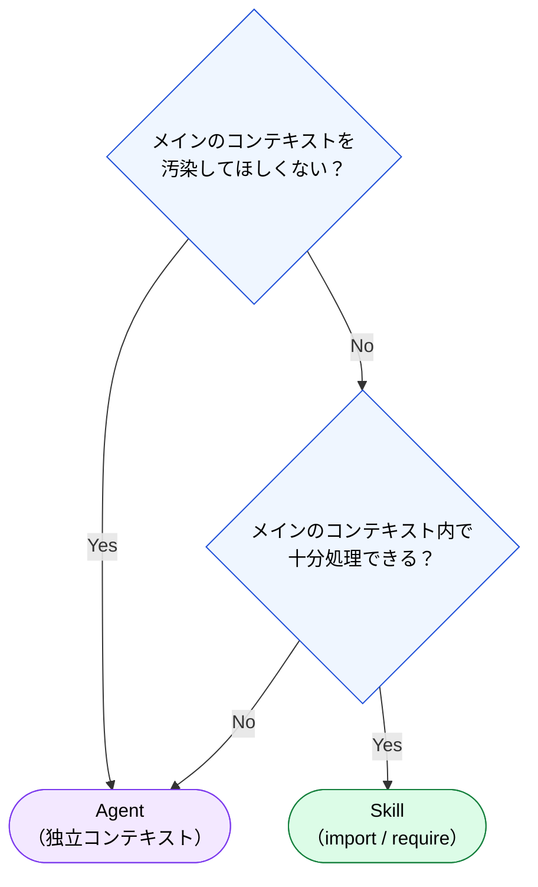

# import vs 別プロセスの判断基準

> [!TIP]
> Skills と Agents のどちらを使うべきかの判断フロー。

## 判断フロー



## 比較表

| 観点 | Skill | Agent |
|:--|:--|:--|
| コンテキスト | メインと共有 | 独立（別のコンテキストウィンドウ） |
| メインへの影響 | コンテキストを消費する | 結果の要約のみ返す |
| 実行速度 | 速い（読み込みのみ） | やや遅い（新規プロセス） |
| 適用場面 | 手順書、テンプレート、参照情報 | レビュー、分析、独立タスク |
| プログラミング比喩 | `import` / `require` | 別プロセス / Worker Thread |

## Skills を選ぶべき場面

- コンポーネント生成の手順書
- コーディング規約の参照
- テンプレートファイルの適用
- 短時間で完了する定型タスク

## Agents を選ぶべき場面

- **コードレビュー**: 追従性（Sycophancy）を避けるため、独立コンテキストで実行
- **大規模な分析**: メインコンテキストを圧迫しない
- **専門ドメインのタスク**: 知識境界（Knowledge Boundary）対策
- **品質検証**: Cross-Model QA として異なるモデルでのチェック

## 組み合わせパターン

```
ユーザー: 「新しい Feature Module を作って」
  ├─ Skill: component-generator（手順書を参照して生成）
  │
  └─ Agent: code-reviewer（生成結果を独立コンテキストでレビュー）
```

---

> **前へ**: [Agents の設計原理](agents.md)

> **Part 5 完了 → 次へ**: [Part 6: ツール定義としてのコンテキスト](../06-tool-context/index.md)
