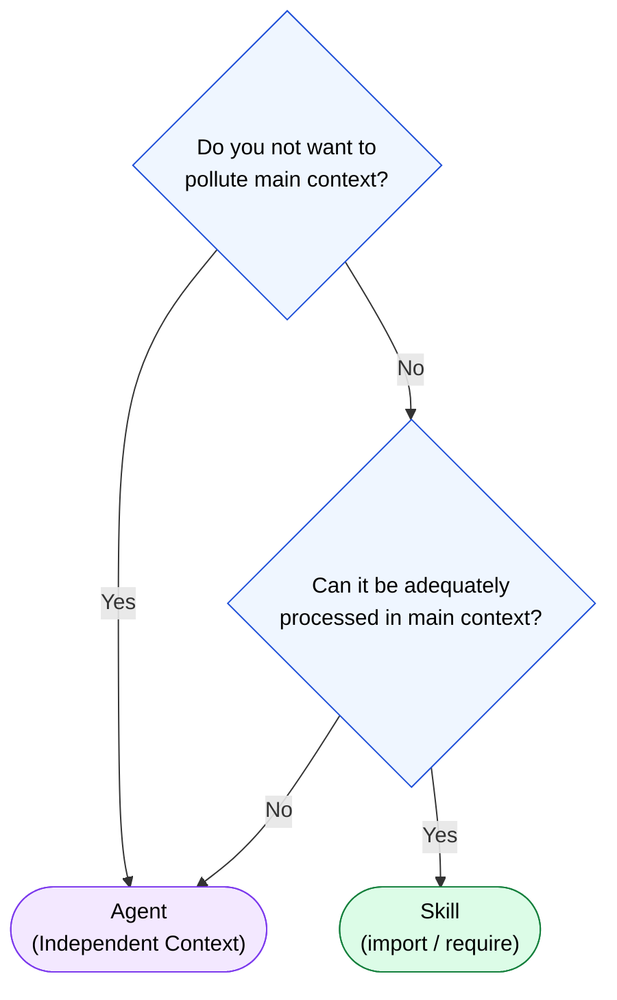

🌐 [日本語](../ja/05-on-demand-context/skill-vs-agent.md)

# Criteria for Skill vs Agent

> [!TIP]
> Decision flow for choosing between Skills and Agents.

## Decision Flow



## Comparison Table

| Perspective | Skill | Agent |
|:--|:--|:--|
| Context | Shared with main | Independent (separate context window) |
| Impact on Main | Consumes context | Returns only result summary |
| Execution Speed | Fast (load only) | Slightly slower (new process) |
| Use Cases | Procedures, templates, references | Reviews, analysis, independent tasks |
| Programming Analogy | `import` / `require` | Separate process / Worker Thread |

## When to Use Skills

- Component generation procedures
- Coding standards reference
- Template file application
- Short-duration standard tasks

## When to Use Agents

- **Code review**: Run in independent context to avoid Sycophancy
- **Large-scale analysis**: Does not burden main context
- **Specialist domain tasks**: Address Knowledge Boundary
- **Quality verification**: Cross-model QA with different models

## Combination Patterns

```
User: "Create a new Feature Module"
  ├─ Skill: component-generator (generate by referencing procedures)
  │
  └─ Agent: code-reviewer (review generated result in independent context)
```

---

> **Previous**: [Agents Design Principles](agents.md)

> **Part 5 Complete → Next**: [Part 6: Context as Tool Definition](../06-tool-context/index.md)
