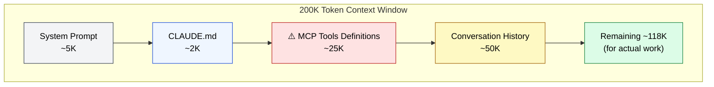

🌐 [日本語](../ja/06-tool-context/mcp-context-cost.md)

# MCP Context Cost

> [!IMPORTANT]
> → Why: **Context Rot** mitigation (constant consumption of tool definitions pressures context)
> → Why: **Knowledge Boundary** mitigation (external knowledge retrieval reduces LLM's dependency on internal knowledge)

## How MCP Consumes Context

When you connect an MCP server, tool definitions (name, parameter schema, description) are injected into the context window **every turn**. This is the same "resident cost" as CLAUDE.md.

| Property | Value |
| :--- | :--- |
| Injection Timing | Loaded as tool definitions at session start |
| Context Consumption | **Constant consumption** as tool definitions |
| How LLM Sees It | List of "available tools" |
| Danger Threshold | **20K+ tokens total across all MCPs** |

## Concrete Example of Context Consumption

> [!WARNING]
> When MCP tool definitions balloon to 50K, the remaining budget drops to 93K — long conversations become impossible.

## MCP as Knowledge Boundary Mitigation

While MCP carries Context Rot risk, it is also the most fundamental mitigation for **Knowledge Boundary**.

- Instead of relying on the LLM's internal knowledge (training data), directly reference external trusted sources
- Real-time access to API documentation, internal wikis, databases, etc.
- Address "unknown unknowns" by supplementing with external knowledge

## Operational Best Practices

- Don't connect unnecessary MCP servers
- Monitor that total MCP consumption doesn't exceed 20K tokens
- Connect infrequently-used MCPs only when needed

---

> **Previous**: [Part 6: Context as Tool Definitions](index.md)

> **Next**: [Tool Search / Deferred Loading](tool-search.md)
