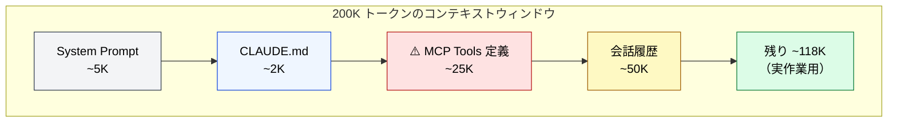

# MCP のコンテキストコスト

> [!IMPORTANT]
> → Why: **Context Rot** 対策（ツール定義の常時消費がコンテキストを圧迫する）
> → Why: **Knowledge Boundary** 対策（外部知識参照で LLM の内部知識への依存を減らす）

## MCP のコンテキスト消費の仕組み

MCP サーバーを接続すると、ツール定義（名前、パラメータスキーマ、説明文）が**毎ターン**コンテキストウィンドウに注入される。これは CLAUDE.md と同じ「常駐コスト」。

| 属性             | 値                                       |
| :--------------- | :--------------------------------------- |
| 注入タイミング   | セッション開始時にツール定義としてロード |
| コンテキスト消費 | ツール定義として**常時消費**             |
| LLM からの見え方 | 「使用可能なツール」のリスト             |
| 危険閾値         | **全MCP合計 20K トークン超**             |

## コンテキスト消費の具体例

> [!WARNING]
> MCP Tools 定義が 50K に膨れると、残りは 93K — 長い会話が成立しなくなる。

## Knowledge Boundary 対策としての MCP

MCP は Context Rot のリスクを持つ一方で、**Knowledge Boundary** の最も根本的な対策でもある。

- LLM の内部知識（訓練データ）に依存する代わりに、外部の信頼できるソースを直接参照
- API ドキュメント、社内Wiki、データベースなどをリアルタイムで参照可能
- 「知らないことを知らない」問題を、外部知識で補完

## 運用のポイント

- 不要な MCP サーバーは接続しない
- MCP の合計が 20K トークンを超えないよう監視
- 使用頻度の低い MCP は必要な時だけ接続

---

> **前へ**: [Part 6: ツール定義としてのコンテキスト](index.md)

> **次へ**: [Tool Search / Deferred Loading](tool-search.md)
