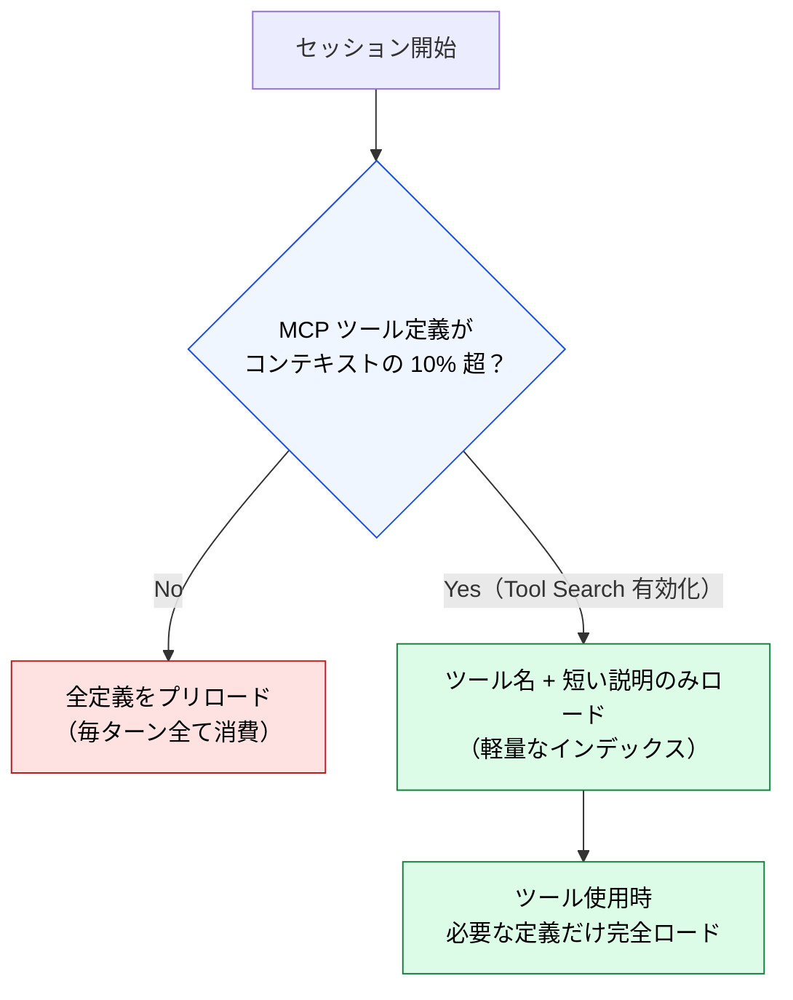

# Tool Search / Deferred Loading

> [!NOTE]
> MCP ツール定義がコンテキストの 10% を超えると自動的に有効化される遅延ロードの仕組み。

## Tool Search とは

Claude Code v2.1.7+ で導入された機能。MCP ツール定義がコンテキストの 10% を超えると、自動的に「Tool Search」モードに切り替わる。

## 動作の仕組み

## コンテキスト予算への効果

Tool Search により、MCP 接続数が多くても常時消費を抑えられる。ただし、検索のオーバーヘッドが発生するため、頻繁に使うツールは少ないに越したことはない。

## Context Rot 対策としての位置づけ

Tool Search は Context Rot の「Attention Dilution」メカニズムへの対策:

- 全ツール定義がコンテキストにあると、個々のツールへの注意が薄まる
- 必要なツールだけをロードすることで、注意の集中度を維持

---

> **前へ**: [MCPのコンテキストコスト](mcp-context-cost.md)

> **Part 6 完了 → 次へ**: [Part 7: LLMが見ないレイヤー](../07-runtime-layer/index.md)
