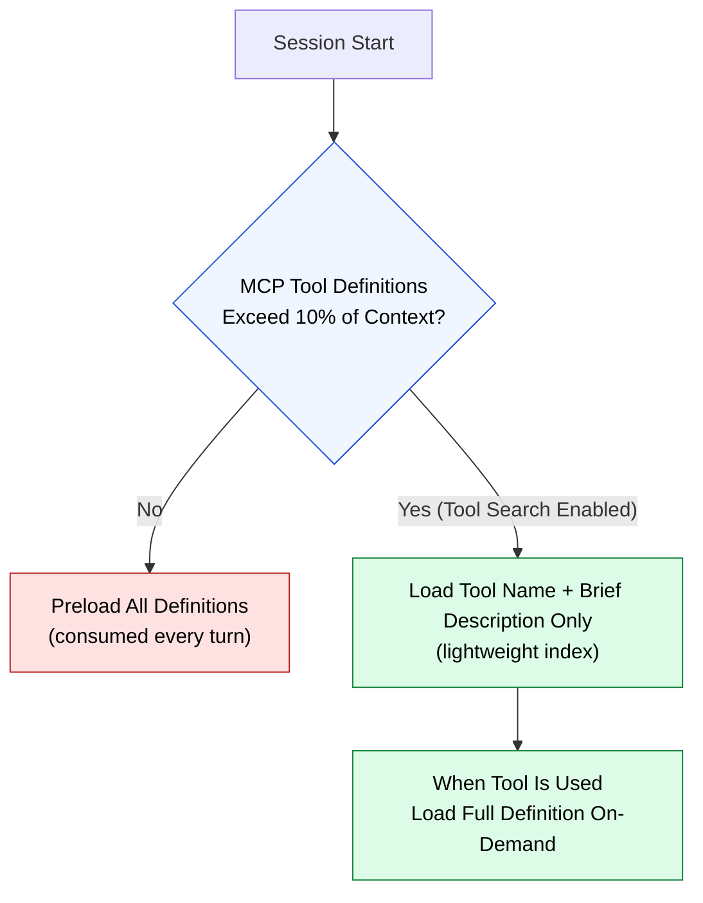

🌐 [日本語](../ja/06-tool-context/tool-search.md)

# Tool Search / Deferred Loading

> [!NOTE]
> A lazy loading mechanism that automatically activates when MCP tool definitions exceed 10% of context.

## What is Tool Search?

A feature introduced in Claude Code v2.1.7+. When MCP tool definitions exceed 10% of context, the system automatically switches to "Tool Search" mode.

## How It Works

## Impact on Context Budget

Tool Search reduces constant consumption even when many MCPs are connected. However, there is search overhead, so it's best to minimize the number of frequently-used tools.

## Tool Search as Context Rot Mitigation

Tool Search addresses the "Attention Dilution" mechanism of Context Rot:

- When all tool definitions are in context, attention to individual tools gets diluted
- Loading only needed tools maintains attention concentration

---

> **Previous**: [MCP Context Cost](mcp-context-cost.md)

> **Part 6 Complete → Next**: [Part 7: The Layer LLMs Don't See](../07-runtime-layer/index.md)
