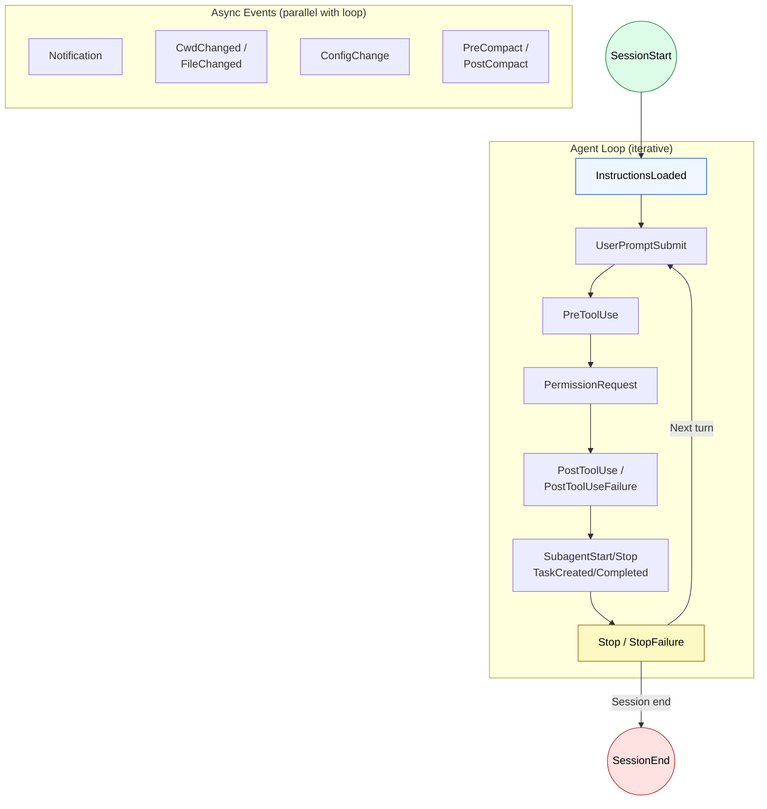

🌐 [日本語](../ja/07-runtime-layer/hooks.md)

# Hooks Lifecycle

> [!IMPORTANT]
> → Why: **Hallucination** mitigation (test execution Hooks detect mechanically)
> → Why: **Sycophancy** mitigation (compilers and test runners don't follow along)
> → Why: **Instruction Decay** mitigation (forced execution independent of context)

## What Are Hooks?

Hooks are context-independent processing triggered by Claude Code lifecycle events. They don't consume the LLM's context window.

| Attribute | Value |
| :--- | :--- |
| Injection Timing | **Not injected into context** |
| Context Consumption | None (except Prompt Hook) |
| Execution Location | Claude Code runtime (shell / HTTP) |
| Definition Location | `hooks` key in settings.json |

## Why They Exist

If you instruct an LLM to "run eslint every time,"

1. It consumes the context window
2. It may be forgotten due to Instruction Decay
3. It may skip judgment due to Sycophancy ("looks fine")

Hooks execute at the runtime level, avoiding all these problems.

## Lifecycle Flow



> [!TIP]
> **Three-layer structure**: Session layer (`SessionStart` → `SessionEnd`) wraps the agent loop layer, and async event layer fires in parallel with the loop.

## Event List

### Session Lifecycle

| Event | Fire Timing | Main Use Case |
| :--- | :--- | :--- |
| `SessionStart` | Session start/resume | Environment check, log initialization |
| `SessionEnd` | Session end | Cleanup |
| `UserPromptSubmit` | User input submission | Input validation, context addition |
| `Stop` | Response completion | Continuation judgment, quality gate |
| `StopFailure` | API error termination | Error log, alert sending |

### Tool Execution

| Event | Fire Timing | Main Use Case |
| :--- | :--- | :--- |
| `PreToolUse` | Before tool execution | Block dangerous commands |
| `PermissionRequest` | Permission dialog display | Auto-approve/deny permissions |
| `PostToolUse` | After tool success | Auto-format, run lint |
| `PostToolUseFailure` | After tool failure | Error log, retry judgment |

### Subagent & Tasks

| Event | Fire Timing | Main Use Case |
| :--- | :--- | :--- |
| `SubagentStart` | Subagent generation | Context injection to agents |
| `SubagentStop` | Subagent completion | Result validation, continuation judgment |
| `TaskCreated` | Task creation | Enforce naming conventions, task validation |
| `TaskCompleted` | Task completion | Validate completion conditions |
| `TeammateIdle` | Before teammate waits | Quality gate, resource validation |

### Configuration & Environment Changes

| Event | Fire Timing | Main Use Case |
| :--- | :--- | :--- |
| `InstructionsLoaded` | CLAUDE.md / rules loaded | Audit log, compliance tracking |
| `ConfigChange` | Configuration file change | Security audit, policy enforcement |
| `CwdChanged` | Working directory change | Environment variable management (direnv, etc.) |
| `FileChanged` | Watched file change | Automate file change triggers |
| `Notification` | Notification occurs | Desktop notification |

### Context Management

| Event | Fire Timing | Main Use Case |
| :--- | :--- | :--- |
| `PreCompact` | Before context compression | Pre-compression validation |
| `PostCompact` | After context compression | Post-compression validation |

### Worktree & MCP

| Event | Fire Timing | Main Use Case |
| :--- | :--- | :--- |
| `WorktreeCreate` | Worktree creation | Replace Git operations |
| `WorktreeRemove` | Worktree deletion | Cleanup |
| `Elicitation` | MCP input request | Automate user input |
| `ElicitationResult` | MCP input response | Validate/correct response data |

> [!NOTE]
> For detailed event information (JSON input/output schema, matcher specification, async Hooks, etc.), refer to the official reference:
> [Hooks reference](https://code.claude.com/docs/en/hooks) | [Hooks guide](https://code.claude.com/docs/en/hooks-guide)

## Hook Types

### Command Hook (most common)

```jsonc
{
  "hooks": {
    "PostToolUse": [
      {
        "type": "command",
        "command": "npx prettier --write $CLAUDE_FILE_PATH",
        "matcher": {
          "toolName": "edit_file",
          "pathPattern": "**/*.ts",
        },
        "timeout": 10000,
      },
    ],
  },
}
```

### Prompt Hook (only one affecting context)

```jsonc
{
  "hooks": {
    "UserPromptSubmit": [
      {
        "type": "prompt",
        "prompt": "Always git stash before making changes",
      },
    ],
  },
}
```

### HTTP Hook (external service integration)

```jsonc
{
  "hooks": {
    "PostToolUse": [
      {
        "type": "http",
        "url": "https://my-service.com/webhook",
        "matcher": { "toolName": "execute_command" },
      },
    ],
  },
}
```

### Agent Hook (multi-turn validation)

Used for validations requiring file reading or command execution. Spawns a subagent to verify conditions with up to 50 turns of tool use.

```jsonc
{
  "hooks": {
    "Stop": [
      {
        "type": "agent",
        "prompt": "Verify that all unit tests pass. Run the test suite and check the results.",
        "timeout": 120,
      },
    ],
  },
}
```

## Exit Code Meanings

| Exit Code | Meaning |
| :--- | :--- |
| 0 | Allow operation (continue as is. stdout may be added to context) |
| 2 | Block operation (stderr content fed back to Claude) |
| Other | Continue operation. stderr logged but not shown to Claude |

---

> **前へ**: [The Role of settings.json](settings-json.md)

> **次へ**: [Why Not Show LLMs](why-not-in-context.md)
