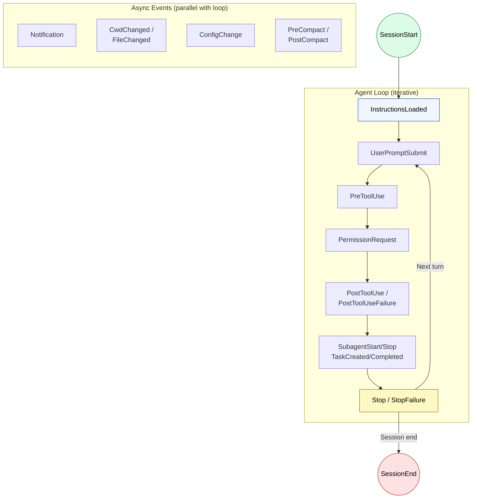

🌐 [日本語](../ja/07-runtime-layer/hooks.md)

# Hooks Lifecycle

> [!IMPORTANT]
> → Why: **Hallucination** mitigation (test execution Hooks detect mechanically)
> → Why: **Sycophancy** mitigation (compilers and test runners don't follow along)
> → Why: **Instruction Decay** mitigation (forced execution independent of context)

## What Are Hooks?

Hooks are context-independent processing triggered by Claude Code lifecycle events. They don't consume the LLM's context window.

| Attribute | Value |
| :--- | :--- |
| Injection Timing | **Not injected into context** |
| Context Consumption | None (Prompt/Agent Hook `reason` is fed back to Claude on `ok: false`) |
| Execution Location | Claude Code runtime (shell / HTTP / sub-LLM / subagent) |
| Definition Location | `hooks` key in settings.json |

## Why They Exist

If you instruct an LLM to "run eslint every time,"

1. It consumes the context window
2. It may be forgotten due to Instruction Decay
3. It may skip judgment due to Sycophancy ("looks fine")

Hooks execute at the runtime level, avoiding all these problems.

## Lifecycle Flow


```mermaid
flowchart TB
    SS@{ shape: circle, label: "SessionStart" }
    SE@{ shape: circle, label: "SessionEnd" }

    subgraph loop ["Agent Loop (iterative)"]
        direction TB
        IL["InstructionsLoaded"]
        UPS["UserPromptSubmit"]
        PTU["PreToolUse"]
        PR["PermissionRequest"]
        POST["PostToolUse /<br>PostToolUseFailure"]
        SUB["SubagentStart/Stop<br>TaskCreated/Completed"]
        STOP["Stop / StopFailure"]

        IL --> UPS
        UPS --> PTU --> PR --> POST --> SUB --> STOP
        STOP -->|"Next turn"| UPS
    end

    SS --> IL
    STOP -->|"Session end"| SE

    style SS fill:#dcfce7,stroke:#15803d,color:#000
    style SE fill:#fee2e2,stroke:#b91c1c,color:#000
    style IL fill:#eff6ff,stroke:#1d4ed8,color:#000
    style STOP fill:#fef9c3,stroke:#a16207,color:#000

    subgraph async ["Async Events (parallel with loop)"]
        direction TB
        NF["Notification"]
        CWD["CwdChanged /<br>FileChanged"]
        CFG["ConfigChange"]
        CMP["PreCompact /<br>PostCompact"]
    end
```

> [!TIP]
> **Three-layer structure**: Session layer (`SessionStart` → `SessionEnd`) wraps the agent loop layer, and async event layer fires in parallel with the loop.

## Event List

### Session Lifecycle

| Event | Fire Timing | Main Use Case |
| :--- | :--- | :--- |
| `SessionStart` | Session start/resume | Environment check, log initialization |
| `SessionEnd` | Session end | Cleanup |
| `UserPromptSubmit` | User input submission | Input validation, context addition |
| `Stop` | Response completion | Continuation judgment, quality gate |
| `StopFailure` | API error termination | Error log, alert sending |

### Tool Execution

| Event | Fire Timing | Main Use Case |
| :--- | :--- | :--- |
| `PreToolUse` | Before tool execution | Block dangerous commands |
| `PermissionRequest` | Permission dialog display | Auto-approve/deny permissions |
| `PostToolUse` | After tool success | Auto-format, run lint |
| `PostToolUseFailure` | After tool failure | Error log, retry judgment |

### Subagent & Tasks

| Event | Fire Timing | Main Use Case |
| :--- | :--- | :--- |
| `SubagentStart` | Subagent generation | Context injection to agents |
| `SubagentStop` | Subagent completion | Result validation, continuation judgment |
| `TaskCreated` | Task creation | Enforce naming conventions, task validation |
| `TaskCompleted` | Task completion | Validate completion conditions |
| `TeammateIdle` | Before teammate waits | Quality gate, resource validation |

### Configuration & Environment Changes

| Event | Fire Timing | Main Use Case |
| :--- | :--- | :--- |
| `InstructionsLoaded` | CLAUDE.md / rules loaded | Audit log, compliance tracking |
| `ConfigChange` | Configuration file change | Security audit, policy enforcement |
| `CwdChanged` | Working directory change | Environment variable management (direnv, etc.) |
| `FileChanged` | Watched file change | Automate file change triggers |
| `Notification` | Notification occurs | Desktop notification |

### Context Management

| Event | Fire Timing | Main Use Case |
| :--- | :--- | :--- |
| `PreCompact` | Before context compression | Pre-compression validation |
| `PostCompact` | After context compression | Post-compression validation |

### Worktree & MCP

| Event | Fire Timing | Main Use Case |
| :--- | :--- | :--- |
| `WorktreeCreate` | Worktree creation | Replace Git operations |
| `WorktreeRemove` | Worktree deletion | Cleanup |
| `Elicitation` | MCP input request | Automate user input |
| `ElicitationResult` | MCP input response | Validate/correct response data |

> [!NOTE]
> For detailed event information (JSON input/output schema, matcher specification, async Hooks, etc.), refer to the official reference:
> [Hooks reference](https://code.claude.com/docs/en/hooks) | [Hooks guide](https://code.claude.com/docs/en/hooks-guide)

## Hook Types

> [!IMPORTANT]
> All four types share the same nesting structure: `event → [{ matcher?, hooks: [{ type, ... }] }]`. The `matcher` field is a string regex (e.g. `"Edit|Write"`) against tool names, **not** an object with `toolName` / `pathPattern` keys. Tool names are PascalCase (`Edit`, `Write`, `Bash`).

### Command Hook (most common)

Runs a shell command. Hook input arrives on **stdin as JSON**; parse it with `jq` to extract fields like `file_path`. `exit 0` allows, `exit 2` blocks with stderr fed back to Claude.

```jsonc
{
  "hooks": {
    "PostToolUse": [
      {
        "matcher": "Edit|Write|MultiEdit",
        "hooks": [
          {
            "type": "command",
            "command": "jq -r '.tool_input.file_path' | xargs -r npx prettier --write --ignore-unknown",
          },
        ],
      },
    ],
  },
}
```

### Prompt Hook (single-turn LLM judgment)

Sends the hook input to a Claude model (Haiku by default) for a yes/no decision. The model must return `{"ok": true}` to allow, or `{"ok": false, "reason": "..."}` to block. On `Stop` events, the `reason` is fed back to Claude so it keeps working.

```jsonc
{
  "hooks": {
    "Stop": [
      {
        "hooks": [
          {
            "type": "prompt",
            "prompt": "Check if all tasks are complete. If not, respond with {\"ok\": false, \"reason\": \"what remains to be done\"}.",
          },
        ],
      },
    ],
  },
}
```

### HTTP Hook (external service integration)

POSTs the hook input as JSON to an HTTP endpoint. The endpoint returns the same `ok`/`reason` JSON via response body. Useful for shared audit services across a team.

```jsonc
{
  "hooks": {
    "PostToolUse": [
      {
        "hooks": [
          {
            "type": "http",
            "url": "http://localhost:8080/hooks/tool-use",
            "headers": { "Authorization": "Bearer $MY_TOKEN" },
            "allowedEnvVars": ["MY_TOKEN"],
          },
        ],
      },
    ],
  },
}
```

### Agent Hook (multi-turn verification, experimental)

> [!WARNING]
> Agent hooks are **experimental**. Behavior and configuration may change. For production workflows, prefer Command hooks.

Spawns a subagent that can read files, search code, and use other tools to verify conditions before returning `{"ok": ..., "reason": ...}`. Default timeout 60s, up to 50 tool-use turns.

```jsonc
{
  "hooks": {
    "Stop": [
      {
        "hooks": [
          {
            "type": "agent",
            "prompt": "Verify that all unit tests pass. Run the test suite and check the results. $ARGUMENTS",
            "timeout": 120,
          },
        ],
      },
    ],
  },
}
```

> [!TIP]
> When to choose which: **Command** for deterministic shell rules (lint, format, file protection). **Prompt** when input data alone is enough for judgment (Haiku-level evaluation). **Agent** when verification needs to read files or run commands (e.g. test execution). **HTTP** when an external service should handle the logic.

## Exit Code Meanings (Command Hook only)

| Exit Code | Meaning |
| :--- | :--- |
| 0 | Allow operation (continue as is. stdout may be added to context via `additionalContext`) |
| 2 | Block operation (stderr content fed back to Claude) |
| Other | Continue operation. stderr logged but not shown to Claude |

> Prompt/Agent/HTTP hooks use the `{"ok": true/false, "reason": "..."}` JSON response format instead of exit codes.

## Practical Recipes by Framework

| Framework | Recipe |
| :--- | :--- |
| Angular + NgRx + RxJS | [examples/angular-ngrx/](https://github.com/shuji-bonji/understanding-llm-through-claude-code/tree/main/examples/angular-ngrx) |
| SvelteKit + Svelte 5 | [examples/svelte-kit/](https://github.com/shuji-bonji/understanding-llm-through-claude-code/tree/main/examples/svelte-kit) |

## 8 Problems × Hooks: Quick Reference

> [!IMPORTANT]
> Hooks aren't a silver bullet for every structural problem. The table below shows where Hooks are strong, where they're partial, and where other layers (rules / Agents / sessions) carry more weight. Use this as a "should I reach for a Hook here?" decision aid.

| Structural Problem | Recommended Hook Event | Concrete Command / Type | Effect | Strength |
| :--- | :--- | :--- | :--- | :--- |
| **Context Rot** | `SessionStart` (matcher: `compact`) | `echo` project conventions, `git log --oneline -5` | Re-injects key rules after compaction | ◯ Partial — `/compact` itself is the main mitigation |
| **Lost in the Middle** | (Hooks alone are weak) | — | Hooks don't reposition context | △ Rules / Agents are more effective |
| **Priority Saturation** | `PostToolUse`, `Stop` | `prettier`, `eslint`, `tsc --noEmit` | Removes mechanical rules from CLAUDE.md | ◎ Strong — frees the instruction budget |
| **Hallucination** | `PostToolUse`, `Stop` | `tsc --noEmit`, `svelte-check`, `vitest run` | Compilers / type checkers don't hallucinate | ◎ Strong — primary mitigation |
| **Sycophancy** | `Stop` | Command: `eslint --no-warn-ignored`<br>Agent Hook: "verify tests pass" | LLM agreement bias doesn't affect runners | ◎ Strong — mechanical verifiers don't flatter |
| **Knowledge Boundary** | `Stop` | `svelte-check` (catches legacy Svelte syntax mixed with Svelte 5), `tsc` (catches missing types) | Detects outdated API / syntax patterns | ◯ Partial — works only when the boundary is checkable |
| **Prompt Sensitivity** | `PreToolUse`, `Stop` | Same mechanical checks as Hallucination | Output quality doesn't depend on prompt wording | ◯ Partial — last line of defense |
| **Instruction Decay** | `Stop`, `PreToolUse` | `block-dangerous-commands.sh`, `tsc --noEmit` | Forced execution independent of context | ◎ Strong — Hooks can't be "forgotten" |

> [!TIP]
> **Reading the strength column**:
> - ◎ Strong: Hooks are the primary mitigation for this problem
> - ◯ Partial: Hooks help, but other layers (rules / Agents / sessions) do more
> - △ Weak: Don't reach for Hooks first — use a different layer

For the full countermeasure landscape across all layers (rules, Skills, Agents, sessions, plugins), see [Appendix: Problem × Countermeasure Map](../appendix/problem-countermeasure-map.md).

---

> **Previous**: [The Role of settings.json](settings-json.md)

> **Next**: [Why Not Show LLMs](why-not-in-context.md)
