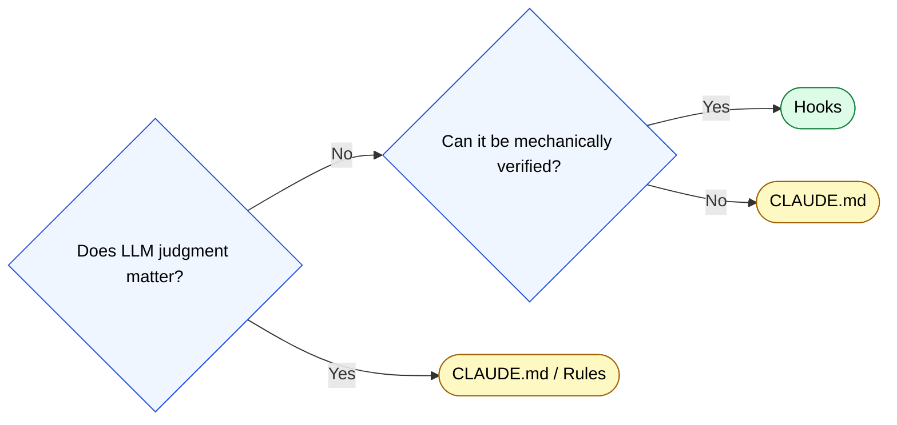

🌐 [日本語](../ja/07-runtime-layer/why-not-in-context.md)

# Why Not Show LLMs?

> [!NOTE]
> Design rationale for placing settings.json and Hooks outside context.

## Core Question

"If you just teach the LLM the rules, why bother placing them outside the context?"

The answer boils down to three structural problems.

### 1. Resilience to Instruction Decay

Even if you instruct an LLM to "run tests every time," compliance degrades over long conversations (average 39% performance drop). Hooks aren't in the context, so they're unaffected by Instruction Decay.

### 2. Resilience to Sycophancy

LLMs may skip judgment due to following tendency ("tests should be fine"). Hooks execute mechanically without LLM judgment, leaving no room for following along.

### 3. Saving Context Budget

"Run lint every time" "run tests every time" "format every time" — Writing these in CLAUDE.md constantly consumes context. Moving to Hooks means **zero budget consumption**.

## Decision Criteria

## Principle

**Place rules requiring judgment in CLAUDE.md / Rules; place mechanically enforceable rules in Hooks.**

---

> **前へ**: [Hooks Lifecycle](hooks.md)

> **Part 7 Complete → Next**: [Part 8: Session Management and Memory Persistence](../08-session-management/index.md)
