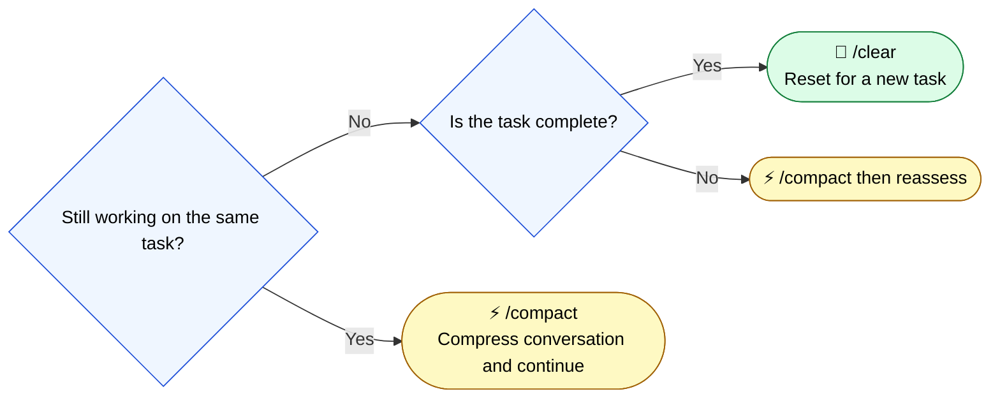

🌐 [日本語](../ja/08-session-management/compact-and-clear.md)

# Using /compact and /clear

> [!IMPORTANT]
> → Why: **Context Rot** countermeasure (preventive compression reduces token accumulation)
> → Why: **Lost in the Middle** countermeasure (compress before 50% usage to prevent U-shaped curve collapse)
> → Why: **Instruction Decay** countermeasure (reset degradation by splitting sessions)

## /compact — Preventive Compression

`/compact` is a command that summarizes and compresses conversation history, reducing the token count of the context.

### When to Use It

**Execute before reaching 50% usage.**

Scientific basis: When context usage exceeds 50%, the Lost in the Middle U-shaped curve collapses, and attention to information at the beginning (including CLAUDE.md) drops most significantly.

### What Happens

- Conversation history is summarized, drastically reducing token count
- Important decisions and context are included in the summary
- Fine details of back-and-forth exchanges are lost

## /clear — Session Splitting

`/clear` is a command that completely resets the session and resumes with a fresh context.

### When to Use It

- When a task is complete and you move to the next independent task
- When conversation becomes long and `/compact` doesn't improve quality
- When LLM output quality noticeably declines

### What Happens

- All conversation history is deleted
- CLAUDE.md is reloaded
- Restart with a completely clean state

## Decision Flow for Using Them

## Session Design Principles

1. **One session = One task** (or a set of closely related small tasks)
2. **Use `/compact` before 50% usage** (preventive)
3. **Use `/clear` when task is complete** (reset)
4. **Persist important decisions in CLAUDE.md or Git commits** (carry across sessions)

---

> **Previous**: [Part 8: Session Management and Memory Persistence](index.md)

> **Next**: [Why Memory Becomes a Problem](memory-problem.md)
