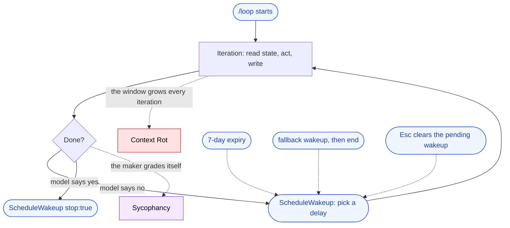

🌐 [日本語](../ja/08-session-management/loop-and-self-driving-sessions.md)

# /loop and Self-Driving Sessions

> [!IMPORTANT]
> → Why: **Context Rot** — turns accumulate in one session with no human between them  
> → Why: **Sycophancy** — the model that did the work also decides the work is done  
> → Why: **Instruction Decay** — the opening instruction thins out across dozens of unattended turns

Every other feature in this part shortens the session or cuts it. `/loop` does the opposite. It keeps one session running turn after turn with nobody in between, which makes it the one feature in this book whose main effect is to _increase_ exposure to the structural problems. That is exactly why it is worth reading closely: the guards written into its specification are the constraints made visible.

## What /loop does

`/loop` is a bundled skill that re-runs a prompt inside the current session. What you pass decides how it behaves.

| What you pass                                     | Behavior                                                                                                          |
| ------------------------------------------------- | ----------------------------------------------------------------------------------------------------------------- |
| Interval and prompt (`/loop 5m check the deploy`) | Runs on a fixed cron schedule                                                                                     |
| Prompt only (`/loop check the deploy`)            | Claude picks a delay between 1 minute and 1 hour after each iteration, and prints the delay and the reason for it |
| Neither (`/loop`)                                 | Runs the built-in maintenance prompt, or `.claude/loop.md` / `~/.claude/loop.md` when one exists                  |

Tasks are session-scoped. They fire only while the session is running and idle, `claude --resume` restores the ones that have not expired, and a recurring task expires 7 days after it was created.

## An amplifier, not a countermeasure

Read against the rest of this book, `/loop` sits on the other side of the ledger.

| Feature                          | Effect on the structural problems           |
| -------------------------------- | ------------------------------------------- |
| `/compact`                       | Shortens the history — countermeasure       |
| `/clear`                         | Cuts the history — countermeasure           |
| [Hooks](/07-runtime-layer/hooks) | Enforces outside the model — countermeasure |
| `/loop`                          | Adds turns nobody reads — **amplifier**     |

Three problems grow with the turn count.

- **[Context Rot](/01-llm-structural-problems/context-rot)**: every iteration appends tool output and reasoning to the same window. A human running the same work would notice the window filling up; a loop does not stop to look.
- **[Sycophancy](/01-llm-structural-problems/sycophancy)**: in self-paced mode the loop ends when Claude calls `ScheduleWakeup` with `stop: true`. The maker signs off on its own work.
- **[Instruction Decay](/01-llm-structural-problems/instruction-decay)**: the prompt that opened the loop is one message among many by iteration thirty. `loop.md` is the counter-move — it is read again on every iteration, so edits take effect on the next one, which makes it re-injection rather than a one-time instruction.

## The guards are the constraints, written down

None of the following are conveniences. Each one exists because a self-driving loop cannot be trusted with the decision it would otherwise own.

| Guard in the specification                                                                                                                                            | What it refuses to trust                                           |
| --------------------------------------------------------------------------------------------------------------------------------------------------------------------- | ------------------------------------------------------------------ |
| A recurring task expires 7 days after creation: it fires once more, then deletes itself                                                                               | That someone remembers a loop they started                         |
| An iteration that neither reschedules nor stops gets one fallback wakeup about 20 minutes later, and the loop ends if that one is silent too                          | That "no reschedule" means "finished"                              |
| `Esc` clears the pending wakeup of a self-paced loop                                                                                                                  | That the model's stop decision is the only stop                    |
| The built-in maintenance prompt starts no new initiatives, and pushes or deletes only to continue something the transcript already authorized                         | That an unattended turn should be able to widen its own permission |
| A scheduled fire runs only skills Claude may invoke on its own; skills marked `disable-model-invocation: true`, including the bundled `/verify`, arrive as plain text | That the checker should start itself                               |
| A session holds at most 50 scheduled tasks                                                                                                                            | That the number of loops takes care of itself                      |

The fifth row is the one to sit with. The reviewing skill is precisely the thing a loop cannot fire on its own schedule.

## Separating maker from checker

Sycophancy is not a mood. A model asked to grade its own output has no independent evidence to grade it against, so "the tests still fail, but I made progress, so this is done" is a well-formed answer for it. A loop closes that gap into a circle: the same model writes, judges, and schedules its own next turn.

The separation has to come from outside the model.

- **Machine-checkable completion.** Define "done" as a passing test, a green CI run, or a [hook](/07-runtime-layer/hooks) that fails the turn — not as the model's own report. Hooks are the enforcement the model cannot talk past.
- **A checker the loop does not start.** `/verify` reaching a scheduled fire as plain text is this rule expressed in the product. A human, or a separate session, invokes the check.
- **A different session, not a different paragraph.** When the checker must also be a model, put it in a [sub-agent or a separate session](/10-multi-session/) so it reads the output rather than its own reasoning about the output.

> [!WARNING]
> A loop with no checker is not autonomy. It is one model agreeing with itself on a schedule, at whatever interval it chose for itself.

## → What / How: designing the loop itself

This page covers why an unattended loop needs stop conditions, context hygiene, and an outside critic. How to build that — the outer loop as an engineering discipline, its four hard parts, and what is lost when a person steps out of it — belongs to the sister site.

- [Loop Engineering — moving the outer loop into the system](https://shuji-bonji.github.io/ai-agent-architecture/strategy/loop-engineering) — the outer loop as design
- [Agent loop patterns](https://shuji-bonji.github.io/ai-agent-architecture/strategy/agent-loop-patterns) — ReAct, Plan-and-Execute, Reflexion, Evaluator-Optimizer

## References

- Anthropic. "Run prompts on a schedule." Claude Code Docs. [code.claude.com](https://code.claude.com/docs/en/scheduled-tasks) — `/loop` modes, `loop.md`, seven-day expiry, fallback wakeup, and the skills a scheduled fire will not execute

---

> **Previous**: [Using /compact and /clear](compact-and-clear.md)

> **Next**: [Why Memory Becomes a Problem](memory-problem.md)
