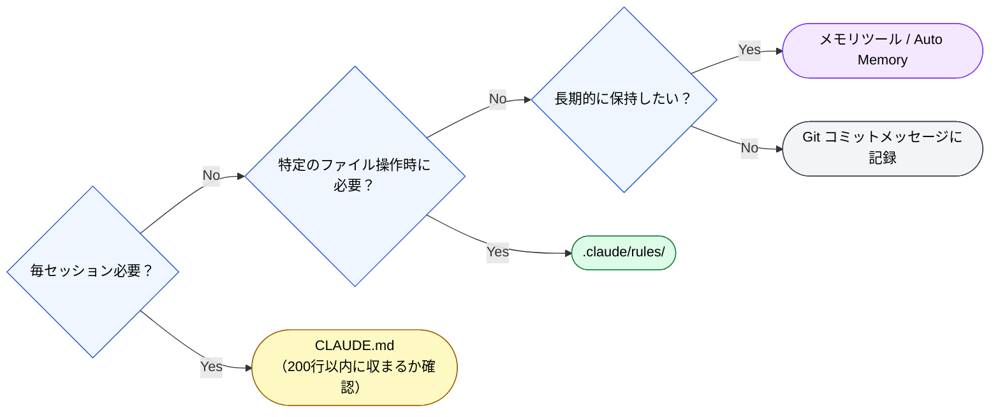

# ツール比較と選定基準

> [!NOTE]
> 記憶の永続化に使えるツールの比較。

## ツール比較表

| ツール               | 記憶の書き込み | 記憶の読み出し       | コンテキスト消費 | 適用場面                         |
| :------------------- | :------------- | :------------------- | :--------------- | :------------------------------- |
| **CLAUDE.md**        | 手動           | 自動（毎セッション） | 常時             | プロジェクト規約、技術スタック   |
| **Git コミット**     | 自動           | 手動（git log）      | なし             | コード変更履歴                   |
| **`.claude/rules/`** | 手動           | 条件付き自動         | 条件時のみ       | ファイル種別ルール               |
| **MCP メモリツール** | 自動/半自動    | 検索ベース           | 検索時のみ       | 長期的な設計判断、ユーザー情報   |
| **Auto Memory**      | 自動           | 自動                 | セッション開始時 | ユーザーの好み、プロジェクト知識 |

## 選定基準

---

> **前へ**: [いつ・どう思い出すか](when-to-recall.md)

> **Part 8 完了 → 次へ**: [Part 9: 他LLMへの応用](../09-cross-llm-principles/index.md)
