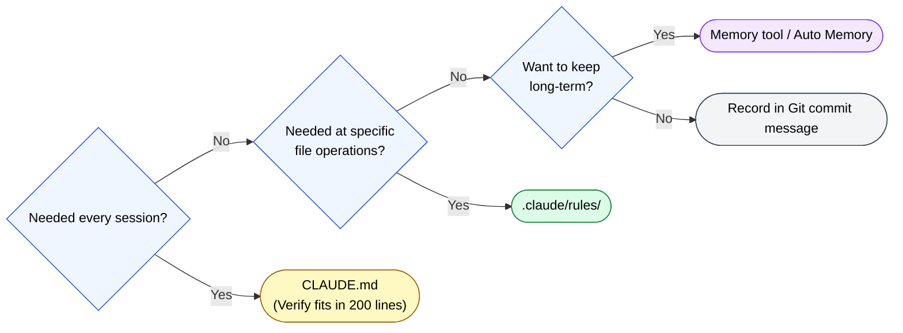

🌐 [日本語](../ja/08-session-management/tools-comparison.md)

# Tool Comparison and Selection

> [!NOTE]
> Comparison of tools available for memory persistence.

## Tool Comparison Table

| Tool | Memory Write | Memory Read | Context Cost | Use Cases |
| :--- | :--- | :--- | :--- | :--- |
| **CLAUDE.md** | Manual | Automatic (every session) | Always | Project conventions, technical stack |
| **Git commits** | Automatic | Manual (git log) | None | Code change history |
| **`.claude/rules/`** | Manual | Conditional automatic | Condition-dependent | File type rules |
| **MCP memory tools** | Automatic/semi-automatic | Search-based | Search-time only | Long-term design decisions, user info |
| **Auto Memory** | Automatic | Automatic | At session start | User preferences, project knowledge |

## Selection Criteria

---

> **Previous**: [When and How to Recall](when-to-recall.md)

> **Part 8 Complete → Next**: [Part 9: Application to Other LLMs](../09-cross-llm-principles/index.md)
