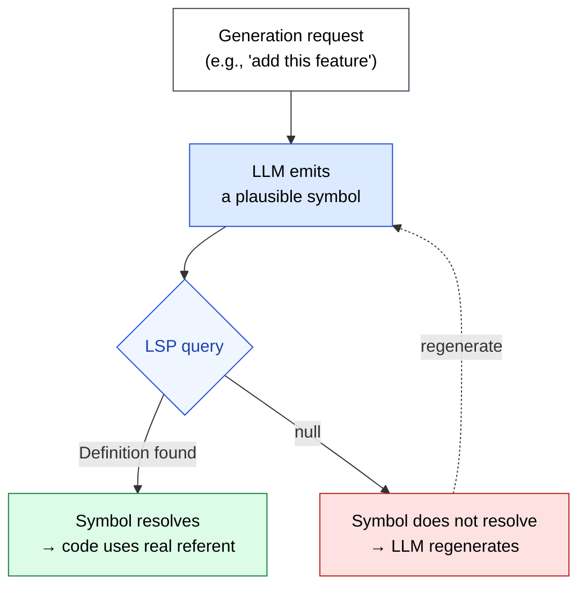

🌐 [日本語](../ja/09-code-intelligence/hallucination-and-symbols.md)

# Hallucination and Symbols

> [!IMPORTANT]
> → Why: **Hallucination** mitigation (symbol-level grounding stops the most common code-generation failures before they reach disk)
> → Why: **Knowledge Boundary** mitigation (project-private and post-cutoff symbols become resolvable instead of guessable)

## The Most Dangerous Hallucinations Are Plausible Ones

The Hallucination chapter framed this in general terms: LLMs generate confident, fluent text that contradicts facts. In code, the dangerous variant is not wildly wrong code — wildly wrong code is caught immediately. The dangerous variant is code that **looks right, compiles in some sibling version, and fails only on the specific commit in front of you**.

These failures all share a structure: the LLM emits a symbol that *could plausibly exist*, and there is no signal inside the LLM telling it that this particular symbol does not. LSP is the signal.



## Pattern 1: Function Signature Drift

The same library evolves across versions. The LLM has seen many versions; it averages them.

**RxJS example.** A reasonable-looking generation:

```typescript
import { combineLatest } from 'rxjs';

combineLatest(userId$, filter$).pipe(
  map((id, filter) => ({ id, filter })),
);
```

This was a real signature in RxJS 6. In RxJS 7+, `combineLatest` only accepts an array or object of observables — the positional-arguments form was removed. The LLM's "average" of training data emits the deprecated shape with confidence.

**LSP intervention.** Hover on `combineLatest` in the installed RxJS version returns:

```
combineLatest<T extends readonly unknown[]>(
  sources: readonly [...ObservableInputTuple<T>]
): Observable<T>
```

The LLM regenerates with the array form. No test had to run. No human had to review.

## Pattern 2: Project-Private Type Drift

Internal types that the LLM has never seen are the worst category, because the LLM has *nothing* to anchor against and falls back to inventing a plausible shape.

**Angular store example.** The LLM generates:

```typescript
this.store.select(selectFilteredUsers).subscribe(users => { ... });
```

`selectFilteredUsers` does not exist in this codebase. There is `selectActiveUsers` and `selectUserById(id)`, but the LLM has invented a third selector by analogy.

**LSP intervention.** `textDocument/definition` on `selectFilteredUsers` returns null. The LLM then either runs `textDocument/references` on the surrounding store module to discover the actual exported selectors, or — if connected to the project — performs symbol search and finds `selectActiveUsers`. The fabricated symbol never reaches the file.

> [!TIP]
> This is the failure mode most invisible to tests. A unit test for the component would still pass against a *mock* selector. The bug only surfaces at runtime, possibly in production. LSP catches it during generation.

## Pattern 3: Import Path Hallucination

Even if the symbol name is correct, the *path* may be wrong. Barrel exports, monorepo aliases, and re-exports compound the problem.

**Example.** The LLM emits:

```typescript
import { UserService } from '@app/services';
```

`UserService` is real. But this monorepo exports it from `@app/users/service`, not `@app/services`. The compiler will fail; the LLM may then "fix" it by inventing another wrong path.

**LSP intervention.** Definition resolves `UserService` to its canonical file. Auto-import suggestions from the language server emit the *correct* path the first time, using the project's own `tsconfig.json` `paths` configuration. The LLM is not asked to remember the alias map.

## Pattern 4: Field / Method Hallucination on Real Types

The type exists. The method on the type does not.

**Angular signals example.** The LLM has seen many signal APIs across frameworks (React, Solid, Vue) and emits:

```typescript
const count = signal(0);
count.value = 1;
```

`.value` is the Vue ref API. Angular's `signal` uses `count.set(1)` or `count.update(prev => prev + 1)`. The LLM has plausibly mixed APIs.

**LSP intervention.** Hover on the result of `signal(0)` returns `WritableSignal<number>`. Reading the type surface reveals `set`, `update`, and `asReadonly` — no `value`. The LLM regenerates with `count.set(1)`.

## Pattern 5: Outdated Idioms Presented as Current

Sometimes the symbol exists and the type is correct, but the idiom is the wrong era.

**TakeUntilDestroyed example.** The LLM emits the pre-v16 pattern:

```typescript
private destroy$ = new Subject<void>();
ngOnDestroy() {
  this.destroy$.next();
  this.destroy$.complete();
}

source$.pipe(takeUntil(this.destroy$)).subscribe(...);
```

This works, but in Angular 16+ the project likely uses:

```typescript
source$.pipe(takeUntilDestroyed()).subscribe(...);
```

**LSP intervention.** This one is harder. LSP confirms both patterns type-check. The signal here is not "non-existent symbol" but "outdated idiom." Mitigation requires combining LSP with [CLAUDE.md version pinning](../03-always-loaded-context/claude-md.md) ("this project is Angular 17, prefer `takeUntilDestroyed`") and possibly a Skill that documents the project's chosen idiom.

> [!WARNING]
> LSP is not a full Hallucination cure. It is the strongest defense against the *symbol existence* and *type shape* categories, which together account for the majority of generation failures in typed languages. Pattern 5 (outdated idioms) needs CLAUDE.md and Skills working alongside LSP.

## Failure Modes That LSP Does Not Catch

To set expectations honestly:

| Failure Mode | LSP catches? | Where to address |
|:--|:--|:--|
| Symbol does not exist | ✅ Definition returns null | Part 9 |
| Wrong function signature | ✅ Hover shows real signature | Part 9 |
| Wrong import path | ✅ Definition resolves canonical path | Part 9 |
| Non-existent method on real type | ✅ Hover shows real surface | Part 9 |
| Outdated idiom (both versions compile) | ⚠️ Partial — needs CLAUDE.md | Part 3 + Part 9 |
| Correct types, wrong logic | ❌ | Part 7 Hooks (tests), Part 5 Agents (review) |
| Race conditions, async ordering | ❌ | Part 7 Hooks (integration tests) |
| Security flaws (e.g., SQL injection) | ❌ | Part 7 Hooks (lint, SAST), Part 5 Agents |

The pattern across the table: **LSP closes the symbol-level gaps. Tests and review close the semantic-level gaps.** They stack.

## References

- Liu, F. et al. (2024). "Exploring and Evaluating Hallucinations in LLM-Powered Code Generation." [arXiv:2404.00971](https://arxiv.org/abs/2404.00971) — Empirical study quantifying symbol-level Hallucination rates
- Tian, R. et al. (2024). "CodeHalu: Code Hallucinations in LLMs Driven by Execution-based Verification." [arXiv:2405.00253](https://arxiv.org/abs/2405.00253) — Taxonomy of code-Hallucination categories aligned with the patterns in this page
- Microsoft. "Language Server Protocol Specification." [microsoft.github.io/language-server-protocol](https://microsoft.github.io/language-server-protocol/) — `textDocument/definition`, `textDocument/hover`, `textDocument/references`

---

> **Previous**: [LSP as Grounding](lsp-as-grounding.md)

> **Next**: [Live Type Errors](live-type-errors.md)
