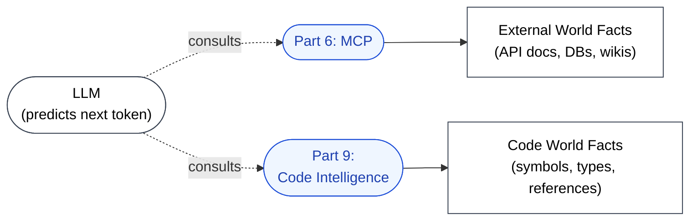

🌐 [日本語](../ja/09-code-intelligence/index.md)

# Part 9: Code-World Grounding — Code Intelligence

> [!NOTE]
> Connection to the **facts of the code world**.
> Where MCP grounds the LLM in external facts, LSP grounds it in the symbols, types, and references that exist *inside the repository at this moment*.
> Claude Code's Code Intelligence is a representative example. Grounding symbols through a language server is not product-specific.

## Why This Part Exists

The Hallucination chapter established that LLMs generate plausible-looking but non-existent function names, type signatures, and import paths as a structural consequence of next-token prediction. Telling the LLM "do not hallucinate" does not work — Hallucination is not a bug that can be patched away.

What *does* work is **grounding**: forcing the LLM to consult a source of truth before it commits to a symbol. Part 6 (MCP) introduced grounding for the external world (API docs, databases, internal wikis). Part 9 introduces grounding for the **code world** — the symbols, types, references, and diagnostics that exist in the user's repository right now.

## → Why: Which Structural Problems Does It Address?

> [!IMPORTANT]
> - **Hallucination**: LSP returns symbols and types that *actually exist* in the project. Generated code is constrained to real referents, not plausible-sounding fabrications.
> - **Knowledge Boundary**: Library APIs released after training cutoff, and project-specific types the LLM has never seen, become directly inspectable. The boundary shifts from "what the model memorized" to "what the LSP can resolve."
> - **Context Rot** (secondary): Definition jump and references retrieve precisely the symbols needed instead of loading whole files. Less token consumption per investigation, less pressure on the context window.

## How LSP Differs from Other Mitigations

| Mitigation | Source of Truth | What It Verifies |
|:--|:--|:--|
| **Hooks (test execution)** | Runtime behavior | Whether code actually runs and passes tests |
| **MCP** | External services | Facts outside the repository |
| **CLAUDE.md (version pinning)** | Static declaration | "Which version's knowledge to use" |
| **Code Intelligence (LSP)** | Live code analysis | Whether symbols exist, what their types are, what depends on them |

Tests fail *after* the LLM has written broken code. LSP catches the broken reference *before* the code is even committed — it operates inside the generation loop, not after it.

## Documents in This Part

| Document | Content |
|:--|:--|
| [LSP as Grounding](lsp-as-grounding.md) | The four LSP capabilities (Definition / Hover / References / Diagnostics) and what each one anchors |
| [Hallucination and Symbols](hallucination-and-symbols.md) | Concrete examples of code-symbol Hallucination and how LSP shuts each one down |
| [Live Type Errors](live-type-errors.md) | Why type errors retrieved *during* generation enable a self-correction loop |
| [Grep / Read / LSP — Which Tool When?](vs-grep-vs-read.md) | Token-efficiency comparison: when to load whole files, when to query symbols |

---

> **Previous**: [Part 8: Session Management](../08-session-management/index.md)

> **Next**: [LSP as Grounding](lsp-as-grounding.md)
