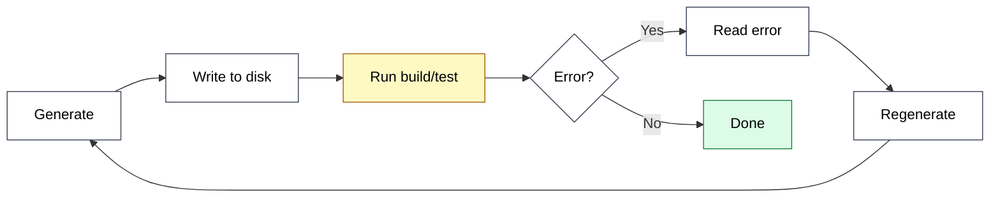
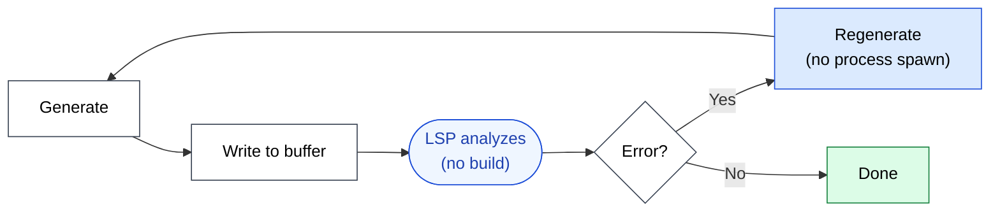

🌐 [日本語](../ja/09-code-intelligence/live-type-errors.md)

# Live Type Errors

> [!IMPORTANT]
> → Why: **Hallucination** mitigation (errors retrieved during generation, not after)
> → Why: **Instruction Decay** mitigation (verification happens at the runtime layer — does not depend on the LLM remembering to verify)

## The Feedback Loop Problem

Generating code without verification is open-loop. The LLM emits tokens, hopes they compile, and only learns otherwise when something later in the pipeline complains. The longer the loop, the more wasted generation and the more drift between intent and output.

Each iteration through this loop costs at minimum a process spawn (build, test runner), at worst tens of seconds of CI. The LLM has likely produced more code in the interim that depends on the broken code. The loop *works*, but it is expensive and slow.

## LSP Diagnostics Collapse the Loop

`textDocument/publishDiagnostics` is a push notification. The language server continuously analyzes the open editor state and emits errors *as the code changes*. There is no build to wait for.

The verification step is inside the LLM's edit-and-check loop, not outside it. For typed languages, this means **the majority of Hallucination-class errors never reach disk**.

## What Counts as a "Live" Error

LSP diagnostics cover everything the language server can compute without execution:

| Diagnostic Kind | Example | Severity |
|:--|:--|:--|
| Type mismatch | Passing `number` where `string` is expected | Error |
| Missing import | Symbol used but not imported | Error |
| Unresolved symbol | Calling a function that does not exist | Error |
| Missing required field | TypeScript object literal missing `required: true` | Error |
| Unused variable | Declared but never referenced | Warning |
| Lint rule violation | ESLint / `tslint` rule failure (when wired in) | Warning |
| Deprecated API | Use of `@deprecated` symbol | Warning |

Errors are blocking signals; warnings inform but do not gate. Both arrive in the same channel, instantly.

## Why This Helps Instruction Decay

A common pattern in long sessions: the user wrote in `CLAUDE.md` "always run `tsc --noEmit` after edits." Forty turns later, with a half-full context, the LLM forgets — [Instruction Decay](../01-llm-structural-problems/instruction-decay.md).

LSP diagnostics do not depend on the LLM remembering anything. The language server is always running. Errors are surfaced in the tool response whether or not the LLM thought to look. This is the same design principle as [Part 7 Hooks](../07-runtime-layer/hooks.md): **verification at the runtime layer, not via the LLM's instructions**.

> [!IMPORTANT]
> LSP diagnostics and test-execution Hooks are both runtime-layer verifications, but they sit at different points in the cost spectrum.
>
> - **LSP**: nearly free, sub-second, but only catches errors the language server can reason about statically.
> - **Test Hooks**: more expensive, requires runtime, catches behavioral errors.
>
> Use LSP as the inner loop, tests as the outer loop.

## A Practical Loop

A typical Claude Code session editing a TypeScript file:

1. LLM proposes an edit.
2. Edit is applied to the working buffer.
3. LSP returns `publishDiagnostics` — usually within milliseconds.
4. If any diagnostic has `severity: Error`, the response is fed back into the LLM as part of the tool output.
5. LLM revises and re-edits in the same turn, often without the user seeing the intermediate broken state.

The user experience is "the LLM wrote correct code on the first apparent try." The internal reality is "the LLM tried, failed, was corrected by the language server, and revised — all inside a single turn."

## Limits

> [!WARNING]
> Live diagnostics depend on the language server being healthy and aware of the right project state.
>
> - **Cold start**: When the LSP first attaches to a large repo, it may take seconds to minutes to fully index. Diagnostics during this period are incomplete.
> - **Stale lockfile / `node_modules`**: If the LSP sees an older version of a dependency than what runs in CI, diagnostics will be misleading.
> - **Multi-language repos**: Each language needs its own LSP. A polyglot repo may have inconsistent coverage.
> - **Generated code**: Codegen outputs (`.d.ts` from a build step, GraphQL types) are only visible to LSP after the generation step has run.

When live diagnostics are unreliable, the verification weight shifts back to test Hooks. The two-layer design is robust precisely because either layer can carry the load if the other is degraded.

## Relation to Other Parts

- The verification-at-runtime-layer principle is shared with [Part 7: Settings & Hooks](../07-runtime-layer/index.md). LSP is the static-analysis counterpart to test-execution Hooks.
- The "errors during generation, not after" property is what allows [Part 5 Agents](../05-on-demand-context/agents.md) to delegate code edits to a subagent and trust the result. Without LSP, every delegation risks returning code that needs another round of regeneration.

## References

- Microsoft. "Language Server Protocol Specification: publishDiagnostics." [microsoft.github.io/language-server-protocol](https://microsoft.github.io/language-server-protocol/specifications/lsp/3.17/specification/#textDocument_publishDiagnostics) — Canonical specification of the diagnostic push notification
- Anthropic. "Claude Code: IDE integration." Claude Code documentation. [docs.claude.com](https://docs.claude.com/) — Official guidance on how diagnostics surface in Claude Code tool responses

---

> **Previous**: [Hallucination and Symbols](hallucination-and-symbols.md)

> **Next**: [Grep / Read / LSP — Which Tool When?](vs-grep-vs-read.md)
