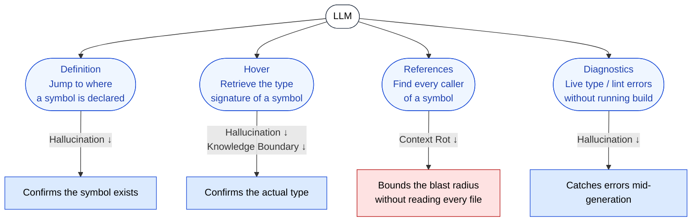

🌐 [日本語](../ja/09-code-intelligence/lsp-as-grounding.md)

# LSP as Grounding

> [!IMPORTANT]
> → Why: **Hallucination** mitigation (constrains generated symbols to real referents)
> → Why: **Knowledge Boundary** mitigation (project-local types and post-cutoff APIs become inspectable)
> → Why: **Context Rot** mitigation (symbol-level retrieval avoids whole-file reads)

## What the LSP Provides

The Language Server Protocol (LSP) is a JSON-RPC protocol originally designed so that one language server can serve any editor. From the LLM's perspective, it is a **factual oracle for the code world**: a service that answers "does this symbol exist?", "what is its type?", "where is it defined?", "who depends on it?" without the LLM having to guess.

Claude Code uses four LSP capabilities. Each one shuts down a specific failure mode.



## Capability 1: Definition — "Does This Symbol Exist?"

`textDocument/definition` returns the location where a symbol is declared. If the LLM is about to call `userStore.selectFilteredUsers()`, the LSP either jumps to a real declaration or returns nothing.

A returned definition is **proof of existence**. A null response is **proof of non-existence** — and it is at this moment, before the suggestion is committed to code, that the Hallucination loop is broken.

This is qualitatively different from Grep. Grep finds string matches; it cannot distinguish a real declaration from a comment, a string literal, or a docstring that happens to mention the same name. LSP returns *the* declaration, with the language server's semantic model behind it.

## Capability 2: Hover — "What Is Its Type?"

`textDocument/hover` returns the type signature and documentation of a symbol. This is the single most powerful Hallucination mitigation for typed languages.

For example, in an RxJS-heavy codebase, the LLM may need to compose:

```typescript
combineLatest([userId$, filter$]).pipe(
  switchMap(([id, filter]) => api.getUsers(id, filter)),
);
```

The LLM cannot remember every operator's exact signature across RxJS versions. Hover on `combineLatest` returns the actual signature for the version installed in `node_modules` — including the `ObservableInput<T>` union, the array-vs-object overloads, and the deprecated forms. The LLM generates code against the real signature, not the one it half-remembers.

> [!TIP]
> This is the most direct cure for the failure mode in [Knowledge Boundary § Pattern 2: Calling Nonexistent APIs](../01-llm-structural-problems/knowledge-boundary.md). The LLM is no longer asked to remember which APIs exist; it is told.

## Capability 3: References — "Who Depends on This?"

`textDocument/references` returns every call site of a symbol. This is primarily a **Context Rot mitigation**.

Without LSP, asking "what breaks if I change this function?" requires loading dozens of files into the context window and scanning manually. With References, the LSP returns the exact set of files and line numbers — the LLM loads only those, in only the regions it actually needs.

The result is a smaller, denser context. The same investigation that would have eaten 30K tokens now consumes a few hundred.

## Capability 4: Diagnostics — "Is This Code Valid Right Now?"

`textDocument/publishDiagnostics` streams type errors, missing imports, and lint warnings *as code is edited* — without invoking a build.

This is the capability that turns LSP into a feedback signal **inside the generation loop**, not just a query tool. The next section ([Live Type Errors](live-type-errors.md)) treats this in depth, because it changes the loop from "generate → run tests → fix" to "generate → see error → fix" with no shell call in between.

## Why LSP Solves Different Problems from Tests

Both LSP diagnostics and Hooks-driven tests verify the LLM's output, but they intercept at different points and catch different errors.

| Layer | When It Fires | Catches | Misses |
|:--|:--|:--|:--|
| **LSP Diagnostics** | While generating / editing | Type errors, missing symbols, import errors | Logic bugs (correct types, wrong behavior) |
| **Hooks (test execution)** | After file write | Behavioral bugs, runtime errors, regressions | Errors the test suite doesn't exercise |

LSP and Hooks are complementary, not redundant. LSP catches the failures that *would have* failed at compile time — quickly, cheaply, before any process spawns. Hooks catch the failures that compile but misbehave.

## What LSP Cannot Do

> [!WARNING]
> LSP is a fact source for **symbols**, not for **semantics**.
>
> - LSP confirms `getUserById(id: string)` exists and accepts a string. It does not confirm that passing an empty string is sane.
> - LSP confirms a function returns `Promise<User>`. It does not confirm whether the caller awaits it.
> - LSP confirms types align. It does not confirm the business logic is correct.
>
> For those, you still need tests (Part 7 Hooks) and review (Part 5 Agents, Cross-Model QA).

## Operational Notes

- LSP must be wired to the same language server the user's IDE uses, against the same `node_modules` / lockfile state. A stale server returns stale answers, which is worse than no LSP at all.
- For TypeScript monorepos, project references and `tsconfig.json` resolution must be sane. If `tsc --noEmit` is broken, LSP will be broken too.
- Languages without strong type systems (untyped Python, plain JS) get less from Hover and Diagnostics. They still get full value from Definition and References.

## References

- Microsoft. "Language Server Protocol Specification." [microsoft.github.io/language-server-protocol](https://microsoft.github.io/language-server-protocol/) — Canonical LSP specification
- Anthropic. "Claude Code: IDE integration and language servers." Claude Code documentation. [docs.claude.com](https://docs.claude.com/) — Official guidance on Code Intelligence in Claude Code
- Liu, F. et al. (2024). "Exploring and Evaluating Hallucinations in LLM-Powered Code Generation." [arXiv:2404.00971](https://arxiv.org/abs/2404.00971) — Empirical study of symbol-level Hallucination rates in code generation

---

> **Previous**: [Part 9 Overview](index.md)

> **Next**: [Hallucination and Symbols](hallucination-and-symbols.md)
