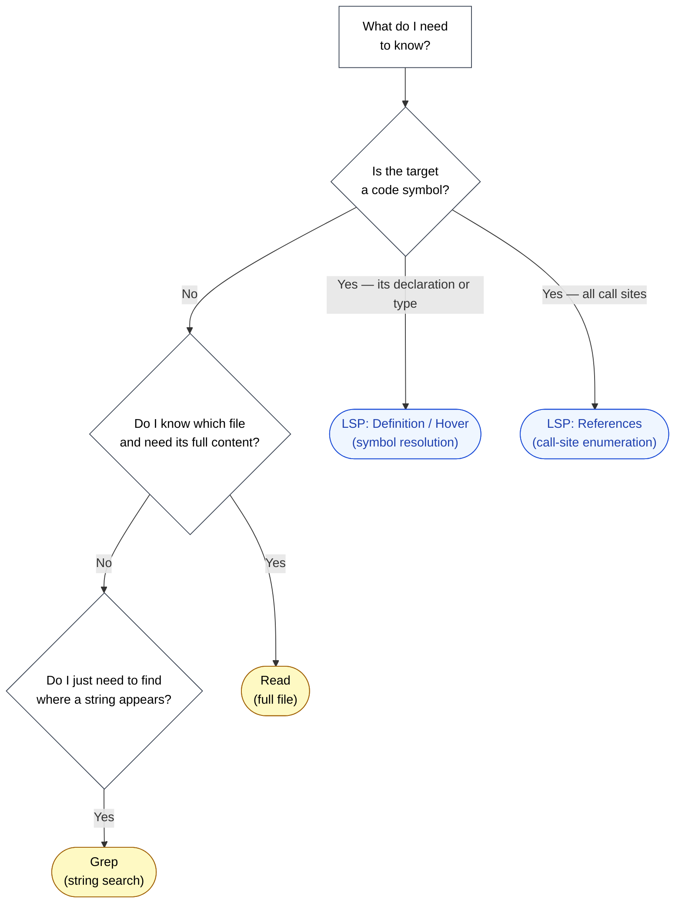

🌐 [日本語](../ja/09-code-intelligence/vs-grep-vs-read.md)

# Grep / Read / LSP — Which Tool When?

> [!IMPORTANT]
> → Why: **Context Rot** mitigation (using the right tool means loading only the tokens that matter)
> → Why: **Lost in the Middle** mitigation (smaller context keeps relevant information at high-attention positions)

## Three Tools, Three Cost Profiles

Claude Code has three primary ways to consult the code world. Each one answers a different question and each one has a different token cost.

| Tool | Answers | Token Cost | Semantic? |
|:--|:--|:--|:--|
| **Grep** | "Which files contain this string?" | Low | No — string matches only |
| **Read** | "What is the full content of this file?" | High — whole file | Implicit (LLM reads) |
| **LSP** | "Where is this *symbol* defined / used / typed?" | Very low — just the symbol info | Yes — semantic resolution |

The wrong choice does not produce wrong answers, but it does produce wasted context. And Context Rot, as established in Part 1, degrades quality long before the window is full.

## The Decision Tree

## Worked Example: "What Will Break If I Change This Function?"

Imagine investigating an impact radius for a refactor of `getUserById` in an Angular service.

**Naive approach — Read everything that imports it.**

1. Grep for `getUserById` across the repo: 14 files match.
2. Read all 14 files in full.
3. Average file size: ~200 lines. Total: ~2,800 lines of context, roughly 25K tokens.
4. Many of the matches are in test files or comments. Only ~6 are real call sites.

**LSP-first approach.**

1. `textDocument/references` on `getUserById`: returns 6 exact call sites with file + line range.
2. Read only the relevant call sites — say 20 lines around each. ~120 lines total, roughly 1.2K tokens.

The LSP-first approach uses **~5% of the tokens** for the same investigation, with higher accuracy (no false positives from string matches in comments).

## Worked Example: "Find Where We Talk About Rate Limiting"

Now consider a question that is *not* about a code symbol — finding all the places in the codebase that discuss rate limiting, whether in code, comments, docstrings, or config files.

**LSP cannot help here.** Rate limiting is a concept, not a symbol. The right tool is Grep.

| Query | Best tool | Why |
|:--|:--|:--|
| `getUserById` (the function) | LSP References | The LLM needs the call sites, not the string occurrences |
| `"rate limit"` (the concept) | Grep | Concept appears in comments, strings, config — LSP would miss most of it |
| `UserService` (the class) | LSP Definition | One canonical declaration; Grep returns dozens of irrelevant imports |
| `TODO` markers | Grep | TODO is not a symbol; comments are exactly what we want |

The rule: **symbols → LSP; concepts and strings → Grep; full content of a known file → Read**.

## Why "Read Everything" Is Always a Mistake

A tempting shortcut: "just Read the whole module folder, the LLM will figure it out." This fails for two reasons.

**Context Rot.** As covered in [Part 1: Context Rot](../01-llm-structural-problems/context-rot.md), LLM quality degrades with token count. Loading 30K tokens of source to answer a 1K-token question multiplies the degradation for no informational benefit.

**Lost in the Middle.** [Lost in the Middle](../01-llm-structural-problems/lost-in-the-middle.md) shows that information in the middle of a long context is recalled worse than information at the ends. Loading 14 files in sequence guarantees that information from the middle files is at the worst recall position.

The combination is brutal: spending tokens to *make accuracy worse*.

> [!CAUTION]
> Reading entire directories should be reserved for sessions where the user explicitly wants comprehensive review (e.g., a security audit). For routine "what does this codebase do" questions, **always start with LSP or Grep to localize, then Read only the precise regions**.

## When to Read Whole Files

Reading a whole file is the right move when:

- The file is small (< 200 lines) and you need its full structure (e.g., a config file, a small component).
- You have already localized the work to one file via LSP/Grep, and need surrounding context.
- The file lacks LSP support (Markdown, plain text, generated code outside the language server's view).

Reading is the *finishing* tool, not the *starting* tool.

## A Note on Tool Order

A common antipattern: "I'll just Grep first, then if I need types I'll use LSP." This wastes a tool call. If the target is a typed symbol, LSP knows everything Grep would have found, plus the type, plus the canonical declaration site, in one call.

The reverse is also true: if the target is a string concept, do not bother with LSP. Go straight to Grep.

**Pick the right tool first.** Tool calls themselves cost tokens (the request and response both consume context).

## Relation to Other Parts

- [Part 6 MCP Context Cost](../06-tool-context/mcp-context-cost.md) makes the same argument for tool definitions: every byte loaded is a byte not available for actual work. The same logic applies here at the per-investigation level.
- [Part 8 Session Management](../08-session-management/index.md) covers what to do when context has already filled up. Tool selection is the upstream control; session management is the downstream remediation.

## References

- Hong, K., Troynikov, A., & Huber, J. (2025). "Context Rot: How Increasing Input Tokens Impacts LLM Performance." Chroma Research. [research.trychroma.com](https://research.trychroma.com/context-rot) — Quantitative measurement of Context Rot across 18 models; motivates loading only what is necessary
- Liu, N. F. et al. (2023). "Lost in the Middle: How Language Models Use Long Contexts." [arXiv:2307.03172](https://arxiv.org/abs/2307.03172) — Empirical demonstration of U-shaped recall

---

> **Previous**: [Live Type Errors](live-type-errors.md)

> **Part 9 Complete → Next**: [Part 10: Multi-Session Coordination — Agent Teams](../10-multi-session/index.md)
