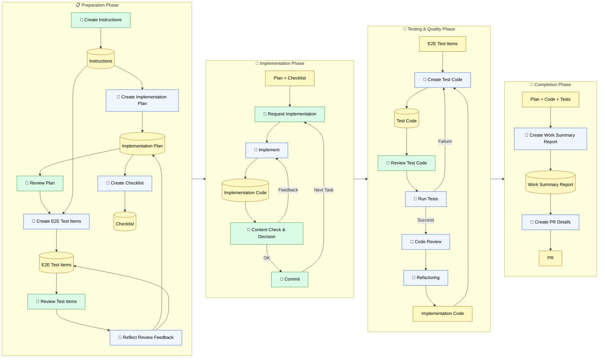

🌐 [日本語](../ja/09-cross-llm-principles/prompt-driven-development.md)

# Practical Application Without Tool Support

> [!NOTE]
> Even in environments where CLAUDE.md, Rules, Skills, and MCP are unavailable, the principle for dealing with LLM structural constraints remains the same.
> Here we cover "prompt-driven development," a practical method of manually reproducing the same patterns.

## Real-World Constraints

Not all development environments have tool support like Claude Code.

- GitHub Copilot's agent model has no equivalent to CLAUDE.md
- Source control is CodeCommit, task management is a separate tool, authentication is fragmented
- MCP cannot directly reference tickets or repositories
- Commit message conventions are not unified, and `git log` doesn't function as context

Even in such environments, understanding the principles from Parts 1–8 allows you to **manually implement the same solutions**.

## Workflow for Prompt-Driven Development

Below is a step-by-step development method actually used in environments where CLAUDE.md or Skills are unavailable.

#### Workflow Diagram



Color coding:

- 🟢 Green — User actions (review, judgment, commit)
- 🔵 Blue — LLM actions (generation, implementation, testing)
- 🟡 Yellow (cylinders) — Deliverables (6 items + checklist + PR)

## Why Separate Steps?

> [!IMPORTANT]
> The reason for not requesting everything at once comes from the structural constraints learned in Parts 1–2.

LLMs are stateless, and context grows with each turn. If you ask to "plan, implement, test, and create a PR" all at once, context becomes huge and quality degrades. By separating steps, you keep context small for each step.

| Step | Structural Problem Being Addressed |
| :--- | :--- |
| Create instructions in advance | Knowledge Boundary (explicitly inject project context unknown to LLM) |
| Create plan first → review | Context Rot (prevent context bloat from all-at-once implementation) |
| Create E2E test items before implementation | Sycophancy (set acceptance criteria first to prevent lenient judgment) |
| Externalize checklist | Instruction Decay (prevent forgetting procedures in long sessions) |
| Commit per task phase | Context Rot (reset session when phase completes) |

## Deliverables as Context Substitutes

The core of this workflow is **persisting deliverables as files and having the LLM reference them by path in the next step**.

```
# Example prompt
Please refer to the following deliverables and proceed with Phase 2 implementation.

- Instructions: ./docs/instructions.md
- Implementation Plan: ./docs/implementation-plan.md
- Checklist: ./docs/checklist.md

First, confirm that you understand the content.
```

When you pass the path to the LLM, it reads the content, displays a summary, and asks for confirmation. This "comprehension check" step is important—it validates whether the LLM has correctly grasped the context.

> [!TIP]
> This is essentially doing manually what CLAUDE.md + Skills do.
>
> | Manual Process | Claude Code Feature |
> | :--- | :--- |
> | Create instructions and specify path | CLAUDE.md (resident context) |
> | Pass deliverable paths and say "refer to" | Skills reference-based design |
> | Convert tickets to Markdown and save locally | llms.txt / MCP integration |
> | Have LLM output summary for confirmation | Comprehension check prompt |

## Markdown-ifying External Information

When MCP cannot directly connect to ticket management systems or repositories, the practical solution is to **manually convert information to text and place it in your project folder**.

- Copy Backlog / GitHub Issue ticket content to Markdown
- Text-ify backend repository API specifications
- Save related design documents locally

```
Project Folder/
├── docs/
│   ├── instructions.md        # Instructions (template-ready)
│   ├── implementation-plan.md # Implementation plan generated by LLM
│   ├── e2e-test-spec.md       # E2E test items generated by LLM
│   └── checklist.md           # Checklist generated by LLM
├── references/
│   ├── ticket-123.md          # Ticket content Markdown-ified
│   ├── backend-api-spec.md    # Backend API specification
│   └── design-doc.md          # Design documentation
└── src/
```

This manual conversion is tedious but has advantages. If you pass raw ticket data, comments and unrelated discussions also end up in context. By Markdown-ifying, you extract "only what the LLM needs." In a sense, this is **manual Context Budget management**.

## Commit Messages and Context Quality

> [!WARNING]
> In environments where commit messages are not standardized, `git log` barely functions as LLM context.

When commits like `fix bug` or `update` pile up, the LLM cannot grasp the intent behind past changes. With conventions like Conventional Commits and issue numbers attached:

```
feat(auth): add login flow (#123)
fix(api): handle timeout in payment service (#456)
```

The LLM can trace Issue #123, understand the background, and track related changes. The quality of "development process metadata" like commit messages, branch naming, and PR templates directly affects the efficiency of LLM utilization.

This has been a concern since before LLMs, but its importance is renewed in the context of AI adoption. Between humans, "that thing at that time" makes sense. With LLMs, it doesn't.

## Mapping Principles

The principles of addressing problems are the same regardless of tool support.

| Principle | Claude Code Implementation | Prompt-Driven Implementation |
| :--- | :--- | :--- |
| Keep resident context minimal | CLAUDE.md 200-line limit | Simplify instruction template |
| Distribute with conditional injection | `.claude/rules/` | Specify only needed deliverable paths per step |
| Inject knowledge on-demand | Skills | Reference deliverable files |
| Make external info readable to LLM | MCP / llms.txt | Markdown-ify and save locally |
| Keep sessions short | `/compact` / `/clear` | Commit per phase + reset |
| Mechanical validation outside context | Hooks | CI/CD, manual test execution |

## Approach of Defining the Workflow Itself as Skills

Up to this point, we've discussed "manually applying principles without tool support." Conversely, in environments where Skills-compatible tools like Claude Code or Cursor are available, you can **define this workflow itself as a Skill**, enabling process standardization and reuse.

Addy Osmani's [agent-skills](https://github.com/addyosmani/agent-skills) systematizes exactly this approach, defining production-level development workflows as Plain Markdown Skills.

- **Spec before code** — Define specification before implementation (corresponds to "create instructions in advance")
- **Plan-mode task breakdown** — Break tasks into verifiable units (corresponds to "create plan first → review")
- **TDD with Prove-It pattern** — Reproduce bugs as failing tests first (corresponds to "create E2E test items before implementation")
- **5-axis code review** — Review across accuracy, readability, design, security, and performance
- **Anti-rationalization table** — Pre-define agent excuses for skipping steps and counter-arguments (Sycophancy mitigation)

> [!TIP]
> The important thing is that these are **Plain Markdown**. They work with Claude Code, Cursor, Windsurf, Copilot, Codex—any tool. The manual processes introduced on this page can be reused in tool-supported environments once defined as Skills.

## References

- Osmani, A. (2025). "agent-skills: Production-grade engineering skills for AI coding agents." [github.com/addyosmani/agent-skills](https://github.com/addyosmani/agent-skills) — Systematizes development workflows as Plain Markdown Skills. MIT License

---

> **Previous**: [Structural Constraints Are Universal Across All Models](universal-patterns.md)

> **Next**: [Cursor / Cline / Copilot Reference Table](cursor-cline-mapping.md)
