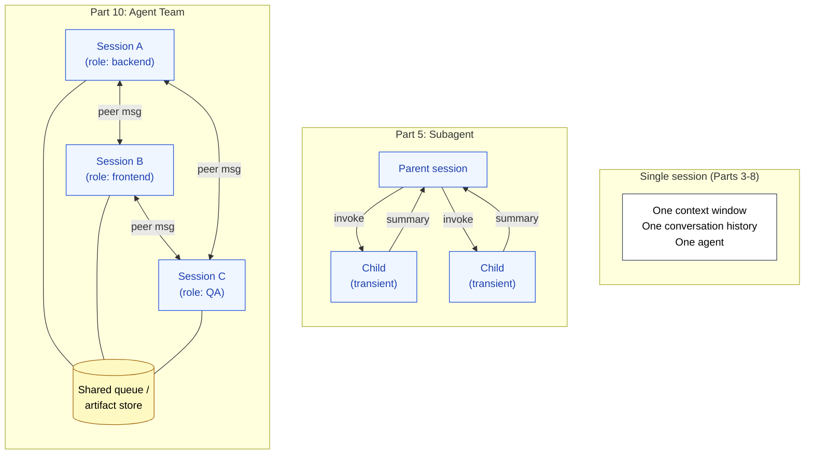

🌐 [日本語](../ja/10-multi-session/index.md)

# Part 10: Multi-Session Coordination — Agent Teams

> [!NOTE]
> When a single session cannot complete a task without degrading, the answer is not "a better single session." It is **multiple sessions, each with bounded scope, coordinating peer-to-peer**.
> Where Part 5 Subagents are delegated children of a parent session, Agent Teams are peers with their own lifespans.
> Agent Teams are a representative example in Claude Code. Designing session boundaries is not product-specific.

## Why This Part Exists

Part 5 introduced Subagents: the parent session invokes a child in an independent context window, the child returns a summary, the parent continues. This pattern works for tasks that fit cleanly into "call → result." It breaks down when the task is too large for any single session to hold in mind from start to finish — a multi-week refactor, a feature spanning backend and frontend, a long debugging session interleaved with QA.

What is needed at that scale is not bigger contexts but **bounded sessions that coordinate**. Each session owns one slice of the work, with its own context budget, its own history, its own model invocation. They talk to each other when they need to.

This shifts the design surface. Where Parts 3–8 designed *the contents* of a session, Part 10 designs *the boundaries between sessions*.

## → Why: Which Structural Problems Does It Address?

> [!IMPORTANT]
> Agent Teams address three structural problems at once, because the underlying remedy — *keeping each context small and focused* — is what each of those problems individually demands.
>
> - **Context Rot**: Parallel decomposition is the root-cause fix. Each session holds only its slice; no single session ever fills up.
> - **Lost in the Middle**: When each session's conversation is short and topic-focused, there is no "middle" to lose information in. The U-shape never forms.
> - **Priority Saturation**: With responsibilities split across sessions, each session carries fewer simultaneous instructions. Compliance stays above the degradation threshold.

This is qualitatively different from what `/compact` and `/clear` (Part 8) achieve. Those are *downstream* remediations — they manage degradation after it has begun. Agent Teams are *upstream*: they prevent degradation from forming in the first place by never letting any single session grow large.

## Where Subagents Stop and Agent Teams Begin

| Dimension | Subagent (Part 5) | Agent Team (Part 10) |
|:--|:--|:--|
| **Topology** | Hierarchical (parent → child) | Peer-to-peer (sessions → sessions) |
| **Lifespan** | One task, then exit | Project-scoped, persistent across many tasks |
| **State** | Stateless (every call is fresh) | Stateful (each session retains its history) |
| **Coordination** | Parent waits for child's return value | Sessions exchange messages asynchronously |
| **Failure mode it solves** | Parent's Context Rot | Long-horizon work that no single session can hold |

A useful rule: if the work fits in a single call-and-return, a Subagent is enough. If the work spans many call-and-returns, with each session needing to remember what it did last time, you want Agent Teams.

## What This Part Is Not About

> [!WARNING]
> This part is about **the structural rationale** for multi-session coordination — why it works, what it solves, when to reach for it. It is not a tutorial for any specific orchestration framework or SDK.
>
> The concrete API surface (how to spawn a session, how to address a peer, what the message envelope looks like) varies between Claude Code's own coordination primitives, the Claude Agent SDK, and third-party frameworks like AutoGen or CrewAI. The principles in this part apply across all of them; the specifics belong in tool-specific documentation.

## Documents in This Part

| Document | Content |
|:--|:--|
| [Subagent vs Agent Team](subagent-vs-team.md) | The two patterns side by side, and how to decide which one to use |
| [Session Boundary Design](session-boundary-design.md) | Splitting work by role, by stage, by layer, or by feature — and how to choose |
| [Peer Messaging](peer-messaging.md) | How sessions communicate: shared queues, direct messages, artifacts, and conflict resolution |
| [Long-Running Tasks](long-running-tasks.md) | Parallel decomposition as the root-cause fix for Context Rot at scale |

## Where this leads

Through this Part, the layers of countermeasures using Claude Code as a representative example are in place. Product-independent principles are extracted in [Part 11: Applying to Other LLMs](../11-cross-llm-principles/index.md).

## References

- Anthropic. (2025). "How we built our multi-agent research system." Anthropic Engineering. [anthropic.com/engineering](https://www.anthropic.com/engineering/built-multi-agent-research-system) — Anthropic's own account of the design decisions behind a production multi-agent system
- Wu, Q. et al. (2023). "AutoGen: Enabling Next-Gen LLM Applications via Multi-Agent Conversation." [arXiv:2308.08155](https://arxiv.org/abs/2308.08155) — Reference framework for multi-agent conversation patterns

---

> **Previous**: [Part 9: Code-World Grounding — Code Intelligence](../09-code-intelligence/index.md)

> **Next**: [Subagent vs Agent Team](subagent-vs-team.md)
