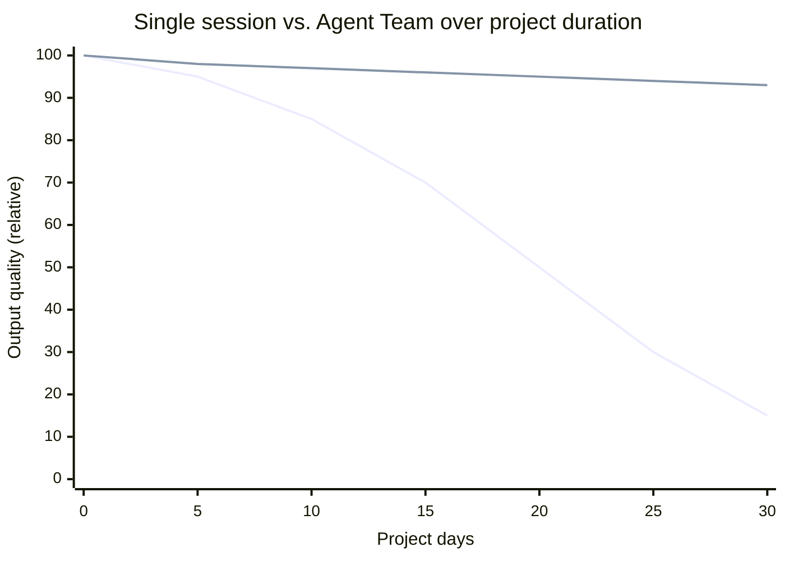
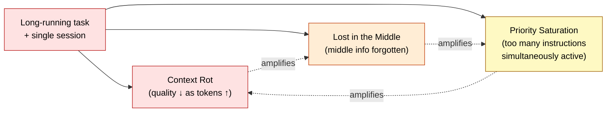
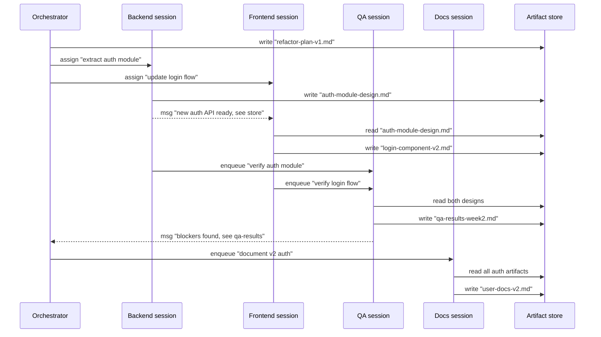

🌐 [日本語](../ja/10-multi-session/long-running-tasks.md)

# Long-Running Tasks

> [!IMPORTANT]
> → Why: **Context Rot** root-cause mitigation (no single session ever has to hold the whole project)
> → Why: **Lost in the Middle** root-cause mitigation (each session's history stays short enough that the U-shape never forms)
> → Why: **Priority Saturation** root-cause mitigation (each session carries instructions for one role, not for all)

## The Problem at Scale

Parts 3–8 give you tools to manage a session: keep CLAUDE.md tight, distribute rules conditionally, compact at 50% — all of it works. But every one of those techniques is a **delaying tactic**. They slow the rate of degradation; they do not eliminate it. For a task that takes one afternoon, that is enough. For a task that takes one month, it is not.

The first line (single session, even with `/compact`) decays as the cumulative weight of remembered decisions, prior code, and accumulated rules grows. The second line (Agent Team) stays nearly flat — because no single session ever has to remember everything. Each session's history covers only its slice; when that slice is done, the session can `/clear` and the artifact store carries forward the durable facts.

> [!NOTE]
> The numbers in this chart are illustrative, not measured. The qualitative shape — degradation curve vs. flat plateau — is what the research on Context Rot (Hong et al., 2025) and Lost in the Middle (Liu et al., 2023) predicts at scale.

## What Counts as "Long-Running"

The threshold is not measured in days but in **context budget consumed by the work itself**. A useful rule of thumb:

| Work scope | Single-session budget pressure | Pattern |
|:--|:--|:--|
| One PR, one afternoon | Low | Single session |
| One feature, one week | Medium; `/compact` once or twice | Single session with discipline |
| One epic, several weeks | High; multiple `/clear` cycles, losing local context | Agent Team |
| One initiative, ongoing | Saturated; every `/clear` loses critical history | Agent Team with persistent artifact store |

The signal that you have crossed the threshold is when **`/clear` starts costing you**. If clearing a session means losing important state that the LLM had figured out (which file does what, which patterns the team uses, which decisions were made and why), the session has grown beyond what `/clear` can safely reset. That state needs to live in artifacts owned by sessions, not in a single session's chat history.

## Why Parallel Decomposition Is the Root-Cause Fix

The other Part 8 remedies (`/compact`, `/clear`) operate inside one session's lifecycle. Agent Teams operate at a different level: **they ensure no single session ever has to hold the full state**.

This matters because the three structural problems addressed here are not independent — they reinforce each other:

Single-session remedies address each problem individually. They can stack, but only up to a point. Agent Teams break the cycle at the source: by keeping each session small and focused, all three problems remain below their critical thresholds simultaneously.

## When Parallel Decomposition Does Not Help

> [!WARNING]
> Agent Teams help when the *work* is decomposable. Some long-running work is not.
>
> - **Single-threaded reasoning chains.** A complex proof, a difficult debugging session where the answer depends on context that cannot be split — these cannot run in parallel. The work is intrinsically serial; multi-session would just add coordination cost.
> - **Tasks dominated by one specialist's expertise.** If 90% of the work is in one role, splitting it across roles produces 9 idle sessions and one bottleneck.
> - **Work that is genuinely small.** A two-day task is not long-running. The setup cost of an Agent Team exceeds its benefit.
>
> The honest test is: does the work *naturally* split into independent slices, each of which a single session can complete without constantly asking peers? If yes, parallel decomposition is the fix. If no, the answer is `/compact`, `/clear`, and disciplined single-session work — even if it is slow.

## A Worked Pattern: The Multi-Week Refactor

Consider a multi-week refactor that touches backend services, frontend components, tests, and documentation. The work is decomposable along role lines.

No single session needs to know everything. The orchestrator routes work. Each role session owns its slice. The artifact store carries durable knowledge across weeks. Even if the backend session is `/clear`-ed and restarted halfway through, the next backend session reads `refactor-plan-v1.md` and `auth-module-design.md` and resumes coherently.

## Operational Discipline for Long-Running Teams

> [!TIP]
> Four habits that keep a long-running Agent Team healthy:
>
> 1. **Write artifacts as if peers will read them next year.** Future sessions — possibly fresh `/clear`-ed instances of the same role — depend on the artifact, not on the writer's session history.
> 2. **Keep CLAUDE.md per session, not per team.** Each role-session has its own CLAUDE.md tuned to its work. A shared CLAUDE.md across roles bloats every session.
> 3. **Cycle sessions deliberately.** Once a session's history grows large, `/clear` and rehydrate from artifacts. The artifact store is your team's long-term memory; the session is just working memory.
> 4. **Have a designated "team CLAUDE.md."** Not as resident context — as an artifact that every new role-session reads at startup. It describes the team's conventions, the artifact store layout, who owns what.

## Relation to Other Parts

- [Part 1 Context Rot](../01-llm-structural-problems/context-rot.md) — the structural problem that long-running single-session work cannot escape.
- [Part 1 Lost in the Middle](../01-llm-structural-problems/lost-in-the-middle.md) — why a session's history of decisions becomes hard to recall.
- [Part 8 Session Management](../08-session-management/index.md) — the single-session remedies (`/compact`, `/clear`) that Agent Teams complement, not replace.
- [Part 9 Code Intelligence](../09-code-intelligence/index.md) — when sessions are split by code area, LSP is what lets each session understand the cross-session impact of a change without loading every file.

## References

- Hong, K., Troynikov, A., & Huber, J. (2025). "Context Rot: How Increasing Input Tokens Impacts LLM Performance." Chroma Research. [research.trychroma.com](https://research.trychroma.com/context-rot) — Quantitative measurement of Context Rot at scale, the empirical basis for why parallel decomposition matters at long horizons
- Anthropic. (2025). "How we built our multi-agent research system." Anthropic Engineering. [anthropic.com/engineering](https://www.anthropic.com/engineering/built-multi-agent-research-system) — Production-scale account of the same pattern applied to research workflows

---

> **Previous**: [Peer Messaging](peer-messaging.md)

> **Part 10 Complete → Next**: [Part 11: Cross-LLM Principles](../11-cross-llm-principles/index.md)
