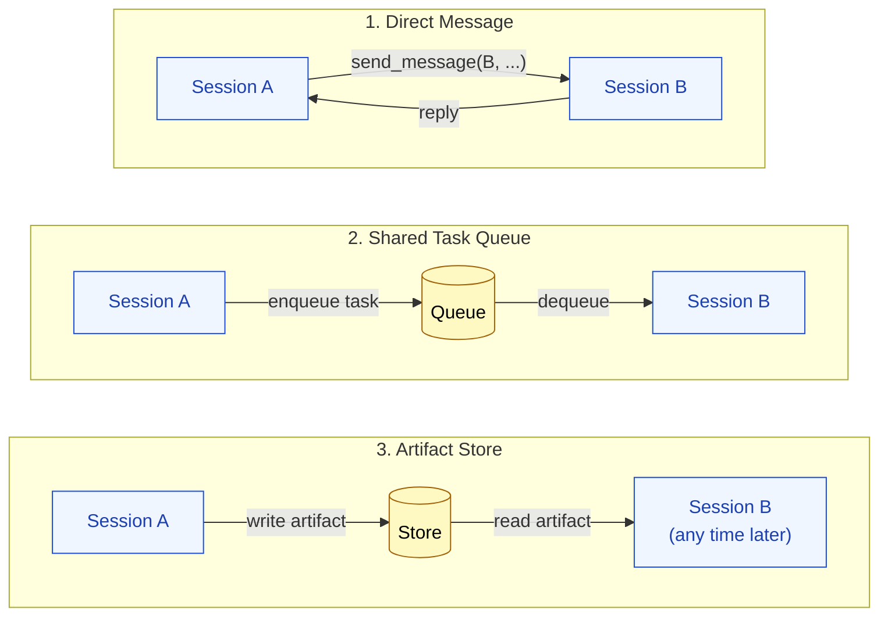
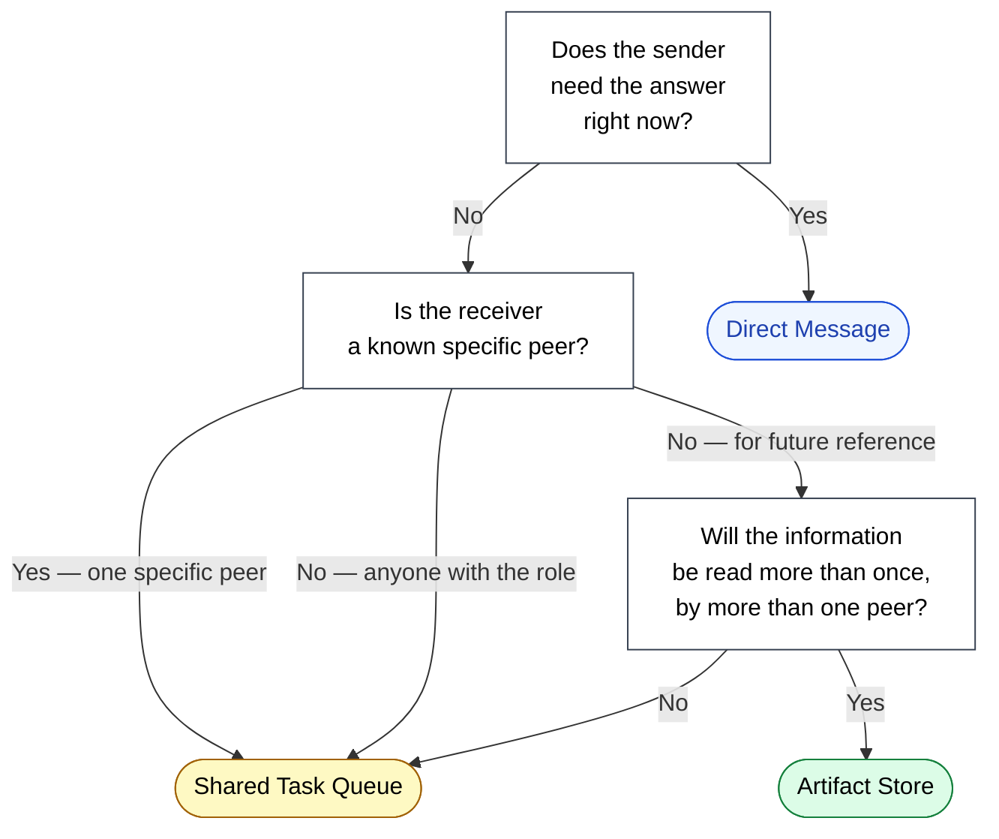

🌐 [日本語](../ja/10-multi-session/peer-messaging.md)

# Peer Messaging

> [!IMPORTANT]
> → Why: peer messaging is the *only* channel through which an Agent Team coordinates. The design of this channel determines whether the team behaves as a coherent unit or as a collection of sessions stepping on each other.

## Three Communication Primitives

Multi-session coordination uses three primitives, in increasing order of asynchrony:



### 1. Direct Message — "Ask me right now"

A session sends a message addressed to a specific peer, with a continuation expected. The sender waits (synchronously or with a polling loop) for a reply.

Use when: the work cannot proceed without the answer.

Examples:
- "What is the schema of the `users` table?" (backend → infrastructure session)
- "Is this design ready for implementation?" (implement-stage session → design-stage session)

### 2. Shared Task Queue — "Pick this up when ready"

A session enqueues a task. Any peer that owns that task type dequeues and processes it. The enqueuer does not wait; it continues with other work.

Use when: the work *can* proceed in parallel. The enqueuer does not need to know which peer picks up the task or when.

Examples:
- "Run the regression suite on this commit." (any session → QA session)
- "Document this new public API." (implement → docs session)

### 3. Artifact Store — "Read this when relevant"

A session writes an artifact — a design doc, a code module, a test report — to a shared store. Peers read it on their own schedule.

Use when: the information is durable and may be relevant to multiple future readers, possibly across multiple sessions of work.

Examples:
- A design document referenced by both implement and review sessions.
- Test results consulted by both the implement and the PM session.
- Architecture decision records (ADRs) consulted by every new session at startup.

## Choosing the Right Primitive



A useful default: **prefer Artifact over Queue, Queue over Direct Message**. Each step up reduces coupling and increases the team's ability to operate at different paces.

## Message Discipline: What to Put in a Message

A peer message consumes context in the sender's history *and* in the receiver's. Sloppy messaging is a cheap way to burn context budget on coordination instead of work. Three principles:

> [!TIP]
> **Send a *summary*, not the full reasoning.** If you spent 10K tokens figuring something out, the peer needs the conclusion, not the trail. Save the trail in an artifact and link to it.
>
> **Address the question, not the context.** "What's the auth flow?" is better than "I'm working on the login screen and I see we have OAuth and I think there's also a magic-link thing somewhere — can you explain what's going on?" The peer can ask follow-ups if needed.
>
> **Make the reply easy.** Yes/no questions, structured-output requests, or "respond with file path and line range" are cheaper to answer than open-ended prompts. Constrain the response shape when you can.

## Conflict Resolution

When sessions act in parallel, they will sometimes step on each other. The team needs a resolution policy *before* the first conflict, not after.

| Conflict | Typical resolution |
|:--|:--|
| Two sessions edit the same file | Last write wins is dangerous. Either lock at the artifact-store level, or designate one session as owner of that file. |
| Two sessions enqueue the same task | Deduplicate at the queue level by task identity (commit hash, ticket ID), not by message content. |
| Two sessions disagree on a fact | The artifact store is the source of truth. If the artifact is wrong, fix the artifact; do not let two sessions hold contradictory copies. |
| A session goes silent | Time out the request. The team should not block forever waiting for a peer that may have crashed or been `/clear`-ed. |

> [!CAUTION]
> The single biggest source of multi-session chaos is **stale artifacts**. Session A reads an artifact, makes decisions, takes hours of work — and meanwhile session B has rewritten the artifact. Session A's decisions are now built on outdated facts.
>
> The remedy is either:
>
> - Make artifacts append-only with explicit versioning.
> - Re-read artifacts immediately before any decision that depends on them.
> - Use direct messages for facts that are rapidly evolving, and reserve the artifact store for stable knowledge.

## The Orchestrator Role

In many Agent Teams, one session takes on an **orchestrator** role — it does not do the work itself, but routes messages, assigns tasks from the queue, and arbitrates conflicts.

The orchestrator is not the same as the "parent" in a Subagent topology. It is a peer with a specific responsibility, and it can be removed or replaced without dissolving the team. It exists as a *role*, not as a structural ceiling.

Whether to include an orchestrator is a tradeoff:

- **With orchestrator**: easier debugging, clearer task ownership, single point of conflict resolution. Cost: the orchestrator's context fills up with metadata about the team.
- **Without orchestrator**: fully peer-to-peer, more resilient, no bottleneck. Cost: harder to debug, no single place to enforce policy.

For teams of 2–3 sessions, no orchestrator is usually fine. For teams of 4+ sessions, an orchestrator earns its keep.

## What This Looks Like in Practice

A concrete example, in shorthand:

```
[backend-session] writes artifact "api/v2-schema.md"
[backend-session] enqueues task "verify v2 endpoints" → queue
[QA-session]      dequeues "verify v2 endpoints"
[QA-session]      reads artifact "api/v2-schema.md"
[QA-session]      runs integration tests
[QA-session]      writes artifact "qa/v2-report.md"
[QA-session]      sends direct message → backend-session: "v2 ready, see qa/v2-report.md"
[backend-session] reads qa/v2-report.md, continues
```

Note the mix: schema and report are *artifacts* (durable, possibly read later by docs, PM, etc.). The verification task is on the *queue* (no specific QA session, whichever picks it up). The completion notification is a *direct message* (backend needs to know now).

## Relation to Other Parts

- [Session Boundary Design](session-boundary-design.md) determines who the peers *are*. This page determines how they talk.
- [Long-Running Tasks](long-running-tasks.md) shows messaging patterns at the scale of multi-week projects.
- [Part 8 Session Management](../08-session-management/index.md) — when a peer session's own context fills up, the team needs to handle a peer's `/compact` or `/clear` gracefully. State that survives across these resets must live in the artifact store, not in any session's history.

---

> **Previous**: [Session Boundary Design](session-boundary-design.md)

> **Next**: [Long-Running Tasks](long-running-tasks.md)
