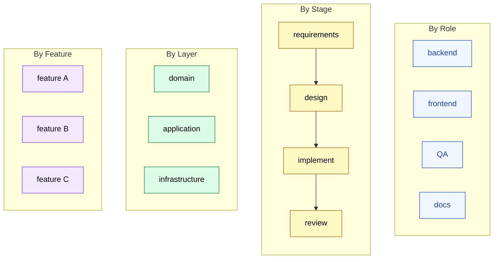

🌐 [日本語](../ja/10-multi-session/session-boundary-design.md)

# Session Boundary Design

> [!IMPORTANT]
> → Why: the wrong split multiplies coordination overhead without reducing per-session load. The right split makes each session **independently coherent** — able to make progress on its slice without constantly asking peers for context.

## The Decision Is Where to Cut

Once you have committed to an Agent Team, the next question is: along which axis do you split the work? The choice determines how often sessions need to talk to each other, and how cleanly each session can think.

A bad split keeps sessions tightly coupled: every step requires a peer message to look up some fact the other session owns. A good split makes each session **mostly self-sufficient**, with peer messages reserved for handoffs and not for ongoing dialogue.

## Four Splitting Patterns

### By Role

Each session owns a *function*: backend engineer, frontend engineer, QA, technical writer. Each role has its own expertise, its own files, its own CLAUDE.md tuned to its work.

This split aligns naturally with how human teams organize. It also aligns well with [Part 5 Agents](../05-on-demand-context/agents.md) for one-off delegations — the difference is that here, the role-sessions are *persistent*. The "backend session" remembers what it wrote last week.

**Best for:** mature projects with stable role boundaries, where the same kinds of work recur. SaaS product development, ongoing platform work.

**Watch out for:** features that cut across all roles. A new feature needs backend + frontend + QA + docs, and each role-session has only one slice. Coordination cost is high when every feature touches everyone.

### By Stage

Each session owns a *phase* of the work: requirements gathering, design, implementation, review. Work flows linearly through them, with handoffs at each boundary.

This is the most pipeline-like split. The advantage is that each session's mental model is bounded to one type of artifact (requirements docs, design diagrams, code, review comments). The disadvantage is that work has to wait at each handoff, and the last stage often gets blocked by problems found upstream.

**Best for:** workflows with well-defined deliverables at each stage — formal engineering, regulated industries, anything where the output of one stage is the input of the next.

**Watch out for:** the inevitable feedback loops. When implement finds a problem in design, do you reopen the design session or solve it in place? Either choice has costs.

### By Layer

Each session owns an *architectural layer*: domain logic, application layer, infrastructure. This mirrors clean architecture / hexagonal architecture splits in the codebase itself.

The session boundary lines up with directory boundaries, dependency boundaries, and (usually) commit boundaries. Each session's context can be tightly scoped to its layer's files. Cross-layer changes require explicit peer handoffs, which is also how the code itself should work.

**Best for:** codebases with strong architectural discipline. Domain-driven design projects, layered architectures.

**Watch out for:** features that span all layers symmetrically — adding a new entity touches domain, application, and infrastructure simultaneously, and you need three sessions in lockstep.

### By Feature

Each session owns a *feature flag* or *product area*: feature A, feature B, feature C. Each session knows everything about its feature — frontend, backend, tests, docs — but only about that feature.

This is the inverse of the By-Role split. Where By-Role optimizes for depth in one function, By-Feature optimizes for ownership of one product slice.

**Best for:** parallel feature development, where each feature is largely independent. Greenfield work, A/B tested experiments.

**Watch out for:** shared infrastructure. When all three feature-sessions need to modify the same auth service, you have three sessions writing to the same files with no single owner.

## Choosing: A Tradeoff Matrix

| Pattern | Coordination cost | Per-session expertise depth | Handoff clarity | When the codebase changes the most |
|:--|:--|:--|:--|:--|
| **By Role** | Medium (every feature touches all) | High (deep in one craft) | Medium | Vertical (within a role's files) |
| **By Stage** | Low (linear pipeline) | Medium (per-stage artifact type) | High (explicit gates) | Sequential (one stage at a time) |
| **By Layer** | Low (boundaries match code) | High (one layer of code) | High (matches dependency direction) | Within a layer |
| **By Feature** | Low (within feature) / High (when features touch shared code) | Medium (full stack, narrow scope) | Medium | Within a feature's slice |

The general rule: **pick the split whose boundaries already exist in your codebase or workflow**. If your team already has role specialization, By-Role costs least to adopt. If your architecture is layered, By-Layer is the cheapest fit.

## What Makes a Boundary "Independently Coherent"

> [!TIP]
> A good session boundary satisfies three properties:
>
> 1. **Self-sufficiency.** The session can make 80%+ of its decisions without asking a peer. Peer messages should be for handoffs, not for routine lookups.
> 2. **Bounded vocabulary.** The session works with a small, stable set of concepts. A "backend" session deals with services, repositories, and queries — not with React components.
> 3. **Stable file set.** The session edits a predictable set of files. If every task touches a different part of the repo, the boundary is wrong.
>
> When you find a session constantly asking peers "what is X?", that is a signal that X belongs in this session's scope — either expand the boundary or move the topic.

## Anti-Patterns

> [!WARNING]
> Two splits look reasonable but produce more coordination cost than they save:
>
> - **By File** — one session per file or per directory. Files are too fine-grained; any non-trivial change crosses files, so every task becomes a multi-session coordination. The boundary fights the work.
> - **By Task** — one session per ticket / PR. The session has no continuity across tasks, so you lose the entire benefit of persistent state. This is just Subagent with extra steps; use Subagent.

## Relation to Other Parts

- [Subagent vs Agent Team](subagent-vs-team.md) determines *whether* to use a team at all. This page determines *how* to split it once you have.
- [Peer Messaging](peer-messaging.md) covers the mechanics of the handoffs the boundary still requires.
- [Part 5 Agents](../05-on-demand-context/agents.md) — many of the same role definitions used for Subagents apply here, just made persistent.

---

> **Previous**: [Subagent vs Agent Team](subagent-vs-team.md)

> **Next**: [Peer Messaging](peer-messaging.md)
