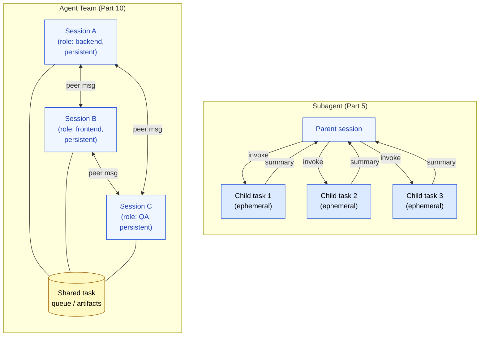
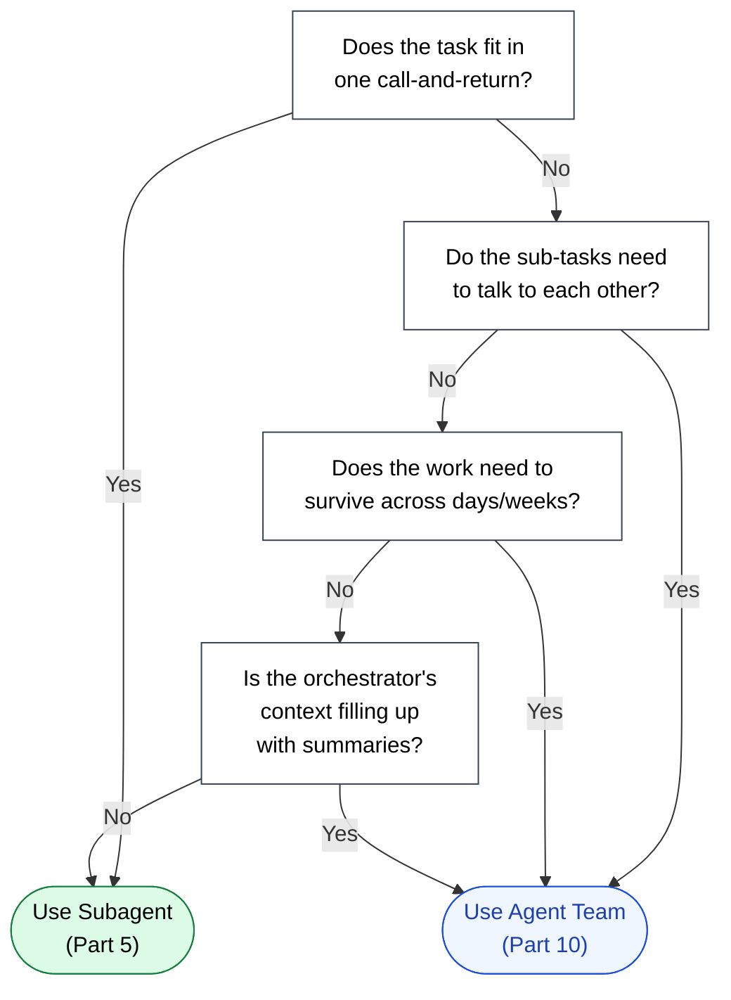

🌐 [日本語](../ja/10-multi-session/subagent-vs-team.md)

# Subagent vs Agent Team

> [!IMPORTANT]
> → Why: choose the lighter primitive first. Subagents are simpler, cheaper, and sufficient for most parallel work. Agent Teams are the answer when the work outgrows a single call-and-return.

## The Default Should Be Subagent

For the vast majority of "split this work and bring back a result" situations, Part 5's Subagent pattern is the right answer:

- The parent owns the task.
- The parent invokes a child with a focused prompt.
- The child runs in a fresh context, does its work, returns a summary.
- The parent integrates the summary and continues.

This is cheap, easy to reason about, and avoids most of the failure modes that come with longer-lived coordination. **Reach for Agent Teams only when this pattern visibly breaks down.**

## When Subagent Breaks Down

Three signals indicate that Subagent is no longer enough:

### Signal 1: The Work Outlives the Parent Session

Subagents are bound to their parent's session. If the parent's `/clear` is needed to recover from Context Rot, every Subagent's identity is gone — there is no "the child agent we were using last week." For work that needs continuity across days or weeks, the persistence has to live somewhere with its own lifespan.

### Signal 2: Children Need to Talk to Each Other

A Subagent returns a summary to its parent, full stop. It cannot ask another Subagent a question. If your QA agent needs to flag a regression to your implementation agent, and the implementation agent needs to ask the documentation agent to record the change, you are forcing a tree-shaped coordination into a structure that does not support it.

### Signal 3: The Parent Becomes the Bottleneck

In the Subagent model, the parent session holds the full picture. Every summary flows through it. For a multi-week project with dozens of work items, the parent's context fills with summaries faster than its own actual work — and you are back to Context Rot, just at a slower rate.

When any of these three signals is present, the right move is to elevate the children to peers — give them their own persistent sessions, let them talk to each other, and let the original "parent" become just another peer with a specific role (often: orchestrator, project lead, or product owner).

## The Topology Difference, Visualized

The Subagent topology is a **star** — everything goes through the center. The Agent Team topology is a **mesh** with a side channel — sessions talk to each other, and they also share state through an external store (a queue, an artifact bucket, a project tracker).

## Decision Flow

The flow is biased toward Subagent. That bias is intentional: Agent Teams introduce coordination overhead (messaging, conflict resolution, shared state consistency) that Subagents do not have. Pay that cost only when the work requires it.

## What Agent Teams Cost

> [!WARNING]
> Agent Teams are not free. Before adopting them, account for:
>
> - **Coordination overhead.** Every peer message is a tool call. A team of 4 sessions exchanging messages can spend a non-trivial fraction of total tokens on coordination rather than work.
> - **State consistency.** Two sessions reading the same artifact at slightly different times may see different versions. Either the workflow tolerates this, or the shared store needs to enforce ordering.
> - **Debuggability.** When something goes wrong in a single-session run, the conversation history is one linear log. In an Agent Team, you need to reconstruct the order of events across multiple sessions to understand what happened.
> - **Per-session cost.** Each session has its own resident context (system prompt, CLAUDE.md, tool definitions). Four sessions ≠ one session at 4× the budget — it is 4× the *fixed* overhead, plus the variable work.

A reasonable heuristic: if you could realistically do the work in a single session by `/clear`-ing every few hours, do that. Spin up an Agent Team when even that strategy breaks down.

## Relation to Other Parts

- [Part 5 Agents](../05-on-demand-context/agents.md) describes the Subagent pattern in depth, and is the first thing to read before considering Agent Teams.
- [Part 8 Session Management](../08-session-management/index.md) covers `/compact` and `/clear` — the *single-session* remediations that should be exhausted before moving to multi-session.
- [Long-Running Tasks](long-running-tasks.md) is the practical follow-on to this page: once you have decided to use a team, how do you actually split the work?

---

> **Previous**: [Part 10 Overview](index.md)

> **Next**: [Session Boundary Design](session-boundary-design.md)
