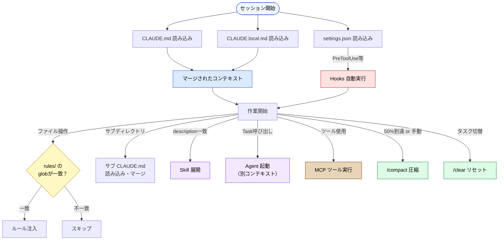

# Claude Code 設定ファイル一覧

> Claude Code のプロジェクト設定を構成するファイル・ディレクトリの網羅的リファレンス。
> 「この設定は何のためにあるのか？」を本プロジェクトの各ページへのリンクで辿れるようにしたもの。

## ディレクトリ構造の全体像

### ユーザーレベル（グローバル）

```
~/.claude/
├── CLAUDE.md                    # 全プロジェクト共通の個人指示
└── settings.json                # グローバル個人設定（ツール許可等）
```

### プロジェクトレベル

```
my-project/
├── CLAUDE.md                    # プロジェクトのメイン指示ファイル（自動読み込み）
├── CLAUDE.local.md              # ローカル専用指示（Git管理外）
├── .claude/
│   ├── settings.json            # ツール許可・MCP設定・Hooks（チーム共有）
│   ├── settings.local.json      # ローカル専用設定（Git管理外）
│   ├── commands/
│   │   └── deploy.md            # カスタムスラッシュコマンド（/deploy で実行）
│   ├── rules/
│   │   ├── frontend.md          # 条件付きルール（globパターンで自動注入）
│   │   ├── testing.md
│   │   └── ...
│   └── skills/
│       └── skill-name/
│           ├── SKILL.md         # Skill 定義（必須）
│           ├── scripts/         # 補助スクリプト（任意）
│           ├── references/      # 参照ドキュメント（任意）
│           └── assets/          # テンプレート等（任意）
├── src/
│   ├── CLAUDE.md                # サブディレクトリ用（該当ディレクトリ操作時に読み込み）
│   └── components/
│       └── CLAUDE.md            # さらに深い階層も可能
```

### エンタープライズレベル（管理者設定）

```
（組織管理者が配布）
├── managed-settings.json        # 組織ポリシー（MDM等で配布、最高優先度）
```

### 設定の優先順位

```
Managed（最高）  managed-settings.json（組織ポリシー）
  ↓
Project          .claude/settings.json（チーム共有）
  ↓
Project Local    .claude/settings.local.json（個人ローカル）
  ↓
User（最低）     ~/.claude/settings.json（グローバル個人）
```

以下では、各ファイル/ディレクトリを「コンテキストへの関わり方」で分類して解説する。

| カテゴリ | 設定ファイル / 機能 | 読み込み | 解説 |
|---|---|---|---|
| **常駐コンテキスト**（Part 3） | `~/.claude/CLAUDE.md` | セッション開始時に自動 | [階層マージ](../03-always-loaded-context/hierarchy.md) |
| | `CLAUDE.md` | セッション開始時に自動 | [設計原理](../03-always-loaded-context/claude-md.md) |
| | `CLAUDE.local.md` | セッション開始時に自動 | [運用](../03-always-loaded-context/local-md.md) |
| | サブディレクトリの `CLAUDE.md` | 該当ディレクトリ操作時 | [階層マージ](../03-always-loaded-context/hierarchy.md) |
| **条件付きコンテキスト**（Part 4） | `.claude/rules/` | glob パターン一致時 | [設計原理](../04-conditional-context/rules.md) |
| **オンデマンドコンテキスト**（Part 5） | `.claude/skills/` | description 一致時に展開 | [Skills](../05-on-demand-context/skills.md) |
| | Agents（`Task()`） | 明示的呼び出し時 | [Agents](../05-on-demand-context/agents.md) |
| **ツール定義コンテキスト**（Part 6） | MCP（`mcpServers`） | ツール定義が常時消費 | [コンテキストコスト](../06-tool-context/mcp-context-cost.md) |
| **ランタイム制御**（Part 7） | `managed-settings.json` | 組織ポリシー強制（最高優先） | [settings.json](../07-runtime-layer/settings-json.md) |
| | `.claude/settings.json` | ランタイムが参照（LLM に見えない） | [settings.json](../07-runtime-layer/settings-json.md) |
| | `.claude/settings.local.json` | 個人ローカル設定 | [settings.json](../07-runtime-layer/settings-json.md) |
| | `~/.claude/settings.json` | グローバル個人設定（最低優先） | [settings.json](../07-runtime-layer/settings-json.md) |
| | Hooks | LLM の行動前後に自動実行 | [ライフサイクル](../07-runtime-layer/hooks.md) |
| **セッション管理**（Part 8） | `/compact` · `/clear` | 手動 or 50% 閾値で自動 | [使い分け](../08-session-management/compact-and-clear.md) |
| | Memory | セッション横断で永続化 | [何を覚えるか](../08-session-management/what-to-remember.md) |

---

## 常駐コンテキスト — セッション開始時に必ず読み込まれる

### ~/.claude/CLAUDE.md（ユーザーレベル）

| 項目 | 内容 |
|---|---|
| **場所** | `~/.claude/CLAUDE.md` |
| **読み込み** | セッション開始時に自動（最初にマージされる） |
| **Git管理** | しない（ホームディレクトリ） |
| **役割** | 全プロジェクト共通の個人指示（例: 「日本語で回答」「関数型スタイル優先」など） |
| **詳細解説** | [階層マージの仕組み](../03-always-loaded-context/hierarchy.md) |

### CLAUDE.md（プロジェクトレベル）

| 項目 | 内容 |
|---|---|
| **場所** | プロジェクトルート直下 |
| **読み込み** | セッション開始時に自動 |
| **Git管理** | する（チーム共有） |
| **役割** | プロジェクト全体の指示・ルール・コンテキストの提供 |
| **対策する問題** | [Priority Saturation](../01-llm-structural-problems/priority-saturation.md)、[Prompt Sensitivity](../01-llm-structural-problems/prompt-sensitivity.md) |
| **制約** | 200行以内推奨（Priority Saturation 回避） |
| **詳細解説** | [CLAUDE.md の設計原理](../03-always-loaded-context/claude-md.md) |

### CLAUDE.local.md

| 項目 | 内容 |
|---|---|
| **場所** | プロジェクトルート直下 |
| **読み込み** | セッション開始時に自動（CLAUDE.md とマージ） |
| **Git管理** | しない（.gitignore 推奨） |
| **役割** | 個人の環境依存設定（ローカルパス、個人APIキー等） |
| **詳細解説** | [CLAUDE.local.md の運用](../03-always-loaded-context/local-md.md) |

### サブディレクトリの CLAUDE.md（階層マージ）

| 項目 | 内容 |
|---|---|
| **場所** | 任意のサブディレクトリ（例: `src/CLAUDE.md`） |
| **読み込み** | そのディレクトリ内のファイルを操作する際にオンデマンド |
| **Git管理** | する |
| **役割** | ディレクトリ固有のルールを追加。親の CLAUDE.md とマージされる |
| **対策する問題** | [Context Rot](../01-llm-structural-problems/context-rot.md)（必要な時だけ読み込む） |
| **詳細解説** | [階層マージの仕組み](../03-always-loaded-context/hierarchy.md) |

---

## 条件付きコンテキスト — 条件一致時のみ注入

### .claude/rules/

| 項目 | 内容 |
|---|---|
| **場所** | `.claude/rules/*.md` |
| **読み込み** | glob パターンが一致したファイル操作時 |
| **Git管理** | する |
| **役割** | ファイル種別ごとの自動適用ルール（例: `*.test.ts` 編集時にテスト規約を注入） |
| **対策する問題** | [Priority Saturation](../01-llm-structural-problems/priority-saturation.md)（常駐させず必要時のみ）、[Lost in the Middle](../01-llm-structural-problems/lost-in-the-middle.md) |
| **詳細解説** | [.claude/rules/ の設計原理](../04-conditional-context/rules.md)、[glob パターン設計の実践](../04-conditional-context/glob-patterns.md) |

**記述例：**

```markdown
---
description: TypeScript test files
globs: **/*.test.ts, **/*.spec.ts
---

- describe/it のネストは2階層まで
- モックは最小限に、実際のサービスを使う統合テストを優先
```

---

## オンデマンドコンテキスト — 呼び出された時だけ展開

### .claude/skills/

| 項目 | 内容 |
|---|---|
| **場所** | `.claude/skills/<skill-name>/SKILL.md` |
| **読み込み** | description が一致した時に展開 |
| **Git管理** | する |
| **役割** | 再利用可能なプロンプトテンプレート。コード生成パターン、ドキュメント生成手順など |
| **対策する問題** | [Context Rot](../01-llm-structural-problems/context-rot.md)（使わない時はコンテキストを消費しない） |
| **詳細解説** | [Skills の設計原理](../05-on-demand-context/skills.md) |

**ディレクトリ構成例：**

```
.claude/skills/
└── component-gen/
    ├── SKILL.md          # プロンプト指示（必須）
    ├── scripts/          # 補助スクリプト
    ├── references/       # 参照ドキュメント
    └── assets/           # テンプレート等
```

### Agents（Task() によるサブプロセス）

| 項目 | 内容 |
|---|---|
| **定義方法** | Skills 内または会話中で `Task()` を使用 |
| **コンテキスト** | 親とは**独立した**コンテキストウィンドウで実行 |
| **役割** | Cross-model QA、並列処理、専門領域の分離 |
| **対策する問題** | [Sycophancy](../01-llm-structural-problems/sycophancy.md)（独立判断）、[Knowledge Boundary](../01-llm-structural-problems/knowledge-boundary.md) |
| **詳細解説** | [Agents の設計原理](../05-on-demand-context/agents.md)、[import vs 別プロセスの判断基準](../05-on-demand-context/skill-vs-agent.md) |

---

## ツール定義コンテキスト — ツールがコンテキストを消費する

### MCP（Model Context Protocol）

| 項目 | 内容 |
|---|---|
| **設定場所** | `.claude/settings.json` 内の `mcpServers` |
| **コンテキストコスト** | ツール定義そのものがトークンを消費する |
| **役割** | 外部ツール・API との連携（DB参照、ファイル操作、外部サービス呼び出し等） |
| **対策する問題** | [Knowledge Boundary](../01-llm-structural-problems/knowledge-boundary.md)（外部知識へのアクセス）、[Hallucination](../01-llm-structural-problems/hallucination.md)（事実確認） |
| **詳細解説** | [MCP のコンテキストコスト](../06-tool-context/mcp-context-cost.md)、[Tool Search / Deferred Loading](../06-tool-context/tool-search.md) |

---

## ランタイム制御 — LLM のコンテキストに入らないレイヤー

### .claude/settings.json

| 項目 | 内容 |
|---|---|
| **場所** | `.claude/settings.json` |
| **読み込み** | ランタイムが参照（LLMには見えない） |
| **Git管理** | する |
| **役割** | ツール許可設定、MCP サーバー定義、Hooks 定義、環境変数 |
| **詳細解説** | [settings.json の役割](../07-runtime-layer/settings-json.md)、[なぜ LLM に見せないのか](../07-runtime-layer/why-not-in-context.md) |

**設定例：**

```json
{
  "permissions": {
    "allow": ["Bash(npm run test)", "Read"],
    "deny": ["Bash(rm -rf)"]
  },
  "hooks": { ... },
  "mcpServers": { ... }
}
```

### .claude/settings.local.json

| 項目 | 内容 |
|---|---|
| **場所** | `.claude/settings.local.json` |
| **Git管理** | しない（.gitignore 推奨） |
| **役割** | 個人のツール許可設定・ローカルMCPサーバー設定 |
| **関係** | `settings.json` とマージされる（local が優先） |

### ~/.claude/settings.json（ユーザーレベル）

| 項目 | 内容 |
|---|---|
| **場所** | `~/.claude/settings.json` |
| **Git管理** | しない（ホームディレクトリ） |
| **役割** | 全プロジェクト共通のグローバル個人設定 |
| **優先順位** | 最低（プロジェクト設定に上書きされる） |

### managed-settings.json（エンタープライズレベル）

| 項目 | 内容 |
|---|---|
| **配布方法** | MDM（モバイルデバイス管理）やサーバー管理で配布 |
| **役割** | 組織全体のセキュリティポリシー・許可設定の強制 |
| **優先順位** | 最高（全設定を上書き。ユーザーは変更不可） |
| **詳細解説** | [settings.json の役割](../07-runtime-layer/settings-json.md) |

### Hooks

| 項目 | 内容 |
|---|---|
| **設定場所** | `.claude/settings.json` 内の `hooks` |
| **実行タイミング** | LLM の行動前後に自動実行（LLM は認識しない） |
| **役割** | 機械的な検証・自動フォーマット・通知など |
| **対策する問題** | [Hallucination](../01-llm-structural-problems/hallucination.md)（自動テスト実行）、[Sycophancy](../01-llm-structural-problems/sycophancy.md)（機械的チェック）、[Instruction Decay](../01-llm-structural-problems/instruction-decay.md) |
| **詳細解説** | [Hooks のライフサイクル](../07-runtime-layer/hooks.md) |

**主なイベント：**

| イベント | タイミング |
|---|---|
| `PreToolUse` | ツール実行前 |
| `PostToolUse` | ツール実行後 |
| `Notification` | 通知発生時 |
| `Stop` | セッション停止時 |

---

## セッション管理 — 会話の寿命と記憶

### /compact・/clear コマンド

| コマンド | 動作 | 用途 |
|---|---|---|
| `/compact` | コンテキストを要約して圧縮 | Context Rot の予防的対処。50%閾値で自動実行も |
| `/clear` | コンテキストを完全リセット | タスク切り替え時。蓄積したノイズを一掃 |

| 項目 | 内容 |
|---|---|
| **対策する問題** | [Context Rot](../01-llm-structural-problems/context-rot.md)、[Lost in the Middle](../01-llm-structural-problems/lost-in-the-middle.md)、[Instruction Decay](../01-llm-structural-problems/instruction-decay.md) |
| **詳細解説** | [/compact と /clear の使い分け](../08-session-management/compact-and-clear.md) |

### Memory（記憶の永続化）

| 項目 | 内容 |
|---|---|
| **仕組み** | セッションを超えて情報を永続化する機構 |
| **対策する問題** | [Context Rot](../01-llm-structural-problems/context-rot.md)（圧縮で失われる情報の救済）、[Instruction Decay](../01-llm-structural-problems/instruction-decay.md) |
| **詳細解説** | [なぜメモリが問題になるのか](../08-session-management/memory-problem.md)、[何を覚えるか](../08-session-management/what-to-remember.md)、[いつ・どう思い出すか](../08-session-management/when-to-recall.md)、[ツール比較と選定基準](../08-session-management/tools-comparison.md) |

---

## カスタムコマンド

### .claude/commands/

| 項目 | 内容 |
|---|---|
| **場所** | `.claude/commands/*.md` |
| **呼び出し** | `/` + ファイル名で実行（例: `/deploy`） |
| **役割** | 定型プロンプトの再利用。デプロイ手順、レビュー手順など |

**記述例（`.claude/commands/deploy.md`）：**

```markdown
本番デプロイ前のチェックリストを実行してください。

1. `npm run test` が全てパスすること
2. `npm run build` がエラーなく完了すること
3. 変更内容のサマリーを出力すること
```

---

## 設定の読み込みタイミング一覧



---

> **前へ**: [構造的問題 × Claude Code 対策マップ](problem-countermeasure-map.md)

> **Discussion**: 追加や修正の提案は [Discussions](https://github.com/shuji-bonji/understanding-llm-through-claude-code/discussions) へ
